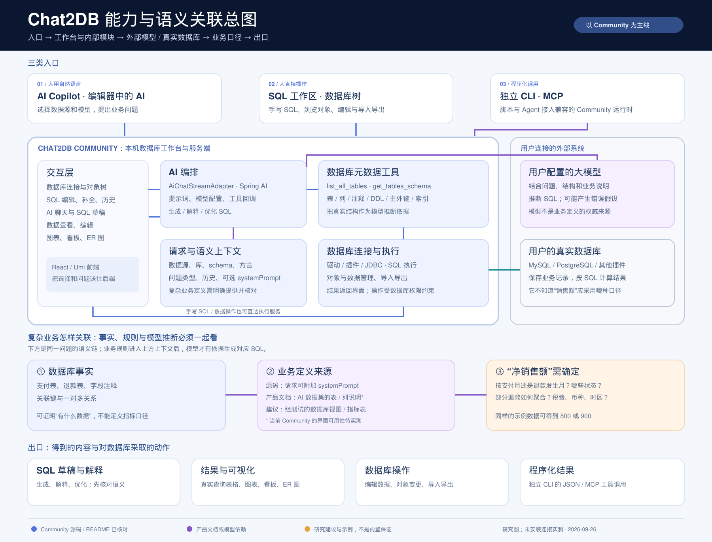
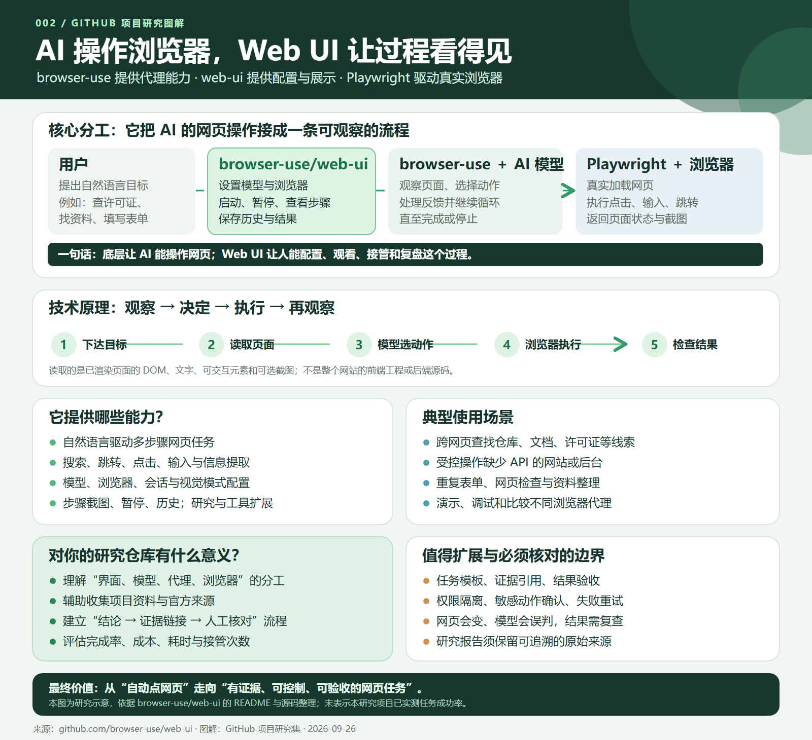
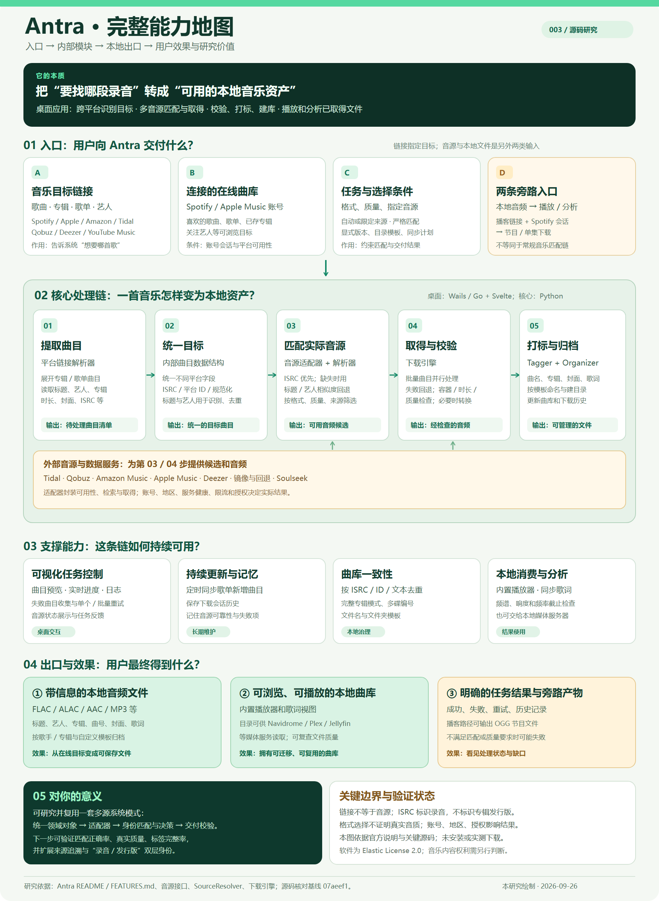
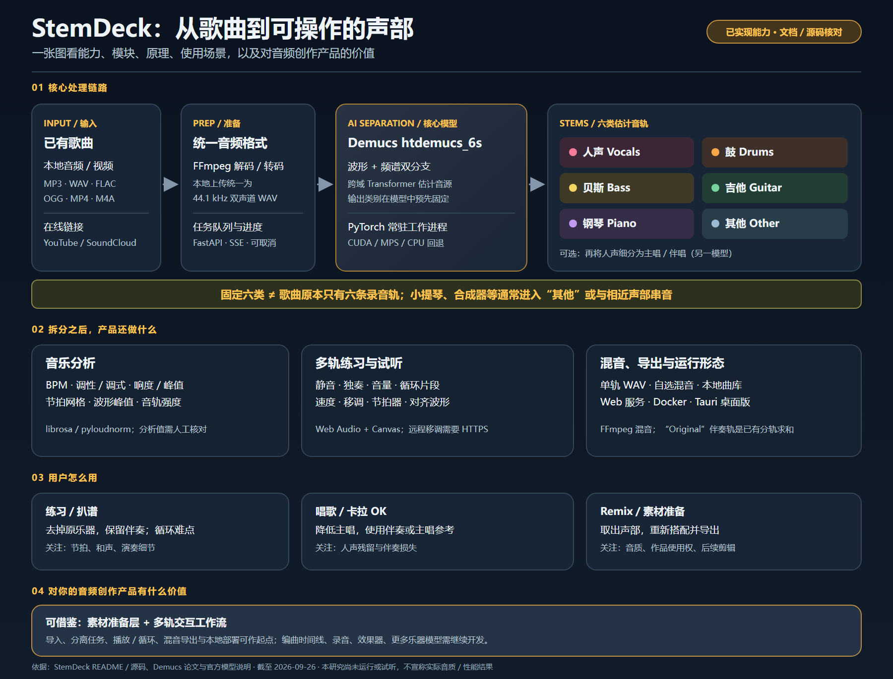
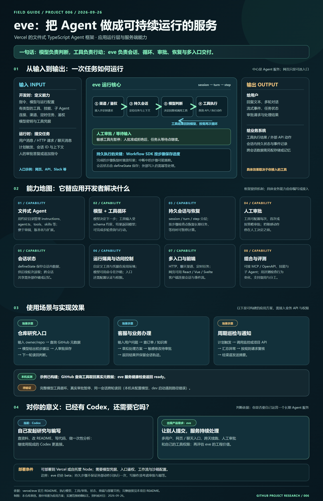
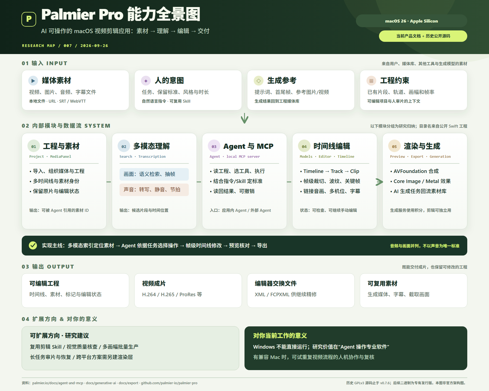

# GitHub 优秀项目研究集

这个仓库按编号整理优秀 GitHub 项目的能力、实现原理与可复现的研究。根页只放摘要、索引和引导图；源码证据、版本边界和详细分析在各子项目中。

## 项目索引

| 编号 | 原仓库 | 能力摘要 | 研究与展示 |
| --- | --- | --- | --- |
| 001 | [OtterMind/Chat2DB](https://github.com/OtterMind/Chat2DB) | 数据库工作台；AI 依据表结构辅助写 SQL，结果由数据库执行。 | [研究记录](projects/001-chat2db/README.md) · [在线展示](https://yydshly.github.io/0926_codex_project/sites/001-chat2db/) · [网页源码](sites/001-chat2db/index.html) |
| 002 | [browser-use/web-ui](https://github.com/browser-use/web-ui) | 配置、运行并观察浏览器代理，展示读取、决策、执行与核对循环。 | [研究记录](projects/002-browser-use-web-ui/README.md) · [在线展示](https://yydshly.github.io/0926_codex_project/sites/002-browser-use-web-ui/) · [网页源码](sites/002-browser-use-web-ui/index.html) |
| 003 | [anandprtp/Antra](https://github.com/anandprtp/Antra) | 匹配多来源音源，下载、校验、打标并整理本地曲库。 | [研究记录](projects/003-antra/README.md) · [在线展示](https://yydshly.github.io/0926_codex_project/sites/003-antra/) · [网页源码](sites/003-antra/index.html) |
| 004 | [stemdeckapp/stemdeck](https://github.com/stemdeckapp/stemdeck) | Demucs 估计六类音轨，支持试听、循环练习、混音与导出。 | [研究记录](projects/004-stemdeck/README.md) · [在线展示](https://yydshly.github.io/0926_codex_project/sites/004-stemdeck/) · [网页源码](sites/004-stemdeck/index.html) |
| 006 | [vercel/eve](https://github.com/vercel/eve) | 把模型、工具、持久会话和人工审批组合成可部署的 Agent 服务。 | [研究记录](projects/006-vercel-eve/README.md) · [在线展示](https://yydshly.github.io/0926_codex_project/sites/006-vercel-eve/) · [网页源码](sites/006-vercel-eve/index.html) |
| 007 | [palmier-io/palmier-pro](https://github.com/palmier-io/palmier-pro) | macOS AI 剪辑器：按画面与语音找素材，Agent 经 MCP 修改帧级时间线，交付成片或可编辑工程；适合重复初剪与人工复核。 | [研究记录](projects/007-palmier-pro/README.md) · [在线展示](https://yydshly.github.io/0926_codex_project/sites/007-palmier-pro/) · [网页源码](sites/007-palmier-pro/index.html) |

## 子项目速览

### 001 · Chat2DB

图片说明：本仓库绘制的 Chat2DB 研究引导图，依据[原仓库](https://github.com/OtterMind/Chat2DB)、[独立 CLI 仓库](https://github.com/OtterMind/Chat2DB-CLI)与已核对源码整理；是分析示意，不是官方架构图或运行截图。[放大查看 SVG](projects/001-chat2db/assets/architecture-map.svg)。

- **能力是什么：** Chat2DB 是本机优先的数据库客户端和 SQL 工作台，可连接多种数据库，浏览结构、编辑和执行 SQL、管理数据、导入导出、查看图表；接入自选模型后可用自然语言生成、解释和优化 SQL。
- **技术原理：** 客户端把所选数据源、数据库结构、字段注释与可提供的业务说明交给模型；模型推断 SQL，真实数据由数据库按 SQL 计算。Spring AI 工具调用读取元数据，驱动和插件负责连接与执行。
- **包含模块：** 交互界面、请求与语义上下文、AI 编排、元数据工具、数据库连接与执行、结果与可视化；另有独立 CLI/MCP 入口供脚本和 Agent 使用。
- **入口与出口：** 人可输入自然语言或直接操作 SQL/表，外部程序可经 CLI/MCP 调用；得到 SQL 草稿、查询结果与图表，也可执行数据管理和导入导出操作。
- **使用场景与对我的意义：** 适合开发排查、DBA 管理、临时分析和受控 Agent 查询。它提供了研究或构建自然语言数据助手的完整样本：从数据库结构到模型推断，再到可核对的 SQL 和真实结果。
- **关键边界：** 退款、销售额等指标必须明确统计口径；字段注释和模型推断不能自动证明业务答案正确。当前研究未安装 Chat2DB 连接真实数据库。[查看详细研究与源码证据](projects/001-chat2db/README.md)。

### 002 · Browser Use Web UI

图片说明：本仓库依据[原仓库文档与源码](https://github.com/browser-use/web-ui)绘制的理解汇总图，不是原产品运行截图或真实任务结果。[放大查看 SVG](projects/002-browser-use-web-ui/assets/understanding-map.svg)。

- **能力与原理：** Web UI 负责任务入口、设置、过程展示与控制；`browser-use` 和浏览器控制层负责网页操作。
- **模块效果：** 模型与浏览器设置决定运行条件，Run Agent 展示步骤，Deep Research 汇总资料，配置与工具扩展便于复用。
- **研究价值：** 可探索带来源证据和人工验收的资料收集流程。[研究记录](projects/002-browser-use-web-ui/README.md) · [在线展示](https://yydshly.github.io/0926_codex_project/sites/002-browser-use-web-ui/)。

### 003 · Antra

图片说明：本仓库依据 [Antra 官方功能说明](https://github.com/anandprtp/Antra/blob/07aeef19966d8e2b72ed53f53442596e8a53255c/FEATURES.md)与关键源码绘制的研究引导图，不是官方架构图或实测结果。[放大查看 SVG](sites/003-antra/assets/capability-map.svg)。

- **能力与原理：** 从链接或已连接的在线曲库提取曲目并统一元数据；通过适配器匹配音源，下载校验后打标归档。
- **模块与出口：** 包含桌面界面、链接解析、统一曲目、音源解析、下载校验、标签曲库、同步历史、播放分析；输出本地音频文件和可浏览曲库。
- **场景与意义：** 适合经授权建立个人曲库、维护更新歌单，也提供研究多源数据一致化、身份匹配和交付校验的案例。
- **边界：** 尚未进行真实下载；音源可用性、文件质量、内容权限和标签完整度需核查。[研究记录](projects/003-antra/README.md) · [在线能力展示](https://yydshly.github.io/0926_codex_project/sites/003-antra/)。

### 004 · StemDeck

图片说明：本研究依据 [StemDeck 官方仓库](https://github.com/stemdeckapp/stemdeck)和 Demucs 模型资料绘制；这是分析图，不是分离音质实测。[放大查看 SVG](projects/004-stemdeck/assets/capability-map.svg)。

- **能力与原理：** 本地音频经 FFmpeg 预处理，由 Demucs 估计固定六类音轨，再进入分析、波形播放、循环练习与导出流程。
- **效果与场景：** 可把歌曲变成可静音、独奏和重混的练习素材，适合乐器跟练、歌唱、扒谱和创作准备。
- **对音频创作产品的价值：** 它示范了从分离模型到可用工作台的路径；新音色识别、时间线编排等仍需另行设计。输出并非录音室原始分轨，质量尚待实测。[研究记录](projects/004-stemdeck/README.md) · [在线能力展示](https://yydshly.github.io/0926_codex_project/sites/004-stemdeck/)。

### 006 · vercel/eve

图片说明：本仓库依据 [eve 官方文档](https://github.com/vercel/eve/blob/main/docs/README.md)原创绘制的能力引导图；场景是可构建的方案，图中另标出本机实测范围。它不是官方架构图或运行截图。[放大查看 SVG](projects/006-vercel-eve/assets/eve-capability-map.svg)。

- **能力：** eve 是文件式 TypeScript Agent 框架，管理多轮工具调用、持久会话、人工审批与暂停恢复，并提供网页、HTTP、聊天和计划任务等接入方式。
- **原理与模块：** 指令和模型配置定义 Agent；渠道鉴权接收请求；Workflow SDK 把会话按轮次和步骤保存；模型选工具，工具结果返回模型；审批与会话状态支持等待和继续。自定义工具、连接、沙箱、前端与部署构成外围模块。
- **输入与输出：** 输入包括开发者配置的模型、指令、工具和权限，以及运行时请求与审批答复；输出包括回复、事件、工具动作和会话状态。具体业务动作要由开发者实现。
- **场景与意义：** 可构建仓库研究受理、客服复核和周期巡检等长期流程。你自己发起研究、整理资料时用 Codex 更直接；需要多人入口、跨天续跑和自己的审批服务时，eve 才有明确价值。
- **验证边界：** 本项目示例已构建，GitHub 查询工具取回真实数据，服务健康检查返回 `ready`；完整模型循环和真实审批仍待验证。[研究记录与源码](projects/006-vercel-eve/README.md) · [在线交互演示](https://yydshly.github.io/0926_codex_project/sites/006-vercel-eve/)。

### 007 · Palmier Pro

图片说明：本仓库依据 [Palmier 官方文档](https://www.palmier.io/docs/agent-and-mcp)与[历史公开源码](https://github.com/palmier-io/palmier-pro/tree/last-gpl-source)绘制的研究引导图；模块分组与扩展方向是归纳，不是官方架构或运行截图。[放大查看 SVG](projects/007-palmier-pro/assets/capability-map.svg)。

- **能力与原理：** Palmier Pro 是 macOS 非线性剪辑应用。它并列利用画面语义检索、语音转写与音频分析定位素材；Agent 经本地 MCP 读取工程、调用剪辑工具修改多轨时间线，人可预览、撤销并继续编辑。公开历史源码使用帧级 Timeline → Track → Clip 模型和 AVFoundation 等媒体技术。
- **输入与输出：** 输入视频、图片、音频、字幕、工程状态与人的剪辑要求；输出可编辑工程、H.264/H.265/ProRes 成片、XML/FCPXML 交换文件及生成素材。
- **场景与对我们的意义：** 适合访谈课程粗剪、字幕处理、批量短视频和实拍与生成素材混剪。它提供了“Agent 操作专业创作软件，并由人复核结果”的研究案例；当前 Windows 环境无法直接运行，实际试用需要兼容的 Apple Silicon Mac。
- **边界：** 现行产品能力依据官方文档；源码只能验证截至 v0.7.6 的 GPLv3 历史版本，不能据此断言后续专有版本的内部实现。[详细研究记录](projects/007-palmier-pro/README.md) · [在线能力地图](https://yydshly.github.io/0926_codex_project/sites/007-palmier-pro/)。

## 仓库结构

- projects/NNN-short-name/：研究记录、来源与图片说明。
- sites/NNN-short-name/：可选静态展示页，使用相对资源路径。
- templates/subproject/：新项目模板，不计入项目索引。

原项目代码、名称和官方图片归原权利人；引用与再使用须遵守各项目许可。本研究图为本仓库原创整理。
