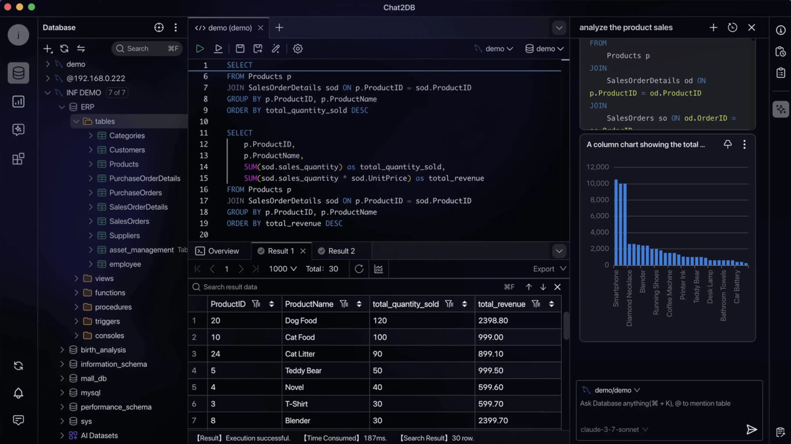
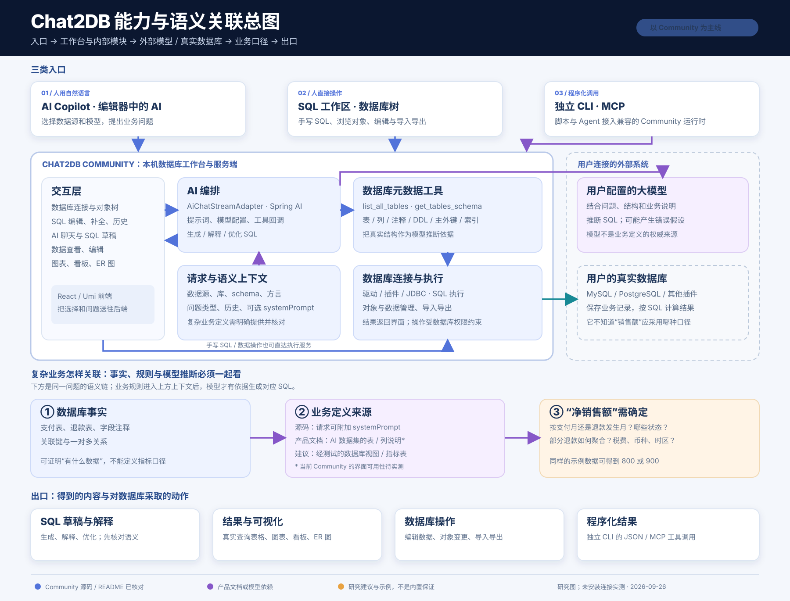
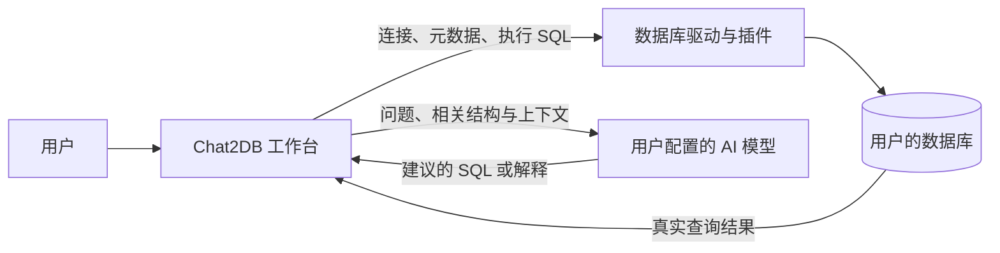
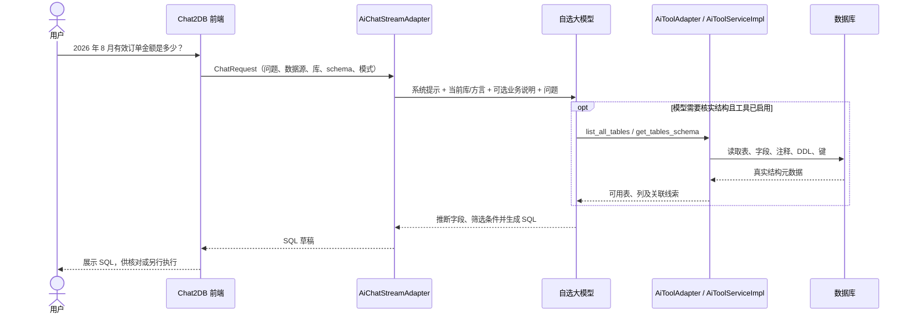

# 001 · Chat2DB：把数据库操作与 AI 辅助放进同一个工作台

> 研究对象是 Chat2DB Community。本文区分「官方声明」「本次资料核对」「尚未运行验证」；配套网页只是教学模拟，不是 Chat2DB 的运行截图或功能测试。

| 项目 | 内容 |
| --- | --- |
| 原仓库 | [OtterMind / Chat2DB](https://github.com/OtterMind/Chat2DB) |
| 维护方与归属 | OtterMind（仓库组织）；当前 LICENSE 标注 © 2026 爱獭科技（杭州）有限公司。原软件、名称和官方图片归原权利人 |
| 研究日期 | 2026-09-26 |
| 研究状态 | 官方资料与仓库结构已核对；尚未安装软件连接数据库 |
| 研究范围 | Community 版公开说明与源码；源码核对基于提交 [`4b20d89`](https://github.com/OtterMind/Chat2DB/tree/4b20d898751e38614d167cf71be9d6b2578ba063)（2026-09-23） |
| 本地概念展示 | [打开静态交互页](../../sites/001-chat2db/index.html)（模拟数据，不连接真实数据库） |



图片说明：这是原项目 README 使用的官方工作台宣传画面，展示数据库树、SQL 编辑与结果、AI 助手和图表。图片由 Chat2DB/OtterMind 提供，原始文件见[官方图片地址](https://cdn.chat2db-ai.com/website/img/first_video_cover.webp)和[原仓库 README](https://github.com/OtterMind/Chat2DB/blob/main/README.md)。原仓库未在图片旁单独标明图片许可；本项目仅为研究展示而引用，不将软件源码的许可证推定为图片授权。

## 一张总图：入口、模块、依赖、语义和出口



[打开可放大的 SVG 原图](assets/architecture-map.svg)；另有[PNG 预览](assets/architecture-map.png)。本图由本研究项目根据公开资料绘制，并非 Chat2DB 官方架构图，也不是已运行系统的调用追踪。蓝色是已核对的 Community 源码或仓库 README 主线；紫色标记模型依赖及产品文档中的 AI 数据集，后者的当前 Community 界面可用性仍待实测；橙色是研究建议和教学示例。

图的主要依据：[Community 功能与模块](https://github.com/OtterMind/Chat2DB/blob/main/README.md)、[固定提交的聊天编排](https://github.com/OtterMind/Chat2DB/blob/4b20d898751e38614d167cf71be9d6b2578ba063/chat2db-community-server/chat2db-community-web/src/main/java/ai/chat2db/community/web/api/adapter/ai/AiChatStreamAdapter.java)、[AI 数据库工具](https://github.com/OtterMind/Chat2DB/blob/4b20d898751e38614d167cf71be9d6b2578ba063/chat2db-community-server/chat2db-community-web/src/main/java/ai/chat2db/community/web/api/adapter/ai/AiToolAdapter.java)、[元数据与 SQL 执行](https://github.com/OtterMind/Chat2DB/blob/4b20d898751e38614d167cf71be9d6b2578ba063/chat2db-community-server/chat2db-community-domain/chat2db-community-domain-core/src/main/java/ai/chat2db/community/domain/core/impl/ai/AiToolServiceImpl.java)、[独立 CLI/MCP 仓库](https://github.com/OtterMind/Chat2DB-CLI)、[AI 数据集文档](https://chat2db.ai/resources/docs/ai-chat/ai-data-collection)。图中程序化入口指独立 CLI 连接兼容的 Community 运行时，并不表示 CLI 源码位于 Community 仓库中。

## 先弄清三个角色

- **数据库**是保存业务记录的地方，例如订单表、商品表、客户表。真实数据可能早已存在于 MySQL、PostgreSQL、SQLite 等系统中。
- **Chat2DB**是连接和操作这些数据库的客户端。它负责展示结构、编辑或执行 SQL、管理数据、呈现结果；它本身不是这些业务数据的来源。
- **AI 模型**是可选助手。用户用自然语言描述问题，模型起草 SQL 或解释已有 SQL；最终要由数据库执行查询，结果才来自实际数据。

例子：想知道「各商品卖了多少」。Chat2DB 可以帮你找到订单和商品表、让 AI 起草关联与汇总 SQL，再在选定数据库上运行，最后查看表格或图表。**AI 写出的语句与数据库算出的结果是两件事**；模型若误解字段含义，查询即使能运行也可能答错业务问题。

## 能力地图

下表是[官方 README](https://github.com/OtterMind/Chat2DB/blob/main/README.md)列出的 Community 能力及其实际含义；「40+ 数据库」是官方覆盖声明，不代表每种数据库的高级操作完全一致。

| 能力 | 用户能做什么 | 依赖与边界 |
| --- | --- | --- |
| 多数据库连接 | 连接 MySQL、PostgreSQL、Oracle、SQL Server、SQLite 等，浏览数据库、表和字段 | 需要有效连接与相应数据库权限；不同类型通过驱动和插件适配 |
| SQL 工作区 | 编写、补全、格式化、运行、保存 SQL，查看历史和结果 | SQL 是否正确、是否影响数据，仍由使用者核对 |
| AI 辅助 | 用自己的模型生成、解释、优化 SQL | 模型可能生成错误 SQL；外部模型会带来数据发送范围问题，需检查所选模型与输入内容 |
| 数据管理 | 查看或编辑数据，管理表及其他对象，导入导出 | 写入和结构变更取决于数据库账号权限 |
| 结果呈现 | 用表格、仪表盘、图表和 ER 图理解数据与结构 | 图表只反映提供给它的查询结果，不会自动证明业务口径正确 |
| 自动化接口 | 通过独立的 [Chat2DB CLI](https://github.com/OtterMind/Chat2DB-CLI) 获取元数据、执行 SQL，使用 MCP 接入 Agent；当前 CLI 说明支持兼容的 Community 5.3.0+ 运行时 | 接口可以触发真实数据库操作，需要控制账号权限和执行范围；本研究未实测安装和联通 |

目前官方 README 另将带技能、外部 MCP、文件与终端工具的本地 Agent 运行时标为 **5.4.0-beta.1 early preview**，不应当作稳定版的既有能力。[版本说明](https://github.com/OtterMind/Chat2DB/blob/main/README.md#early-preview)

## 技术原理：两条相接的链路



**数据库链路。**仓库分为前端与 Java 服务端，服务端另有 SPI、插件、存储和 Web 等模块；插件目录包含 MySQL、PostgreSQL、SQLite 等适配模块。前端说明列出 Umi 4、React、TypeScript、Ant Design 5 和 Zustand。由这些代码结构及官方功能说明，可以判断它通过驱动与数据库对话，再把元数据和结果呈现到工作台。[前端说明](https://github.com/OtterMind/Chat2DB/tree/main/chat2db-community-client)、[服务端目录](https://github.com/OtterMind/Chat2DB/tree/main/chat2db-community-server)、[插件目录](https://github.com/OtterMind/Chat2DB/tree/main/chat2db-community-server/chat2db-community-plugins)

**AI 链路。**Community 要求用户配置自己的模型。当前源码会把选中的数据源、数据库、schema 和数据库类型作为上下文，并在需要时向模型提供查询元数据的工具。上图是概念链路；具体机制见下一节。官网还介绍了通过 AI 数据集选择表、补充 AI 表名和字段注释的方法，但该产品文档未明确标注每个版本和版本线的可用范围；本研究**不把 AI 数据集列为已验证的当前 Community 功能**。[Text2SQL 文档](https://chat2db.ai/resources/docs/ai-chat/text2sql)、[AI 数据集文档](https://chat2db.ai/resources/docs/ai-chat/ai-data-collection)、[Community 聊天实现](https://github.com/OtterMind/Chat2DB/blob/4b20d898751e38614d167cf71be9d6b2578ba063/chat2db-community-server/chat2db-community-web/src/main/java/ai/chat2db/community/web/api/adapter/ai/AiChatStreamAdapter.java)

在**生成 SQL 模式**，图中的数据库执行要由用户另行触发；启用数据库工具的**聊天模式**则可能调用查询工具取得真实数据。源码用 `questionType` 和 `enableTools` 区分这些路径。[请求字段](https://github.com/OtterMind/Chat2DB/blob/4b20d898751e38614d167cf71be9d6b2578ba063/chat2db-community-server/chat2db-community-web/src/main/java/ai/chat2db/community/web/api/model/request/ai/ChatRequest.java)、[模式与工具调用](https://github.com/OtterMind/Chat2DB/blob/4b20d898751e38614d167cf71be9d6b2578ba063/chat2db-community-server/chat2db-community-web/src/main/java/ai/chat2db/community/web/api/adapter/ai/AiChatStreamAdapter.java#L495-L640)

## 人话怎样对应数据库字段：当前源码的做法

1. **限定范围。**请求中可带数据源、数据库和 schema；系统提示还写入所选数据库类型，要求模型使用对应 SQL 方言。没有选数据源时，工具流程可先列出可用数据源。[上下文与提示构造](https://github.com/OtterMind/Chat2DB/blob/4b20d898751e38614d167cf71be9d6b2578ba063/chat2db-community-server/chat2db-community-web/src/main/java/ai/chat2db/community/web/api/adapter/ai/AiChatStreamAdapter.java#L770-L837)
2. **读取真实结构。**模型可调用 `list_all_tables` 看表名、类型和注释，调用 `get_tables_schema` 看指定表的建表语句；服务端还尽可能附上主键、索引和外键。这些结构告诉模型哪些字段真实存在、哪些表可以关联。[工具定义](https://github.com/OtterMind/Chat2DB/blob/4b20d898751e38614d167cf71be9d6b2578ba063/chat2db-community-server/chat2db-community-web/src/main/java/ai/chat2db/community/web/api/adapter/ai/AiToolAdapter.java#L31-L87)、[结构整理代码](https://github.com/OtterMind/Chat2DB/blob/4b20d898751e38614d167cf71be9d6b2578ba063/chat2db-community-server/chat2db-community-domain/chat2db-community-domain-core/src/main/java/ai/chat2db/community/domain/core/impl/ai/AiToolServiceImpl.java#L259-L425)
3. **模型推断语义。**模型结合问题、表名、字段注释与关系，决定「北京」对应 `city`、「总金额」对应 `SUM(amount)` 等。这里仍是推断：如果「销售额」的业务定义没有写明，物理表结构无法证明是否应排除退款、税费或取消订单。
4. **生成与执行分开。**源码中的自然语言转 SQL 模式要求输出一条 SQL，明确要求不执行；遇到歧义则做“最合理的结构化假设”。因此它没有强制向用户澄清每个含糊词。[NL→SQL 提示](https://github.com/OtterMind/Chat2DB/blob/4b20d898751e38614d167cf71be9d6b2578ba063/chat2db-community-server/chat2db-community-web/src/main/java/ai/chat2db/community/web/api/adapter/ai/AiChatStreamAdapter.java#L143-L166)
5. **查询时取真实结果。**在启用数据库工具的聊天流程里，模型可调用 `execute_sql` 获取实际查询结果；代码要求非查询 SQL 经人工确认，Community 默认策略拒绝自动执行这类语句。执行安全与**业务含义正确**是两个不同检查。[执行工具](https://github.com/OtterMind/Chat2DB/blob/4b20d898751e38614d167cf71be9d6b2578ba063/chat2db-community-server/chat2db-community-domain/chat2db-community-domain-core/src/main/java/ai/chat2db/community/domain/core/impl/ai/AiToolServiceImpl.java#L196-L258)、[默认策略](https://github.com/OtterMind/Chat2DB/blob/4b20d898751e38614d167cf71be9d6b2578ba063/chat2db-community-server/chat2db-community-domain/chat2db-community-domain-core/src/main/java/ai/chat2db/community/domain/core/impl/ai/DefaultAiSqlAutoExecutionPolicy.java)

**它有描述，也有针对性的处理。**当前 Community 源码可读取数据库已有的表、字段注释，并连同列类型、键和关系交给模型。官方产品文档还介绍了「AI 数据集」：手工选择相关表，另写 AI 表名、字段名和注释，再在提问时选择该数据集；这能补足 `amt` 等缩写字段的含义。但该文档未明确说明当前 Community 版本是否提供完整的 AI 数据集功能。[元数据代码](https://github.com/OtterMind/Chat2DB/blob/4b20d898751e38614d167cf71be9d6b2578ba063/chat2db-community-server/chat2db-community-domain/chat2db-community-domain-core/src/main/java/ai/chat2db/community/domain/core/impl/ai/AiToolServiceImpl.java#L259-L425)、[AI 数据集文档](https://chat2db.ai/resources/docs/ai-chat/ai-data-collection)

这些描述的准确度取决于写入的业务知识。例如只把 `pay_amount` 注释为「支付金额」，仍无法推出「销售额」是否排除退款、取消订单和税费；需要额外明确统计口径。现有代码显示模型基于提供的描述生成 SQL，未显示对业务指标定义做确定性校验。[聊天与提示实现](https://github.com/OtterMind/Chat2DB/blob/4b20d898751e38614d167cf71be9d6b2578ba063/chat2db-community-server/chat2db-community-web/src/main/java/ai/chat2db/community/web/api/adapter/ai/AiChatStreamAdapter.java)

**结论：**Chat2DB 用真实元数据、数据库范围和方言约束来提高关联准确性，但公开代码中没有一套能自动证明业务词与字段映射正确的机制。可靠使用还需要明确指标口径、核对生成 SQL，并用可复现问题检查查询结果。

## 核心架构：从一句话到字段的关联过程

以下是对固定提交 `4b20d89` 的 **Community 源码路径** 的梳理。模型是否实际调用某个工具取决于请求、可用上下文和模型行为；图中工具调用是可发生的路径，不代表每次提问都完整走一遍。



**1. 请求层：圈定模型要看的数据库。**`ChatRequest` 携带自然语言 `input`、历史对话、`dataSourceId`、`databaseName`、`schemaName`、`databaseType`、`questionType`、`enableTools` 和可选 `systemPrompt`。服务端据此构造工具上下文；若已选库，提示模型以该库/schema 为默认查询范围，使用对应 SQL 方言。没有选数据源时，工具路径可列出可用数据源。这是给模型的范围信息，不能等同于数据库权限隔离。[请求结构](https://github.com/OtterMind/Chat2DB/blob/4b20d898751e38614d167cf71be9d6b2578ba063/chat2db-community-server/chat2db-community-web/src/main/java/ai/chat2db/community/web/api/model/request/ai/ChatRequest.java#L21-L48)、[上下文构造](https://github.com/OtterMind/Chat2DB/blob/4b20d898751e38614d167cf71be9d6b2578ba063/chat2db-community-server/chat2db-community-web/src/main/java/ai/chat2db/community/web/api/adapter/ai/AiChatStreamAdapter.java#L770-L837)

**2. 元数据层：让模型认识真实表结构。**Spring AI 的 `MethodToolCallbackProvider` 注册 `AiToolAdapter` 的 `@Tool` 方法。`list_all_tables` 返回表名、类型和表注释；`get_tables_schema` 对指定表优先取 `CREATE TABLE` DDL，取不到时以列名、类型、是否可空和字段注释构造回退描述，并追加主键、索引、外键信息。这个详细结构调用一次最多处理 20 张指定表。模型因此有依据判断字段是否存在、哪些键可能用于连接，但注释仍可能缺失或过时。[工具注册](https://github.com/OtterMind/Chat2DB/blob/4b20d898751e38614d167cf71be9d6b2578ba063/chat2db-community-server/chat2db-community-web/src/main/java/ai/chat2db/community/web/api/adapter/ai/AiChatStreamAdapter.java#L234-L278)、[工具定义](https://github.com/OtterMind/Chat2DB/blob/4b20d898751e38614d167cf71be9d6b2578ba063/chat2db-community-server/chat2db-community-web/src/main/java/ai/chat2db/community/web/api/adapter/ai/AiToolAdapter.java#L31-L87)、[结构生成](https://github.com/OtterMind/Chat2DB/blob/4b20d898751e38614d167cf71be9d6b2578ba063/chat2db-community-server/chat2db-community-domain/chat2db-community-domain-core/src/main/java/ai/chat2db/community/domain/core/impl/ai/AiToolServiceImpl.java#L259-L425)

**3. 业务描述层：补足物理结构没有写出的意思。**在 `NL_2_SQL` 路径，若请求带有 `systemPrompt`，服务端会把它追加为 `Additional Domain Context`。这提供了传入业务规则的源码入口，但本次没有验证当前 UI 如何编辑、保存或复用该字段。官方产品文档还介绍 AI 数据集，可选择相关表，给表和字段另写 AI 名称及注释；其当前 Community 可用性仍待实测。[提示词组装](https://github.com/OtterMind/Chat2DB/blob/4b20d898751e38614d167cf71be9d6b2578ba063/chat2db-community-server/chat2db-community-web/src/main/java/ai/chat2db/community/web/api/adapter/ai/AiChatStreamAdapter.java#L579-L590)、[AI 数据集文档](https://chat2db.ai/resources/docs/ai-chat/ai-data-collection)

**4. 推断层：模型将业务词翻译为 SQL。**自然语言转 SQL 的系统提示要求使用当前数据库方言与可用结构，优先生成单条 `SELECT`；结构不足时允许调用工具检查。如果问题含糊，它会基于结构作合理假设并仍只输出 SQL。这意味着「有效订单」「销售额」的映射不是固定词典查找，也不是可证明正确的规则引擎。[NL→SQL 提示](https://github.com/OtterMind/Chat2DB/blob/4b20d898751e38614d167cf71be9d6b2578ba063/chat2db-community-server/chat2db-community-web/src/main/java/ai/chat2db/community/web/api/adapter/ai/AiChatStreamAdapter.java#L143-L166)、[工具使用提示](https://github.com/OtterMind/Chat2DB/blob/4b20d898751e38614d167cf71be9d6b2578ba063/chat2db-community-server/chat2db-community-web/src/main/java/ai/chat2db/community/web/api/adapter/ai/AiChatStreamAdapter.java#L579-L640)

**5. 执行层：让真实数据库计算。**`NL_2_SQL` 提示明确只生成、不执行；启用工具的普通聊天则可调用 `execute_sql` 查实际值。该工具根据当前连接运行 SQL、记录操作日志，并返回有界的结果预览；Community 默认策略拒绝 AI 自动执行非查询 SQL。这控制执行行为，不会检查业务词映射是否符合公司定义。[执行代码](https://github.com/OtterMind/Chat2DB/blob/4b20d898751e38614d167cf71be9d6b2578ba063/chat2db-community-server/chat2db-community-domain/chat2db-community-domain-core/src/main/java/ai/chat2db/community/domain/core/impl/ai/AiToolServiceImpl.java#L196-L258)、[默认策略](https://github.com/OtterMind/Chat2DB/blob/4b20d898751e38614d167cf71be9d6b2578ba063/chat2db-community-server/chat2db-community-domain/chat2db-community-domain-core/src/main/java/ai/chat2db/community/domain/core/impl/ai/DefaultAiSqlAutoExecutionPolicy.java)

### 一个具体的语义关联例子

假设订单表有 `created_at`（下单时间）、`paid_at`（支付时间）、`list_amount`（标价）、`pay_amount`（实付金额）、`status`。用户问「2026 年 8 月有效订单金额是多少？」只凭字段名，至少有三个选择没有定论：月份按哪一个时间、金额按标价还是实付、哪些状态算有效。

如果业务方补充定义：「有效订单 = `status = 'paid'`；金额 = `pay_amount`；月份按 `paid_at` 的自然月」，模型才有明确依据生成类似下面的 SQL。**这是讲解用的假设业务规则和示意 SQL，不是 Chat2DB 的运行结果。**

```sql
SELECT SUM(pay_amount) AS valid_order_amount
FROM orders
WHERE status = 'paid'
  AND paid_at >= '2026-08-01'
  AND paid_at < '2026-09-01';
```

这里的三条定义分别映射为 `WHERE status`、`SUM(pay_amount)` 和 `paid_at` 时间范围。物理元数据负责证明这些列确实存在；业务描述负责解释词义；模型负责组合 SQL；数据库只负责按 SQL 计算。若业务描述错了，或模型没有遵循它，SQL 即使可执行也可能给出错误的业务答案。

| 可靠性问题 | Chat2DB 当前可见的处理 | 仍需人工或额外机制解决 |
| --- | --- | --- |
| 写错表名、字段名 | 可读取真实表清单、DDL、列类型与注释 | 模型未调用工具或结构过时时，仍需核对生成 SQL |
| 不知道表怎样关联 | 主键、外键和索引可作为线索 | 无外键的业务关联、历史表与快照表含义 |
| 字段缩写、业务别名 | 数据库注释；产品文档中的 AI 名称与注释；请求可附加业务上下文 | 描述的维护、版本和与真实业务的一致性 |
| 「收入」「有效」等指标口径 | 可把定义作为上下文提供给模型 | 当前核对代码未显示确定性指标校验或自动证明 |
| 误执行写入语句 | 生成 SQL 与执行分开；AI 工具默认拒绝自动执行非查询语句 | SELECT 查询本身是否读取了正确数据、权限是否合适 |

### 复杂指标：退款与销售额不能只靠字段注释

复杂问题通常涉及**多张表、时间归属、记录粒度和公式**。假设有 `payments(payment_id, order_id, paid_at, amount, status)` 与 `refunds(refund_id, payment_id, completed_at, amount, status)`。即使每列都有准确注释，问「2026 年 8 月净销售额」仍至少需要决定：

- **金额口径**：是下单金额、成功支付金额，还是扣除成功退款后的金额？运费、税、折扣、手续费算不算？
- **时间归属**：8 月支付、9 月退款的订单，是回改 8 月，还是将退款记入 9 月？8 月退款也可能来自 7 月支付的订单。
- **记录粒度**：一笔支付可对应多笔部分退款。直接把支付表与退款表连接后相加支付金额，会因重复行而高估销售额。
- **状态与边界**：哪些支付、退款状态算成功？跨时区、跨币种、重复事件和退款冲正如何处理？

下面是**假设的教学数字**，不是 Chat2DB 的输出：8 月成功收款 1,000 元；8 月完成的退款 200 元，来自 7 月订单；9 月又完成 100 元退款，来自 8 月订单。

| 同样叫「8 月净销售额」的两种定义 | 计算 | 结果 |
| --- | --- | ---: |
| 按资金发生月：8 月成功收款减去 8 月完成退款 | 1,000 − 200 | 800 元 |
| 按 8 月支付订单的最终净额：截至约定日期，扣掉这些订单后来发生的退款 | 1,000 − 100 | 900 元 |

两者都可能是企业需要的指标，**没有业务方确认，模型无法从字段注释中判断该选哪一个**。若选择第一种定义，下面是示意 SQL；支付与退款分别汇总后相减，避免一对多连接重复计算。实际系统还须明确币种、时区、最终状态和数据截点。

```sql
WITH paid AS (
  SELECT COALESCE(SUM(amount), 0) AS total
  FROM payments
  WHERE status = 'succeeded'
    AND paid_at >= '2026-08-01'
    AND paid_at < '2026-09-01'
), refunded AS (
  SELECT COALESCE(SUM(amount), 0) AS total
  FROM refunds
  WHERE status = 'succeeded'
    AND completed_at >= '2026-08-01'
    AND completed_at < '2026-09-01'
)
SELECT paid.total - refunded.total AS net_cash_sales
FROM paid CROSS JOIN refunded;
```

**Chat2DB 当前可见的处理能力**是读取两张表的结构、注释与关联线索；在 `NL_2_SQL` 请求里接受额外业务上下文，并让模型据此生成 SQL。产品文档中的 AI 数据集能补写表/字段名称与注释。已核对的 Community 代码路径没有显示一套由系统强制执行的「净销售额」公式定义、指标版本管理或结果口径校验；文档中的 AI 数据集说明也没有给出可复用指标公式的操作流程。[元数据与工具](https://github.com/OtterMind/Chat2DB/blob/4b20d898751e38614d167cf71be9d6b2578ba063/chat2db-community-server/chat2db-community-domain/chat2db-community-domain-core/src/main/java/ai/chat2db/community/domain/core/impl/ai/AiToolServiceImpl.java#L259-L425)、[业务上下文入口](https://github.com/OtterMind/Chat2DB/blob/4b20d898751e38614d167cf71be9d6b2578ba063/chat2db-community-server/chat2db-community-web/src/main/java/ai/chat2db/community/web/api/adapter/ai/AiChatStreamAdapter.java#L579-L590)、[AI 数据集文档](https://chat2db.ai/resources/docs/ai-chat/ai-data-collection)

需要长期稳定的复杂指标时，可由数据团队先定义和测试公式，把结果封装为数据库视图或专门的指标表，再让 Chat2DB 查询这些对象；这是**基于 Chat2DB 之上的设计建议**，不是声称它已内置指标平台。临时探索则应把口径写入提问或可用的业务上下文，并逐项核对生成的 JOIN、时间条件、状态和聚合粒度。

## 关键技术与各自作用

| 技术 | 在这条链路里做什么 |
| --- | --- |
| React、TypeScript、Umi、Ant Design | 提供聊天、数据库树、SQL 编辑器和结果界面；前端将问题及选中的数据源等上下文送到服务端。[前端说明](https://github.com/OtterMind/Chat2DB/tree/4b20d898751e38614d167cf71be9d6b2578ba063/chat2db-community-client)、[请求模型](https://github.com/OtterMind/Chat2DB/blob/4b20d898751e38614d167cf71be9d6b2578ba063/chat2db-community-server/chat2db-community-web/src/main/java/ai/chat2db/community/web/api/model/request/ai/ChatRequest.java) |
| Java、Spring Boot、Spring AI | 接收请求，构造系统提示和聊天上下文；用 `ChatClient` 与 `@Tool` 工具调用机制让模型按需读取元数据或查询结果。[聊天实现](https://github.com/OtterMind/Chat2DB/blob/4b20d898751e38614d167cf71be9d6b2578ba063/chat2db-community-server/chat2db-community-web/src/main/java/ai/chat2db/community/web/api/adapter/ai/AiChatStreamAdapter.java)、[工具适配](https://github.com/OtterMind/Chat2DB/blob/4b20d898751e38614d167cf71be9d6b2578ba063/chat2db-community-server/chat2db-community-web/src/main/java/ai/chat2db/community/web/api/adapter/ai/AiToolAdapter.java) |
| JDBC 与数据库插件 | 从选定数据库读取表、列、DDL、键和关联，并执行 SQL；不同数据库有对应插件或通用 JDBC 接入。[插件目录](https://github.com/OtterMind/Chat2DB/tree/4b20d898751e38614d167cf71be9d6b2578ba063/chat2db-community-server/chat2db-community-plugins)、[元数据工具](https://github.com/OtterMind/Chat2DB/blob/4b20d898751e38614d167cf71be9d6b2578ba063/chat2db-community-server/chat2db-community-domain/chat2db-community-domain-core/src/main/java/ai/chat2db/community/domain/core/impl/ai/AiToolServiceImpl.java) |
| 可配置大模型 | 根据问题、实际结构和方言推断 SQL。当前工厂代码通过 Spring AI 接入 OpenAI、Claude、Gemini 和 MiniMax 对应协议；Community 要求用户配置模型。[模型工厂](https://github.com/OtterMind/Chat2DB/blob/4b20d898751e38614d167cf71be9d6b2578ba063/chat2db-community-server/chat2db-community-web/src/main/java/ai/chat2db/community/web/api/adapter/ai/AiModelFactory.java) |
| SQL 解析与执行策略 | 识别查询和非查询语句；Community 默认不让 AI 自动执行非查询语句。它降低误写风险，却不能验证“销售额”等业务口径。[SQL 类型判断](https://github.com/OtterMind/Chat2DB/blob/4b20d898751e38614d167cf71be9d6b2578ba063/chat2db-community-server/chat2db-community-domain/chat2db-community-domain-core/src/main/java/ai/chat2db/community/domain/core/impl/ai/AiToolServiceImpl.java#L614-L698)、[默认策略](https://github.com/OtterMind/Chat2DB/blob/4b20d898751e38614d167cf71be9d6b2578ba063/chat2db-community-server/chat2db-community-domain/chat2db-community-domain-core/src/main/java/ai/chat2db/community/domain/core/impl/ai/DefaultAiSqlAutoExecutionPolicy.java) |

这条已核对的核心路径是**结构元数据 + 提示词 + 模型工具调用 + SQL 执行**。当前检查的代码没有显示一套预先训练的“自然语言词到字段”的确定性映射表；也不能据此断言整个产品的所有版本都没有其他语义检索实现。

## 适用场景与判断

| 场景 | Chat2DB 的价值 | 使用时要核对 |
| --- | --- | --- |
| 开发者排查数据问题 | 一处查看表结构、写 SQL、查结果与历史 | 环境是否为生产库、查询是否会写入 |
| DBA 日常管理 | 管理连接、对象、数据导入导出 | 账号权限、变更影响与备份流程 |
| 分析人员临时提问 | 用自然语言得到 SQL 草稿并查看结果 | 「收入」「有效订单」等业务词的真实口径 |
| Agent 辅助分析 | CLI/MCP 让其他工具读取元数据或调用查询 | 工具调用的权限、可见数据与操作确认 |

对这个研究仓库的价值是：Chat2DB 提供了一个完整案例，可观察 **数据源 → 数据库结构 → AI 生成 SQL → 人工核对 → 数据库执行 → 结果呈现** 如何接成用户流程。进一步研究最值得测量的是查询的**结果正确率**，而不只是 SQL 能否运行。

## 可扩展方向：研究建议，不是已实现结果

1. **业务语义层**：维护指标公式、时间归属、记录粒度、退款规则、表关系、字段别名和样例问题，减少模型把业务词映射错字段的情况。
2. **查询守门**：对生成 SQL 做只读限制、表与字段校验、资源限制，并在运行前显示它将访问什么。
3. **可复现评测**：准备同一套自然语言问题和标准答案，分别记录 SQL 可执行率、结果正确率、人工修改次数与响应时间。
4. **连接器验证**：选两种数据库，对比表结构浏览、分页、导入导出及方言差异，而不只统计「支持连接」。
5. **受控 Agent 工作流**：基于 CLI/MCP 试验「先读元数据、后生成查询、再经人确认」的流程。

## 本次实际核对与待验证项

| 项目 | 实际结果 |
| --- | --- |
| 项目定位与能力 | 阅读了当前官方 README，核对 Community 的功能列表、版本说明和本地部署边界 |
| 架构与关联机制 | 查看前端、服务端与插件目录；核对提交 `4b20d89` 的 AI 工具、元数据格式、提示和默认执行策略；确认存在独立 [CLI 仓库](https://github.com/OtterMind/Chat2DB-CLI) |
| 许可与安全 | 阅读当前 [LICENSE](https://github.com/OtterMind/Chat2DB/blob/main/LICENSE) 和 [SECURITY.md](https://github.com/OtterMind/Chat2DB/blob/main/SECURITY.md) |
| 图片 | 下载并目视检查原 README 的官方工作台画面，确认不是自行伪造的产品截图 |
| 尚未执行 | 未安装 Chat2DB、未连接真实数据库、未配置模型；不报告查询成功率、性能或使用体验结论 |

下一步如要做实测：用无敏感信息的示例库准备 10 个问题，覆盖单表筛选、多表关联、聚合、模糊业务词；逐条保存模型生成的 SQL、人工修正和最终结果，再把真实结果补进本项目。

## 许可、版本与使用边界

当前 Community **5.3.0 及之后**使用基于 Apache 2.0、附加条件的源码可见许可；历史 5.3.0 之前的发布仍按当时的 Apache 2.0 条款。当前条款允许规定范围内的个人和组织内部使用，也对向独立外部方提供服务、嵌入产品、白标和目标形式分发等情形设置商业授权要求。是否能用于具体二次开发或对外服务，应以[完整许可证](https://github.com/OtterMind/Chat2DB/blob/main/LICENSE)为准。[CLI 仓库](https://github.com/OtterMind/Chat2DB-CLI)的 Apache 2.0 许可独立于 Community 服务端许可。

Community 的官方安全边界是**单用户、本机优先**：Web 服务应绑定回环地址，不能直接作为多用户公网服务。保存的数据源密码和模型 API Key 使用每次安装的密钥加密；使用外部模型时仍需单独考虑发送给模型的内容。[安全策略](https://github.com/OtterMind/Chat2DB/blob/main/SECURITY.md)、[README 密钥说明](https://github.com/OtterMind/Chat2DB/blob/main/README.md#encryption-key)

## 来源与署名

- 原项目与功能声明：[OtterMind/Chat2DB](https://github.com/OtterMind/Chat2DB)；软件及品牌归原作者和贡献者所有。
- 官方封面：`assets/official-workspace.webp`，来自[原项目 README 所引用的图片](https://cdn.chat2db-ai.com/website/img/first_video_cover.webp)，来源、画面和图片许可情况见本文开头图注。
- 架构线索：[Community 前端](https://github.com/OtterMind/Chat2DB/tree/main/chat2db-community-client)、[服务端](https://github.com/OtterMind/Chat2DB/tree/main/chat2db-community-server)、[插件](https://github.com/OtterMind/Chat2DB/tree/main/chat2db-community-server/chat2db-community-plugins)。
- AI 操作说明：[Text2SQL](https://chat2db.ai/resources/docs/ai-chat/text2sql)、[AI 数据集](https://chat2db.ai/resources/docs/ai-chat/ai-data-collection)。
- 本研究总览图：`assets/architecture-map.svg` 与同内容 PNG 预览均由本研究项目绘制；事实依据与版本边界见图下说明和本文源码链接。
- 本项目新增的文字、概念图与静态交互页由本研究仓库编写；交互页使用明确标注的模拟数据，不包含原项目代码。
