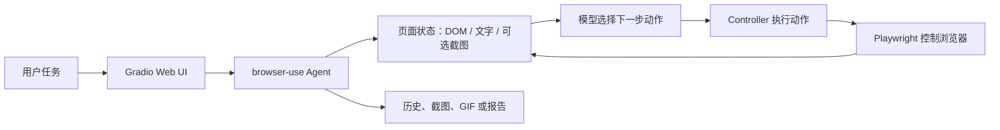

# 002 · Browser Use Web UI：让 AI 在浏览器里完成网页任务

> 研究对象是 [browser-use/web-ui](https://github.com/browser-use/web-ui)，不是底层的 [browser-use/browser-use](https://github.com/browser-use/browser-use)。本文依据公开 README 和源码核对能力；配套网页是教学模拟，没有连接真实浏览器或模型。

| 项目 | 内容 |
| --- | --- |
| 原仓库 | [browser-use/web-ui](https://github.com/browser-use/web-ui) |
| 底层项目 | [browser-use/browser-use](https://github.com/browser-use/browser-use) |
| 维护方与署名 | Browser Use Inc. 及仓库贡献者；原仓库 README 特别感谢 [WarmShao](https://github.com/warmshao) |
| 原项目许可证 | [MIT](https://github.com/browser-use/web-ui/blob/main/LICENSE)，Copyright © 2024 Browser Use Inc. |
| 研究日期 | 2026-09-26 |
| 研究状态 | 已核对公开文档、依赖和关键源码；尚未安装运行 Web UI |
| 概念展示 | [打开静态交互页](../../sites/002-browser-use-web-ui/index.html)（不执行真实网页任务） |

## 我们的理解总览图

图片说明：这是本研究项目依据[原仓库 README](https://github.com/browser-use/web-ui/blob/main/README.md)和下文引用的关键源码绘制的概念图。它总结的是代码与文档支持的工作方式，不是原产品运行截图，也不代表已经实测任务成功率。图片另有可放大的 [SVG 版本](assets/understanding-map.svg)。

## 五个问题的摘要

- **能力是什么：**给自然语言网页任务提供配置、运行、过程查看与控制入口。浏览器操作能力由底层 `browser-use` 代理和浏览器控制层提供。
- **原理是什么：**代理读取已加载页面的状态，模型选择动作，Controller 交给浏览器执行，再读取新页面状态，循环推进任务。
- **模块有什么效果：**Agent Settings 决定模型与代理策略；Browser Settings 决定运行现场；Run Agent 执行并展示步骤；Deep Research 组织资料搜索与报告；Load & Save Config 复用设置；Controller/MCP 用于开发扩展。
- **场景是什么：**网页资料初探、测试环境中的表单与后台流程、重复检查、代理教学与评测。
- **对我的意义：**它可作为本研究集的资料收集辅助和代理机制样本；最值得延伸的是把来源证据、任务验收与人工确认串成可追溯流程。

## 一分钟看懂：谁在操作浏览器

**Web UI 是控制台，`browser-use` 是代理引擎，浏览器是执行现场。**你在 Web UI 输入“打开某个 GitHub 仓库，找到许可证并给出链接”；它把任务交给配置好的模型与 `browser-use` Agent。Agent 读取当前网页状态、选择下一步操作，Controller 借助浏览器自动化执行点击、输入或跳转，随后读取新状态，重复直到结束。[原项目说明](https://github.com/browser-use/web-ui/blob/main/README.md)、[任务执行入口](https://github.com/browser-use/web-ui/blob/main/src/webui/components/browser_use_agent_tab.py)

因此，**可视化只是 Web UI 的一部分价值**。它还提供任务入口、模型与浏览器配置、暂停控制和执行留痕；真正让 AI 能连续操作网页的能力来自底层代理与浏览器控制层。

它分析的主要是**已加载网页的 DOM、可交互元素、文字和可选截图**。这不同于获取并审查整个 React/Vue 工程的源代码；网站后端实现也不会因此向代理开放。项目的浏览器封装使用 Playwright，控制器登记网页动作并执行模型选定的动作。[浏览器封装](https://github.com/browser-use/web-ui/blob/main/src/browser/custom_browser.py)、[控制器](https://github.com/browser-use/web-ui/blob/main/src/controller/custom_controller.py)

## 能力地图

| 能力 | 用户可以做什么 | 来自哪里、有什么边界 |
| --- | --- | --- |
| 自然语言网页任务 | 描述目标，让 Agent 浏览、搜索、点击、输入、提取页面信息 | 核心网页操作由 `browser-use` 提供；能否完成取决于网站、模型和任务复杂度。[Agent 调用](https://github.com/browser-use/web-ui/blob/main/src/webui/components/browser_use_agent_tab.py) |
| 模型与代理设置 | 选择模型提供方、模型、提示词、步数、视觉模式和可选规划模型 | Web UI 将这些参数传给 Agent；支持的提供方以项目 README 和当前配置代码为准。[README](https://github.com/browser-use/web-ui/blob/main/README.md)、[设置读取](https://github.com/browser-use/web-ui/blob/main/src/webui/components/browser_use_agent_tab.py) |
| 浏览器与会话 | 启动浏览器、连接已有浏览器或远程 CDP/WSS、保留会话、设置无头模式 | 使用自己的浏览器配置可复用登录状态，也意味着代理可能接触该配置中的账号页面。[README](https://github.com/browser-use/web-ui/blob/main/README.md)、[浏览器初始化](https://github.com/browser-use/web-ui/blob/main/src/webui/components/browser_use_agent_tab.py) |
| 过程查看与控制 | 查看逐步截图和动作、暂停/继续/停止，保存 JSON 历史与 GIF；可配置录制和 trace | 这些是过程记录，不能单独证明任务结果正确。[执行与导出](https://github.com/browser-use/web-ui/blob/main/src/webui/components/browser_use_agent_tab.py) |
| Deep Research | 生成研究计划、并行浏览搜索、汇总 Markdown 报告，支持根据任务记录恢复 | 研究结果需要逐条追溯来源；当前汇总代码没有可靠地产生参考文献列表。[研究代理](https://github.com/browser-use/web-ui/blob/main/src/agent/deep_research/deep_research_agent.py) |
| 工具扩展 | 在 Controller 中增加动作，或把 MCP 服务工具注册为代理动作 | 接入外部工具后需明确它们可读取和修改的范围。[MCP 注册代码](https://github.com/browser-use/web-ui/blob/main/src/controller/custom_controller.py) |

### 界面功能模块与实际效果

| 模块 | 用户看到的效果 | 关键实现依据 |
| --- | --- | --- |
| Agent Settings | 设置模型、提示词、视觉与规划选项、最大步数等，控制代理如何处理任务 | [界面定义](https://github.com/browser-use/web-ui/blob/main/src/webui/interface.py)、[运行参数读取](https://github.com/browser-use/web-ui/blob/main/src/webui/components/browser_use_agent_tab.py) |
| Browser Settings | 选择本地或远程浏览器、会话、无头模式和录制，决定任务在哪个浏览器环境执行 | [界面定义](https://github.com/browser-use/web-ui/blob/main/src/webui/interface.py)、[浏览器初始化](https://github.com/browser-use/web-ui/blob/main/src/webui/components/browser_use_agent_tab.py) |
| Run Agent | 输入任务，观看截图和动作，暂停、继续或停止，导出历史等过程记录 | [任务页面](https://github.com/browser-use/web-ui/blob/main/src/webui/components/browser_use_agent_tab.py) |
| Deep Research | 制订研究计划、并行浏览搜索、汇总 Markdown 报告；结论需要核对原始来源 | [研究代理](https://github.com/browser-use/web-ui/blob/main/src/agent/deep_research/deep_research_agent.py) |
| Load & Save Config | 保存和载入表单设置，便于复用配置；分享配置前需检查敏感内容 | [配置管理](https://github.com/browser-use/web-ui/blob/main/src/webui/webui_manager.py) |
| Custom Controller / MCP | 开发者注册额外动作或工具，让代理参与更大的流程 | [控制器代码](https://github.com/browser-use/web-ui/blob/main/src/controller/custom_controller.py) |

## 技术原理：一个反复观察和执行的循环

1. **界面层：**`webui.py` 启动 Gradio；`interface.py` 组织模型设置、浏览器设置、任务运行、Deep Research 和配置保存页面。[启动代码](https://github.com/browser-use/web-ui/blob/main/webui.py)、[界面代码](https://github.com/browser-use/web-ui/blob/main/src/webui/interface.py)
2. **代理层：**任务页面构造 `BrowserUseAgent`，传入模型、浏览器上下文、Controller、视觉与步数设置；代理在每一步处理页面状态、模型输出和动作结果。[任务运行代码](https://github.com/browser-use/web-ui/blob/main/src/webui/components/browser_use_agent_tab.py)、[Agent 封装](https://github.com/browser-use/web-ui/blob/main/src/agent/browser_use/browser_use_agent.py)
3. **执行层：**`CustomBrowser` 建立 Playwright 浏览器上下文；`CustomController` 把模型选择的动作映射到网页操作，并可登记额外动作和 MCP 工具。[浏览器代码](https://github.com/browser-use/web-ui/blob/main/src/browser/custom_browser.py)、[控制器代码](https://github.com/browser-use/web-ui/blob/main/src/controller/custom_controller.py)
4. **研究层：**Deep Research 使用 LangGraph 组织计划、浏览搜索与报告合成；并行浏览只是其中一种研究工具。[研究代理代码](https://github.com/browser-use/web-ui/blob/main/src/agent/deep_research/deep_research_agent.py)

**版本边界：**当前 `requirements.txt` 固定 `browser-use==0.1.48`、`gradio==5.27.0`。上图描述的是这个仓库的代码链路，不能把底层项目新版本的全部能力直接算进本 Web UI。[依赖清单](https://github.com/browser-use/web-ui/blob/main/requirements.txt)

## 使用场景

| 场景 | 适合用它做什么 | 需要核对什么 |
| --- | --- | --- |
| 网页代理学习与演示 | 观察模型如何逐步看页面、选动作和处理失败 | 操作轨迹与最终目标是否一致 |
| 临时网页资料收集 | 在多个页面寻找标题、链接、许可证或联系信息 | 页面是否权威、信息是否最新、引用 URL 是否准确 |
| 没有 API 的后台操作 | 在受控账号和测试环境中填写表单、查找记录 | 账号权限、写入前确认、任务失败后的状态 |
| 研究主题初探 | 用 Deep Research 生成问题清单和资料线索 | 每个结论的原始来源，尤其是报告中的归纳 |
| 模型与提示词对比 | 对同一任务重复运行，比较完成情况与步骤 | 使用相同任务、账号状态和判定标准 |

它不适合作为无需核对的事实来源，也不宜直接用个人常用浏览器配置执行有付款、删除、发布等不可逆后果的任务。网页内容会变化，模型也可能误读元素或受到页面文本干扰。这里是基于工作机制提出的使用边界，**不是本次实测的失败率结论**。

## 可扩展方向：研究建议，不是现成功能

1. **来源可追溯的研究结果。**保存“结论 → 原网页 URL → 页面标题 → 抓取时间 → 证据片段”，在报告合成时强制输出可核对的引用。当前汇总代码将 `references` 初始化为空，且提示词明确移除了引用部分；这是本研究仓库最值得补的缺口。[汇总代码](https://github.com/browser-use/web-ui/blob/main/src/agent/deep_research/deep_research_agent.py)
2. **任务模板与验收。**把“核对仓库许可证”“寻找官方图片来源”等变成固定模板，每次执行后再检查目标字段和原始页面，避免只凭 Agent 宣称完成。
3. **风险动作确认。**对提交表单、付款、删除和公开发布增加动作前预览与人工确认，并为浏览器配置设置最小权限。
4. **可复现评测。**建立一组固定网页任务，记录成功率、步骤数、耗时、模型成本、人工接管次数与网页变化带来的失败。
5. **维护与部署。**评估从固定旧版依赖升级的工作量；若多人使用，增加会话隔离、鉴权和密钥保护。当前配置保存代码会将表单设置写入 JSON 文件，部署前需要审查其中是否包含密钥。[依赖清单](https://github.com/browser-use/web-ui/blob/main/requirements.txt)、[配置保存代码](https://github.com/browser-use/web-ui/blob/main/src/webui/webui_manager.py)

## 对这个研究仓库的意义

它提供了一个很具体的研究对象：**AI 如何从自然语言目标走到可见的网页动作**。和 001 的数据库工作台案例相比，这里要重点区分的是“界面、代理引擎、模型、浏览器”四个角色，以及“模型说完成了”和“页面上确实完成了”之间的证据链。

对以后新增研究条目，它也可以成为辅助收集工具：查原仓库、许可证、官方文档和图片出处，再由人逐项核实并写进项目 README。最有价值的延伸项目，是把这一过程做成**带出处和验收记录的研究工作流**，而不只是再做一个聊天窗口。

建议的首轮实测任务是：① 找出一个仓库的许可证并附官方文件链接；② 在两个官方页面之间核对一项功能声明；③ 找到一张官方图片及其来源。每项都保存原始 URL、代理输出和人工核对结果，之后再报告真实完成率。

## 本次实际核对与待验证项

| 项目 | 本次结果 |
| --- | --- |
| 定位与能力 | 阅读官方 README，确认 Web UI 基于 Gradio，底层依赖 `browser-use`，支持自选模型和浏览器会话 |
| 实现路径 | 查看任务页面、Agent、Controller、浏览器封装和 Deep Research 代码，绘制上述概念链路 |
| 图片 | 下载并目视检查原 README 的官方标识，确认它是标识而非运行截图 |
| 许可与依赖 | 核对 MIT 许可证、固定依赖版本和配置保存逻辑 |
| 尚未执行 | 未安装依赖、未配置模型、未启动真实 Agent；不报告任务成功率、速度或对网站的兼容性 |

## 图片、来源与许可

图片说明：这是原仓库 README 顶部使用的[官方 Web UI 标识](https://github.com/browser-use/web-ui/blob/main/assets/web-ui.png)，不是产品运行截图。图片由 Browser Use 项目提供，未见独立于仓库许可证的图片许可说明；此处仅作署名研究引用。

- 原项目：[browser-use/web-ui](https://github.com/browser-use/web-ui)；底层项目：[browser-use/browser-use](https://github.com/browser-use/browser-use)。两者的代码和商标归相应权利人及贡献者所有。
- 软件许可：原仓库 [MIT LICENSE](https://github.com/browser-use/web-ui/blob/main/LICENSE)。若复用源码，应保留原版权与许可声明。
- 本地 `assets/official-web-ui.png` 来自[原仓库 `assets/web-ui.png`](https://github.com/browser-use/web-ui/blob/main/assets/web-ui.png)。画面是黑色标识及“Web UI”字样；原仓库未为该图片单列许可。
- 本地 `assets/understanding-map.svg` 与 `assets/understanding-map.png` 是同一张由本研究项目绘制的总览图，汇总本文对能力、技术原理、场景、研究价值和边界的分析；原项目并未提供这张图。
- 本项目文字、概念图与[静态交互页](../../sites/002-browser-use-web-ui/index.html)由此研究仓库编写。交互页使用虚构任务步骤，不含原项目代码或真实执行结果。
