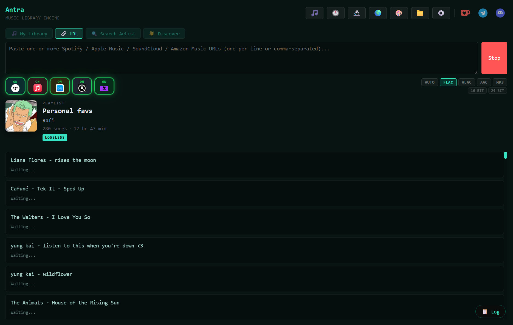
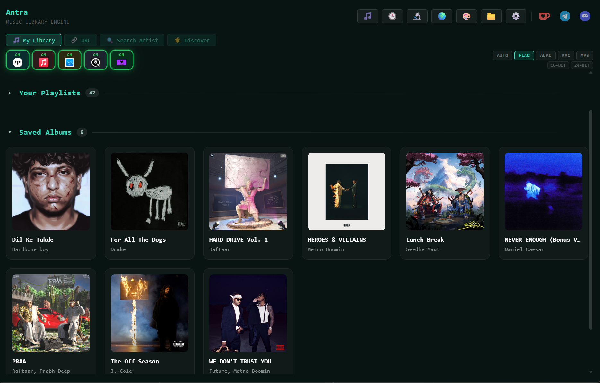

# 003 · Antra：从音乐链接构建本地曲库

> 本研究基于 Antra 的公开文档、许可证与关键源码。这里把“官方功能声明”“源码可核对的机制”和“尚未实测的效果”分开记录；配套网页是概念演示，不会连接音源或下载音乐。

| 项目 | 内容 |
| --- | --- |
| 原仓库 | [anandprtp/Antra](https://github.com/anandprtp/Antra) |
| 作者与归属 | 仓库署名 Hoshiyaar Singh；Antra 软件、名称及官方图片归原权利人 |
| 核对版本 | [`07aeef1`](https://github.com/anandprtp/Antra/tree/07aeef19966d8e2b72ed53f53442596e8a53255c)（2026-09-26 读取的 `main`） |
| 原项目许可证 | [Elastic License 2.0](https://github.com/anandprtp/Antra/blob/07aeef19966d8e2b72ed53f53442596e8a53255c/LICENSE) |
| 研究状态 | 已核对公开说明与关键实现；尚未安装或进行真实下载 |
| 本地展示 | [能力概念页](../../sites/003-antra/index.html)（静态模拟，未发布） |

图片说明：本研究依据 Antra 官方说明与关键源码绘制的能力总图，展示入口、模块、出口及验证边界；它不是官方架构图或运行结果。[放大查看 SVG](../../sites/003-antra/assets/capability-map.svg)。

## 研究摘要

- **能力是什么：** Antra 是桌面音乐曲库工具，将多平台歌曲、专辑、歌单与已连接账号中的目标转成带元数据的本地音频文件；内置播放器和分析器用于使用与检查结果。
- **原理是什么：** 先统一不同平台的曲目信息，再通过音源适配器和解析器按 ISRC、标题及艺人等信息匹配候选；下载引擎校验文件，打标和目录模块完成归档。
- **模块与出入口：** 入口包括音乐链接、在线曲库、格式与音源策略，以及本地音频和播客旁路；核心模块是链接解析、曲目模型、音源解析、下载校验、标签与曲库；出口是本地文件、可浏览播放的曲库及任务状态。
- **场景与意义：** 可用于经授权建立个人曲库、维护更新歌单，也可作为研究多源数据一致化、适配器、身份匹配与可追溯交付的案例。
- **验证边界：** 已核对官方说明、许可证和关键源码，尚未安装或实测下载；音源可用性、取得权限、音质与标签完整度需逐项验证。

## 一分钟理解：它是什么

Antra 的主要任务是**建立本地音乐文件库**：把流媒体链接解析成歌曲或歌单信息，在可用音源中匹配相应录音，取得文件后校验、补充标签和歌词，再按歌手、专辑与曲目存放。它也提供内置播放器，但播放器是曲库建成后的使用入口之一。[项目 README](https://github.com/anandprtp/Antra/blob/07aeef19966d8e2b72ed53f53442596e8a53255c/README.md)、[功能说明](https://github.com/anandprtp/Antra/blob/07aeef19966d8e2b72ed53f53442596e8a53255c/FEATURES.md)

一条 Spotify 或 YouTube Music 链接可以告诉 Antra“要找哪首歌”，**不代表音频一定来自该链接所属的平台**。产品说明列出 Tidal、Qobuz、Amazon Music、Deezer、Apple Music 相关音源、镜像与 Soulseek 回退。能否取得某首歌及其质量，取决于实际音源、账号、地区、服务状态和请求模式。[功能说明：音源链](https://github.com/anandprtp/Antra/blob/07aeef19966d8e2b72ed53f53442596e8a53255c/FEATURES.md#multi-source-audio-engine)

图片说明：原项目仓库的 [v1.1.7 官方应用截图](https://github.com/anandprtp/Antra/blob/main/assets/screenshots/ss_1_v117.png)，展示 URL 输入、音源状态、FLAC 等格式选择以及歌单处理列表。这是原项目画面，不是本研究的运行结果。截图中可能包含第三方专辑封面；仓库未为此截图单独标明图片许可，本项目仅作署名研究引用。

## 能力地图

一张[完整能力地图](../../sites/003-antra/assets/capability-map.svg)（[PNG 版](../../sites/003-antra/assets/capability-map.png)）串起入口、内部模块、出口、预期效果、研究价值和边界。下表汇总[官方功能说明](https://github.com/anandprtp/Antra/blob/07aeef19966d8e2b72ed53f53442596e8a53255c/FEATURES.md)和本次源码核对。它描述功能边界，不报告成功率。

| 能力 | 用户能做什么 | 依赖与边界 |
| --- | --- | --- |
| 多平台链接入口 | 输入歌曲、专辑、歌单或艺人链接，展开曲目清单 | 链接负责识别目标；各平台可解析的信息不同，音频需另找可用来源 |
| 已连接的在线曲库 | 浏览已连接 Spotify / Apple Music 账号中的喜欢歌曲、歌单、专辑等目标 | 依赖账号会话；浏览在线目标不等于统一管理远端音频文件 |
| 多音源检索 | 自动检索或限定 Tidal、Qobuz 等指定音源 | 镜像、代理、账号、限流或地区条件会影响可用性；“支持音源”不等于每首歌都能取得 |
| 录音匹配 | 优先用 ISRC，缺失时用标题、艺人、时长等信息筛选 | 同一录音可能出现在不同发行版；相似度匹配仍可能误判 |
| 格式与质量选择 | 选择 FLAC、ALAC、AAC、MP3 等输出，优先寻找符合偏好的来源 | 改扩展名或转码不会提高源音频的真实质量；无损模式可能因找不到无损来源而失败 |
| 曲库整理 | 写入标题、艺人、专辑、封面、歌词等，按目录模板归档并去重 | 元数据依赖上游；源码中写标签失败会记录警告，不能据此保证每个成功文件都已完整打标 |
| 批量与同步 | 并行处理歌单歌曲，按计划同步歌单新增曲目，重试失败项 | 请求速度仍受音源限制；同步依赖平台账号或会话及原歌单状态 |
| 查看与分析 | 浏览本地曲库、播放文件、查看歌词与音频分析图 | 频谱和截止频率是质量线索，不能单独证明某文件的录制与母带来源 |
| 播客旁路 | 使用 Spotify 会话处理播客单集或节目，输出 OGG 文件 | 这是有独立账号要求和输出的路径，不经过常规音乐跨源匹配链 |

自动打标与去重的声明见[功能说明](https://github.com/anandprtp/Antra/blob/07aeef19966d8e2b72ed53f53442596e8a53255c/FEATURES.md#auto-tagging)；标签失败仍可标记为完成的分支见[下载引擎](https://github.com/anandprtp/Antra/blob/07aeef19966d8e2b72ed53f53442596e8a53255c/antra/core/engine.py)。

图片说明：[原仓库 v1.1.7 截图 2](https://github.com/anandprtp/Antra/blob/main/assets/screenshots/ss_2_v117.png)展示“My Library”歌单与已存专辑视图。画面归原项目及其中专辑封面的相应权利人；它仅说明官方界面的呈现方式，不证明本研究已连接账号或取得这些专辑。

## 技术原理：识别目标、寻找音源、整理文件

[完整能力地图](../../sites/003-antra/assets/capability-map.svg)负责全貌；[内部技术架构详图](../../sites/003-antra/assets/architecture.svg)（[PNG 版](../../sites/003-antra/assets/architecture.png)）进一步标出桌面层、Python 处理链、外部音源与本地输出。两图由本研究依据官方说明与下述源码绘制，表示模块职责和数据流，不是运行追踪结果。

1. **界面与通信。**桌面外壳为 Go/Wails，前端为 Svelte/TypeScript，核心下载引擎为 Python。Go 启动后端进程并将其逐行 JSON 输出转发为界面事件。“一个安装包”表示运行时被打包，并不表示实现中没有 Python。[技术栈](https://github.com/anandprtp/Antra/blob/07aeef19966d8e2b72ed53f53442596e8a53255c/FEATURES.md#tech-stack)、[进程事件处理](https://github.com/anandprtp/Antra/blob/07aeef19966d8e2b72ed53f53442596e8a53255c/antra-wails/app_backend.go)
2. **音源适配。**各音源实现统一的 `is_available()`、`search()`、`download()` 接口；解析器根据输出格式、音源优先级、匹配分数、ISRC、质量信息和限流状态选择候选。[适配器接口](https://github.com/anandprtp/Antra/blob/07aeef19966d8e2b72ed53f53442596e8a53255c/antra/sources/base.py)、[解析器](https://github.com/anandprtp/Antra/blob/07aeef19966d8e2b72ed53f53442596e8a53255c/antra/core/resolver.py)
3. **交付校验。**下载引擎检查文件可读性、容器与时长，发现截断、预览片段或声明质量与实际文件不符时尝试下一来源；随后补充元数据、写标签并记录到曲库。[下载引擎](https://github.com/anandprtp/Antra/blob/07aeef19966d8e2b72ed53f53442596e8a53255c/antra/core/engine.py)

**并行性的准确范围：**`resolver.resolve()` 对单首歌按适配器列表逐个检索；`download_playlist()` 用线程池同时处理多首歌，并可预先解析后续曲目。因此官方“并行查询音源”的描述需要结合代码理解，不能当作单首歌同时请求全部来源。[解析器循环](https://github.com/anandprtp/Antra/blob/07aeef19966d8e2b72ed53f53442596e8a53255c/antra/core/resolver.py)、[歌单线程池](https://github.com/anandprtp/Antra/blob/07aeef19966d8e2b72ed53f53442596e8a53255c/antra/core/engine.py)

## 关键研究发现

1. **跨平台链接与音源是两层。**这解释了为什么粘贴 Spotify 链接也可能检索到其他平台的音频；它适合研究“目标识别与内容取得分离”的架构。[功能说明](https://github.com/anandprtp/Antra/blob/07aeef19966d8e2b72ed53f53442596e8a53255c/FEATURES.md#multi-source-audio-engine)
2. **ISRC 提升录音匹配，但不保证同一发行版。**Antra 文档用“保证精确到发行版”描述 ISRC；[国际 ISRC 登记机构](https://isrc.ifpi.org/faqs)明确它识别录音，不识别包含录音的产品或发行版。若要研究原版专辑、再版与曲目顺序，还应结合 UPC/EAN、平台专辑 ID 等信息。
3. **质量选择有明确的失败路径。**无损模式可以拒绝有损候选；下载后还会校验文件。因而“选择 FLAC”是一项约束，不能保证任意曲目都有真实无损版本。[解析器](https://github.com/anandprtp/Antra/blob/07aeef19966d8e2b72ed53f53442596e8a53255c/antra/core/resolver.py)、[下载引擎](https://github.com/anandprtp/Antra/blob/07aeef19966d8e2b72ed53f53442596e8a53255c/antra/core/engine.py)
4. **完整打标不能仅凭完成提示判断。**源码在 `tagger.tag()` 返回失败时记录警告，随后仍执行 `mark_downloaded()`。实测时应抽检文件中的标签，而不只看界面的完成数量。[下载引擎](https://github.com/anandprtp/Antra/blob/07aeef19966d8e2b72ed53f53442596e8a53255c/antra/core/engine.py)

## 使用场景与可扩展方向

| 场景 | 价值 | 应核对 |
| --- | --- | --- |
| 经授权建立个人本地曲库 | 将多平台歌单整理成可供本地播放器或媒体服务器读取的文件 | 音频取得与保存权限、实际来源、文件质量和标签 |
| 维护频繁更新的歌单 | 定时比较并补充新曲目 | 账号会话、同步差异、失效音源和重复版本 |
| 研究多源解析系统 | 观察适配器、质量排序、限流与回退策略如何组合 | 文档声明与源码、真实可用性是否一致 |

可继续研究或扩展的方向，**不是已验证的 Antra 能力**：

1. **录音与发行版双层身份。**用 ISRC 标识录音，同时保存平台曲目 ID、专辑 ID、UPC/EAN、碟号与发行日期，避免去重时丢掉专辑语境。
2. **交付可追溯。**为每个文件记录输入链接、实际音源、匹配依据、检测到的编解码与位深、标签写入结果和失败链。
3. **更可靠的质量评估。**除容器和频谱启发式之外，加入解码校验、同曲音频指纹与抽样人工听检；明确每项检测能证明什么。
4. **可复现的端到端测试。**准备少量有权测试的歌曲，覆盖同名歌、现场版、洁净版、多碟专辑、无损缺失和限流；记录匹配正确率、完成率、标签完整率与耗时。

对本研究仓库来说，Antra 能补充一个**多源数字内容匹配与归档**案例，与 001 的数据库连接器、002 的网页代理执行链形成不同类型的适配器研究。首轮实测最值得回答的是：输入链接识别是否正确、最终音频是否对应目标录音、文件质量和标签是否与界面声明一致。

## 本次核对与尚未验证

| 项目 | 本次结果 |
| --- | --- |
| 功能与定位 | 阅读原仓库 README、FEATURES 和官方截图；区分链接入口、音源、曲库与播放器 |
| 实现路径 | 核对音源接口、单曲解析器、下载校验、歌单线程池和桌面后端事件转发 |
| 许可 | 核对仓库 `LICENSE` 为 Elastic License 2.0，及其托管服务、许可证密钥限制 |
| 图片 | 下载并目视检查原仓库两张 v1.1.7 截图；本页封面对应官方 URL 输入页 |
| 未执行 | 未安装 Antra，未登录平台或下载音频；不报告下载成功率、音质或平台兼容性实测结论 |

## 来源、署名与许可

- 原项目：[anandprtp/Antra](https://github.com/anandprtp/Antra)。仓库 README 署名 Hoshiyaar Singh；本项目的研究文字与概念图由此研究仓库编写。
- 功能声明：[README](https://github.com/anandprtp/Antra/blob/07aeef19966d8e2b72ed53f53442596e8a53255c/README.md)、[FEATURES.md](https://github.com/anandprtp/Antra/blob/07aeef19966d8e2b72ed53f53442596e8a53255c/FEATURES.md)。机制依据：[适配器](https://github.com/anandprtp/Antra/blob/07aeef19966d8e2b72ed53f53442596e8a53255c/antra/sources/base.py)、[解析器](https://github.com/anandprtp/Antra/blob/07aeef19966d8e2b72ed53f53442596e8a53255c/antra/core/resolver.py)、[下载引擎](https://github.com/anandprtp/Antra/blob/07aeef19966d8e2b72ed53f53442596e8a53255c/antra/core/engine.py)。
- 图片：`assets/official-main-v117.png` 来自[官方截图 1](https://github.com/anandprtp/Antra/blob/main/assets/screenshots/ss_1_v117.png)；`assets/official-secondary-v117.png` 来自[官方截图 2](https://github.com/anandprtp/Antra/blob/main/assets/screenshots/ss_2_v117.png)，展示“My Library”中的已存专辑。两张图片归原权利人及其中素材的相应权利人；原仓库未单列图片许可。网页中的 `capability-map.svg`、`architecture.svg` 及其 PNG 导出为本研究自绘，依据上列说明与源码。
- 软件许可：[原仓库 Elastic License 2.0](https://github.com/anandprtp/Antra/blob/07aeef19966d8e2b72ed53f53442596e8a53255c/LICENSE)允许在条件下使用、复制、分发和改作，但限制以托管服务向第三方提供其主要功能、绕过许可证密钥功能及移除许可声明。软件许可不授予第三方音乐内容的取得或传播权；原项目也要求用户自行确认授权与平台条款。[原项目免责声明](https://github.com/anandprtp/Antra/blob/07aeef19966d8e2b72ed53f53442596e8a53255c/README.md#disclaimer)
