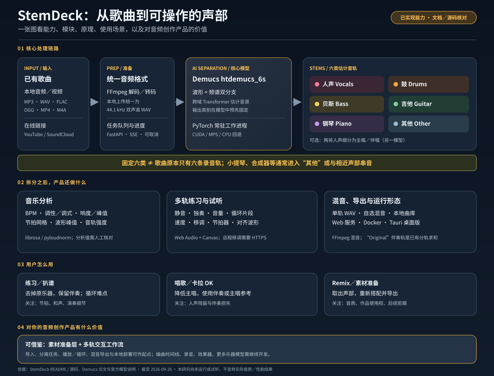
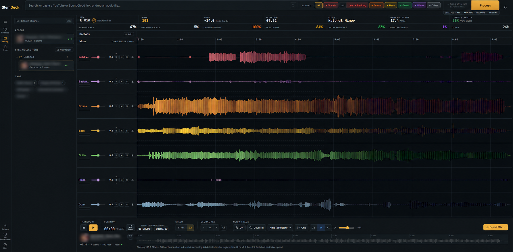

# 004 · StemDeck：把本地音源分离变成可操作的音乐工作台

> 研究对象：[stemdeckapp/stemdeck](https://github.com/stemdeckapp/stemdeck)。本文依据截至 2026-09-26 的公开 README、路线图与关键源码整理能力和使用场景；尚未安装软件、处理歌曲或测量分离质量。

| 项目 | 内容 |
| --- | --- |
| 原仓库 | [stemdeckapp/stemdeck](https://github.com/stemdeckapp/stemdeck) |
| 维护与署名 | StemDeck 项目作者及仓库贡献者；核心分离模型来自 Meta 的 [Demucs](https://github.com/facebookresearch/demucs) |
| 原项目许可证 | [Apache-2.0](https://github.com/stemdeckapp/stemdeck/blob/main/LICENSE)；第三方组件有各自许可证 |
| 研究日期 | 2026-09-26 |
| 研究状态 | 已核对公开资料、处理链路与截图；尚未运行和试听 |
| 在线能力展示 | [打开已发布网页](https://yydshly.github.io/0926_codex_project/sites/004-stemdeck/)（静态说明，不处理音频） |

## 能力全景图

图片说明：本研究依据下文引用的 StemDeck README、关键源码与 Demucs 论文绘制。图中的处理链路与功能来自公开资料核对；使用场景与产品价值是分析，不是运行测试结论。可[打开 PNG 版本](assets/capability-map.png)查看或分享。

## 官方界面

图片说明：这是 StemDeck 原仓库的[官方工作台截图](https://github.com/stemdeckapp/stemdeck/blob/ed8caa0114ab071fc9cb2478427829cc7d06931d/imgs/screenshot/stemdeck.png)，展示曲库、分轨波形、混音控制与底部播放工具。图片由 StemDeck 项目提供；仓库未为该截图单列图片许可，本项目仅作署名研究引用。画面中的歌曲数据来自原截图，不是本项目的运行或测试结果。

## 一分钟看懂

StemDeck 接收一段已经混合好的音乐，用 AI 估计出**人声、鼓、贝斯、吉他、钢琴、其他声音**六条音轨，再把它们放进可试听、循环、调音量和导出的工作台。它提供本地桌面应用、Web 服务及容器部署方式，面向练习、扒谱、卡拉 OK 和创作准备。[官方 README](https://github.com/stemdeckapp/stemdeck/blob/main/README.md)

要分清两个角色：**Demucs 是分离模型，StemDeck 是围绕模型的产品工程。**六条音轨是模型对混合音频的估计，并非找回录音室保存的原始分轨。StemDeck 的附加价值是导入格式兼容、任务管理、音频分析、播放器、曲库和导出流程。[Demucs 论文](https://arxiv.org/abs/2211.08553)、[处理入口](https://github.com/stemdeckapp/stemdeck/blob/main/app/pipeline/runner.py)

## 能力展示与边界

| 能力 | 用户实际能做什么 | 实现依据与边界 |
| --- | --- | --- |
| 导入 | 拖入 MP3、WAV、FLAC、OGG/Opus、MP4、M4A，或粘贴 YouTube 链接；路线图也记录了 SoundCloud 导入 | 本地文件会先由 FFmpeg 转为统一音频格式。在线链接需要网络，且应确保自己有权处理内容。[README](https://github.com/stemdeckapp/stemdeck/blob/main/README.md)、[导入代码](https://github.com/stemdeckapp/stemdeck/blob/main/app/pipeline/download.py) |
| 六轨分离 | 取得 vocals、drums、bass、guitar、piano、other 音轨；可选择要保留的音轨并下载混音 | 默认模型为 Demucs 的 htdemucs_6s。勾选音轨主要影响后处理与混音，后台仍先进行完整六轨分离，不代表只算一轨就会更快。[分离工作进程](https://github.com/stemdeckapp/stemdeck/blob/main/app/pipeline/demucs_worker.py)、[任务接口](https://github.com/stemdeckapp/stemdeck/blob/main/app/api/jobs.py) |
| 人声细分 | 在六轨分离后，按需再拆主唱和伴唱 | 这是另外的可选模型处理，不等同于默认六轨模型本身。[技术说明](https://github.com/stemdeckapp/stemdeck/blob/main/README.md#technologies) |
| 音乐分析 | 查看 BPM、调性、调式、响度、峰值，以及音轨强度等信息 | BPM 和调性由算法估计，不能把显示值当作人工校验的乐谱。响度是测量值，调性识别可能受编曲影响。[分析代码](https://github.com/stemdeckapp/stemdeck/blob/main/app/pipeline/analyze.py) |
| 多轨工作台 | 查看对齐波形，单轨静音、独奏、调音量，设置循环区间、播放速度、节拍器和移调 | 播放与混音依赖 Web Audio；移调使用 AudioWorklet，在非本机浏览器访问时需要 HTTPS 安全上下文。[README](https://github.com/stemdeckapp/stemdeck/blob/main/README.md#serving-other-devices-why-https-is-not-optional)、[播放引擎](https://github.com/stemdeckapp/stemdeck/blob/main/static/js/audioEngine.js) |
| 导出与曲库 | 导出单轨或选定混音，保存已处理歌曲并按文件夹管理 | 混音由 FFmpeg 合成；输出质量受模型分离质量制约。处理任务可排队，但重型分离工作一次只执行一个。[混音代码](https://github.com/stemdeckapp/stemdeck/blob/main/app/pipeline/collect.py)、[任务流程](https://github.com/stemdeckapp/stemdeck/blob/main/app/pipeline/runner.py) |

**不要把截图中的指标当成本次实测。**截图仅证明上游项目展示了这些界面与控制项；本研究尚未用自己的音频验证声音效果。

## 技术原理：从一首歌到可控制的音轨

1. **准备输入。**本地上传先用 FFmpeg 统一为 44.1 kHz、双声道、16 位 WAV；链接音频由 yt-dlp 获取。这样可减少不同格式给模型造成的解码问题。[本地预处理](https://github.com/stemdeckapp/stemdeck/blob/main/app/pipeline/runner.py)、[链接获取](https://github.com/stemdeckapp/stemdeck/blob/main/app/pipeline/download.py)
2. **估计音源。**Demucs 的 htdemucs_6s 同时处理时域波形与频域表示，以双分支网络及跨域注意力估计六个来源。StemDeck 在 Python 子进程中加载模型、分段推断，并复用已加载的工作进程；GPU 失败时可重试 CPU。[模型论文](https://arxiv.org/abs/2211.08553)、[工作进程](https://github.com/stemdeckapp/stemdeck/blob/main/app/pipeline/demucs_worker.py)、[设备回退](https://github.com/stemdeckapp/stemdeck/blob/main/app/pipeline/separate.py)
3. **分析与合成。**后端用 librosa 等库估计节拍和调性，计算响度；对未选音轨求和形成伴奏参考，对已选音轨用 FFmpeg 合成可下载混音。[分析代码](https://github.com/stemdeckapp/stemdeck/blob/main/app/pipeline/analyze.py)、[混音代码](https://github.com/stemdeckapp/stemdeck/blob/main/app/pipeline/collect.py)
4. **交互和打包。**FastAPI 提供任务与进度接口，浏览器端用 Web Audio 播放及混音、Canvas 绘制波形；Windows/macOS 桌面外壳使用 Tauri。一个重型任务占用一个处理槽，避免多个分离任务同时争夺 GPU 或 CPU。[技术栈与 API](https://github.com/stemdeckapp/stemdeck/blob/main/README.md#technologies)、[任务锁](https://github.com/stemdeckapp/stemdeck/blob/main/app/pipeline/runner.py)

这里的“本地”指音频分离在用户机器上执行，不需要把本地文件上传到 StemDeck 的云端；首次取得模型、通过在线链接导入及检查更新仍可能访问网络。[项目说明](https://github.com/stemdeckapp/stemdeck/blob/main/README.md)

## 使用场景汇总

| 场景 | 典型操作 | 产出与适用判断 |
| --- | --- | --- |
| 乐器跟练 | 降低或静音原吉他、鼓、贝斯轨，保留其他伴奏，循环难点 | 能听清自己的演奏与伴奏关系；分轨有串音时仍需以原曲为参照 |
| 扒谱与编曲学习 | 独奏某一音轨，减速、循环、观察波形与节拍 | 帮助听辨节奏和声部；BPM、调性和具体音符仍需人工核对 |
| 歌唱与卡拉 OK | 降低主唱、保留伴奏，必要时区分主唱与伴唱 | 可制作练习用伴奏；人声残留和伴奏损失随曲目而变 |
| 混音和短视频制作 | 导出鼓、贝斯、人声或自选混音，再导入自己的编辑软件 | 快速获得创作素材；不宜当作原始录音室分轨使用 |
| 私密录音的本地分析 | 在自己的设备上处理未公开的排练或创作录音 | 避免向第三方分轨服务上传原始音频；仍应管理好本机文件和备份 |
| 音频 AI 产品研究 | 对照模型、后端任务、Web Audio 和桌面打包的责任边界 | 适合研究“模型如何变成产品”，不适合直接当作新的分离算法论文 |

上述是依据功能推导出的**适用场景**，并非本次实际使用记录。在线音乐和视频的下载、处理与再发布须遵守来源平台条款及作品权利要求。[项目免责声明](https://github.com/stemdeckapp/stemdeck/blob/main/README.md#disclaimer)

## 质量、性能与维护边界

- **分离不保证干净。**Demucs 上游把六音源模型称为实验性模型，特别提醒钢琴音轨存在较多串音和伪影。复杂编曲、效果器或相近音色会增加听辨难度。[Demucs 官方说明](https://github.com/facebookresearch/demucs#readme)
- **速度依赖硬件。**GPU 通常更适合大量或较长歌曲；CPU 可以运行但可能很慢。只选择一个目标音轨也不会跳过其余音轨的模型推断。[StemDeck README](https://github.com/stemdeckapp/stemdeck/blob/main/README.md)、[任务接口](https://github.com/stemdeckapp/stemdeck/blob/main/app/api/jobs.py)
- **上游模型维护有限。**Meta 的 Demucs 仓库已归档，维护者另有分支，且表示只处理重要修复。长期扩展应考虑模型替换和依赖维护成本。[Demucs 仓库](https://github.com/facebookresearch/demucs)
- **文档存在版本差异。**StemDeck 路线图仍把移调列作后续计划，而当前 README、播放代码和官方截图已显示相关功能。本文以当前源码和截图确认“存在控制与实现”，不由此推断所有平台都已充分验证。[路线图](https://github.com/stemdeckapp/stemdeck/blob/main/ROADMAP.md)、[播放代码](https://github.com/stemdeckapp/stemdeck/blob/main/static/js/audioEngine.js)

## 可扩展方向：研究建议

1. **可替换模型与可复现评测。**设计统一的模型适配接口，用同一批获授权的歌曲比较人声、钢琴、吉他的串音、伪影、耗时、峰值内存与主观可用性。先测量再决定是否换模型。
2. **保存完整练习工作台。**恢复每首歌的循环区间、播放位置、速度、节拍器与移调状态；路线图也将工作台恢复列为后续工作。[路线图](https://github.com/stemdeckapp/stemdeck/blob/main/ROADMAP.md)
3. **面向 DAW 的交付。**增加批量导出、统一命名、元数据和工程文件对接；VST 插件也在原项目路线图中处于探索阶段，尚不能按已发布功能介绍。[路线图](https://github.com/stemdeckapp/stemdeck/blob/main/ROADMAP.md)
4. **练习辅助。**在现有循环和节拍器之上增加和弦、歌词时间轴、段落标记的人工校正流程。自动分析应保留可编辑性，避免把错误识别固化为“标准答案”。
5. **真正的实时分离。**若用于直播或现场演奏，需要低延迟模型与音频链路；现有离线 Demucs 流程并不能直接等同实时处理。

## 对本研究仓库的意义

StemDeck 可作为“**开源模型的本地产品化**”案例：从模型推理到格式处理、排队取消、GPU 回退、波形交互、桌面打包与许可说明，每一环都影响用户是否真的能用。与研究模型论文相比，本项目更值得拆解的是**端到端工作流**和“功能可用”与“输出好听”之间的差距。

下一轮实测可以准备 6–10 段自己有权使用、风格不同的音频，记录设备、曲长、处理时间、各轨串音与伪影、导出结果，再把实际发现补到本文。特别应包含钢琴密集、多人合唱和效果器较重的样本。目前本文不声称任何实测成功率或质量排名。

## 本次实际核对与待验证

| 项目 | 本次结果 |
| --- | --- |
| 项目定位与能力 | 阅读原仓库 README、路线图及 API 说明，整理六轨分离、工作台、分析和导出能力 |
| 技术路径 | 查看本地预处理、Demucs 工作进程、失败回退、分析、混音与任务接口代码 |
| 图片 | 获取并目视检查原仓库的真实工作台截图，确认有曲库、分轨波形与播放控制 |
| 许可 | 核对 StemDeck 的 Apache-2.0 许可证及项目对第三方组件许可的说明 |
| 尚未执行 | 未安装 StemDeck、未处理音频、未测 CPU/GPU 性能、未试听输出；静态展示页不执行真实分离 |

## 来源、署名与许可

- 原项目、功能说明和软件许可：[stemdeckapp/stemdeck](https://github.com/stemdeckapp/stemdeck)、[LICENSE](https://github.com/stemdeckapp/stemdeck/blob/main/LICENSE)。StemDeck 名称、界面及原软件归原作者和贡献者所有。
- 分离模型和原理：[Meta Demucs](https://github.com/facebookresearch/demucs)、[Hybrid Transformers for Music Source Separation](https://arxiv.org/abs/2211.08553)。Demucs 代码有自己的 [MIT 许可](https://github.com/facebookresearch/demucs/blob/main/LICENSE)；模型权重、其他依赖及发行打包应按各自条款核查。
- 本地图片：[assets/official-studio.png](assets/official-studio.png)，来自[原仓库截图，固定提交 ed8caa0](https://github.com/stemdeckapp/stemdeck/blob/ed8caa0114ab071fc9cb2478427829cc7d06931d/imgs/screenshot/stemdeck.png)。原仓库未单独标明截图许可；此处保留来源并仅作研究展示。
- 能力全景图：[SVG](assets/capability-map.svg) 与 [PNG](assets/capability-map.png) 由本研究仓库绘制，内容依据文中所列官方说明与源码；不包含实测数据。
- 本文能力归纳、使用场景、扩展建议与[静态展示页](../../sites/004-stemdeck/index.html)由本研究仓库编写。展示页不含音频处理；场景和建议属于分析，不代表原项目已实现或本次已验证。
