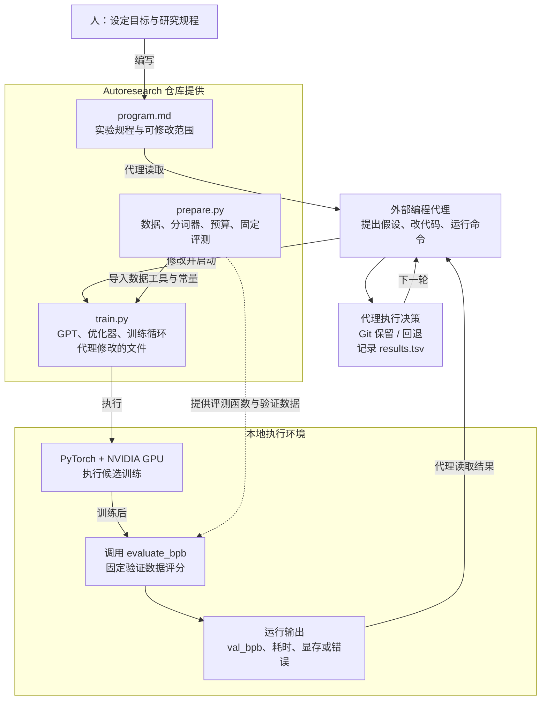

# Autoresearch 原生技术架构

2026-09-26 核对。[网页架构图](../../sites/005-autoresearch/understanding.html#architecture) · [矢量原图](../../sites/005-autoresearch/assets/autoresearch-architecture.svg) · [Mermaid 图源](assets/autoresearch-architecture.mmd)

## 核心判断

可以把 Autoresearch 理解为由外部 AI 代理执行、围绕真实实验反馈持续迭代的研究循环。源仓库提供具体训练实验、固定预算和评测，以及要求代理遵守的工作规程。循环执行与工具调用依赖外部编程代理。

它的意义在于把小语言模型研究整理为可执行、可比较、可追溯的最小实验：代理有可改的代码，有可运行的实验，有根据结果继续改进的规程。仓库自身没有独立的通用任务队列、模型 API 调度服务或网页控制台。

最新共同理解可概括为：**提出改法 → 修改程序 → 实际运行 → 评估结果 → 保留或回退 → 下一轮。**外层大模型负责分析与编辑，内层程序负责实际执行；源库中的内层执行包含模型训练。迁移到其他领域时，循环相对容易搭建，主要工作是任务、可修改范围与可信评估的建设。[网页核心理解](../../sites/005-autoresearch/understanding.html#consensus)

## 架构图

## 各部分由谁提供

| 部分 | 职责 | 归属与关系 |
| --- | --- | --- |
| 人 / 研究者 | 设置目标、规程、环境并启动代理 | 仓库外的使用者 |
| 编程代理 | 提出假设、改代码、运行终端、读取日志、执行决策 | 外部能力；源库不提供大模型自身 |
| program.md | 允许修改的范围、实验步骤、记录和保留／回退规则 | 仓库提供的指令文档，由人调整 |
| prepare.py | 数据准备、分词器、加载工具、时间预算常量和固定评测 | 仓库提供；规程要求实验期间不修改 |
| train.py | GPT、优化器、训练循环，调用评测并输出指标 | 仓库提供；代理修改的程序 |
| PyTorch / NVIDIA GPU | 实际执行候选训练、更新小模型权重 | 运行时依赖与硬件 |
| evaluate_bpb | 对固定验证文本计算 BPB | 在 prepare.py 中定义，由 train.py 在同一进程中调用 |
| Git / results.tsv | 关联代码版本、保留／回退、记录指标和状态 | 代理按规程操作，非独立结果管理服务 |

## 必须准确理解的几个细节

1. **循环由谁执行：**代理读取指令，连续使用编辑器、终端和 Git 等工具。单独运行 train.py 完成一轮训练与评测；它不会自行调用大模型反复修改自己。
2. **训练与推理：**外层编程模型提出代码改动；内层小语言模型在 GPU 上根据误差更新权重。两者职责不同。
3. **时间预算：**源库训练预算为 300 秒；训练实现跳过开始阶段的计时，启动、编译和最终验证另计。总体实验时间超过 300 秒。
4. **固定评测：**不修改 prepare.py 是代理规程中的约束。评测函数由训练进程调用，未提供独立隔离或不可篡改的评测服务。
5. **保留什么：**Git 保存代码版本；results.tsv 记录指标与决策。本次核对的默认 train.py 在结尾打印指标，没有自动保存模型检查点的步骤。自动交付权重需另行增加保存和复验。
6. **迁移需要什么：**扩展为其他软件或仿真任务，需要替换实验对象和评价标准，按需要增加数据治理、独立最终测试、预算控制及管理界面。本项目网页由我们另行制作，尚未接入上游自动研究。

## 来源与归属

- [karpathy/autoresearch README](https://github.com/karpathy/autoresearch)：项目范围、三文件结构、运行方式与许可。
- [program.md](https://github.com/karpathy/autoresearch/blob/master/program.md)：代理指令、Git 操作、results.tsv 与保留／撤销流程。
- [prepare.py](https://github.com/karpathy/autoresearch/blob/master/prepare.py)：TIME_BUDGET、数据准备和 evaluate_bpb。
- [train.py](https://github.com/karpathy/autoresearch/blob/master/train.py)：导入数据与评测工具，实际训练，最终评测与指标输出。

上游作者为 Andrej Karpathy 及贡献者，仓库声明 MIT。图为本研究项目依据源码独立绘制，未使用外部图片。依据核对日期的上游内容整理，未声明已固定某个提交或复跑训练。

## 页面检查与导出

已检查架构图文字边界、1440 / 768 / 390 像素页面宽度、图像加载、本地链接与锚点、键盘展开技术说明，以及原使用场景筛选。窄屏图在自身区域内横向滚动，页面无横向溢出。[检查记录](experiments/architecture-page-check.json)

[架构图 PNG](assets/autoresearch-architecture.png)由上面的矢量图在本机浏览器实际渲染导出；[桌面页面](assets/architecture-section-desktop.png)和[手机页面](assets/architecture-section-mobile.png)为接入后的实际截图，均不代表训练结果。
