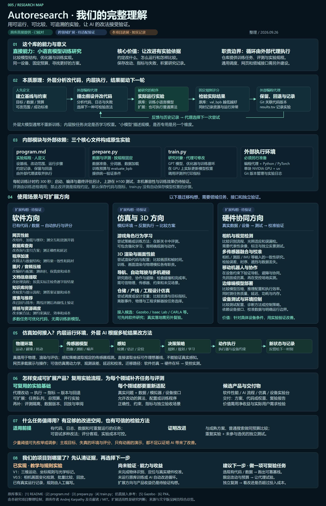
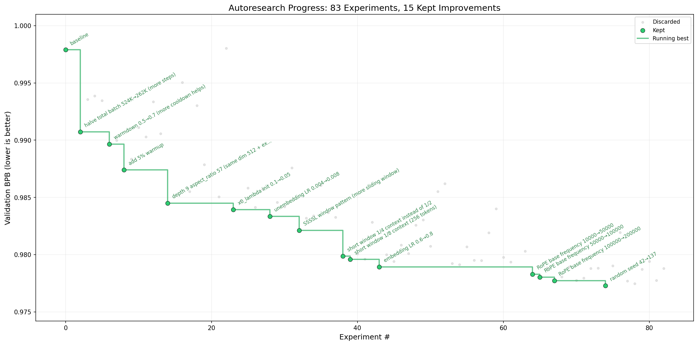
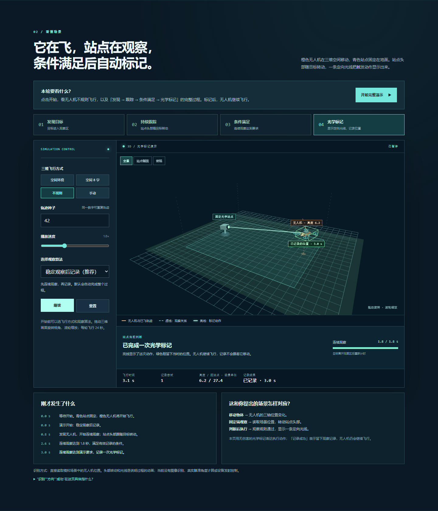

# 005 · Autoresearch：让代理用实验结果改进训练方案

> 研究对象：[karpathy/autoresearch](https://github.com/karpathy/autoresearch)。本文依据 2026-09-26 查看时的上游 README、`program.md`、`prepare.py` 和 `train.py` 整理；网页中的无人机仿真是本研究项目独立制作的教学迁移示例，并非上游功能。

| 项目 | 内容 |
| --- | --- |
| 原仓库 | [karpathy/autoresearch](https://github.com/karpathy/autoresearch) |
| 作者与归属 | Andrej Karpathy 及原仓库贡献者；训练代码简化自其 [nanochat](https://github.com/karpathy/nanochat) |
| 原项目许可证 | 上游 [README 的 License 节](https://github.com/karpathy/autoresearch#license)声明 MIT；图片使用说明见下文 |
| 研究日期 | 2026-09-26 |
| 研究状态 | 已阅读上游关键文件，并实际运行本项目的确定性网页仿真计算；未运行上游 GPU 训练 |
| 网页展示 | [完整总览与理解](https://yydshly.github.io/0926_codex_project/sites/005-autoresearch/understanding.html#overview) · [能力摘要与 V1 演示](https://yydshly.github.io/0926_codex_project/sites/005-autoresearch/) · [V0.5 空间观察实验台](https://yydshly.github.io/0926_codex_project/sites/005-autoresearch/workbench.html) |

## 研究摘要

- **库的能力：** 提供单 GPU 小语言模型训练实验，让外部编程代理比较模型结构、优化器和训练实现，在固定预算下寻找更好的训练方案。
- **实现原理：** `program.md` 规定实验规程；代理修改 `train.py` 并运行，`prepare.py` 提供数据与固定评测；代理依据结果保留或回退，记录版本和指标，再尝试下一轮。循环执行依赖外部代理。
- **使用场景：** 原库直接用于训练研究。软件性能、文档与 AI 流程、仿真导航和硬件测试等是可迁移方向，需要重新提供任务、接口与可信评测，当前尚未验证普遍收益。
- **对我们的意义：** 可借鉴“基线 → 改动 → 执行 → 评测 → 复验”的研究方法，让结论对应真实代码与运行证据；通过独立测试和成本比较，判断是否值得产品化。
- **实际边界：** 本项目已运行三维教学和手工规则对照实验；未运行上游模型训练、AI 自动改进或真实硬件验证。

图片说明：本项目依据[上游源码](https://github.com/karpathy/autoresearch)与研究讨论原创绘制的完整理解总览图，区分事实、构想与本机进展；不是上游功能承诺或新训练结果。[放大阅读](https://yydshly.github.io/0926_codex_project/sites/005-autoresearch/understanding.html#overview) · [SVG 原图](../../sites/005-autoresearch/assets/autoresearch-overview.svg) · [完整文字与来源](OVERVIEW.md)。

## 原作者的实验示例

图片说明：来自上游仓库的[真实进展图 `progress.png`](https://github.com/karpathy/autoresearch/blob/master/progress.png)，画面标注 83 次实验、15 次保留的改进；这是原作者提供的实验示例，**不是本项目复跑的结果**。图片未单独列出许可，本项目保留来源并仅用于署名研究展示；网页也使用同源图片副本。

## 当前进展：从展示页到实验台

本次发布将完整总览图用于网页首页、仓库速览和在线目录，并补齐能力、原理、场景与研究意义的摘要。HTTP 预览检查通过 38 个本地资源与下载目标，桌面和手机布局、总览缩放与场景筛选、V1 和 V0.5 运行均正常；已有 39 项单元测试通过。[发布前检查记录](experiments/publication-check.json) · [首页桌面截图](assets/published-home-desktop.png) · [首页手机截图](assets/published-home-mobile.png)。截图为本机实际页面，不代表新增训练或算法实验。

新增[一张完整理解总览图](../../sites/005-autoresearch/understanding.html#overview)，汇总原库能力、实验循环、三个核心文件、软件八类任务、仿真与硬件方向、产品化适配、验证条件与当前状态。网页支持全图、放大阅读和按主题定位；此前的架构图和场景详解保留。[完整文字与来源](OVERVIEW.md) · [高清 PNG](assets/autoresearch-overview.png) · [SVG 原图](../../sites/005-autoresearch/assets/autoresearch-overview.svg)。图由本项目依据源码和讨论独立绘制，PNG 由矢量图实际渲染，扩展方向均是待适配与验证的构想。

[总览图检查记录](experiments/overview-page-check.json)记录图片边界、页面布局、缩放、主题定位和原场景筛选的验证；本次增加的是说明图与阅读功能，没有新增训练或算法实验。

[最新共同理解](UNDERSTANDING.md)已整合到[网页开头](../../sites/005-autoresearch/understanding.html#consensus)：核心是执行、评估、反馈的迭代循环；外部代理持续执行，原库提供训练实验与规程。区分外层大模型分析和内层程序运行，并明确迁移的主要工作是可运行任务、改动范围与可信评估。首页、实验台和架构说明已同步更新。

本次文字整合已检查 1440 / 768 / 390 / 320 像素布局、首页与实验台入口、架构图加载和场景筛选。[检查记录](experiments/consensus-page-check.json) · [桌面核心说明](assets/consensus-desktop.png) · [手机核心说明](assets/consensus-mobile.png)。截图来自本机实际页面，本次没有新增训练或算法实验。

新增[原生技术架构说明](ARCHITECTURE.md) · [网页架构图](../../sites/005-autoresearch/understanding.html#architecture)：用一张图标出外部编程代理、三个核心文件、GPU 训练与评测、Git 和 results.tsv 的关系。循环由外部代理执行；仓库提供可运行训练任务、固定评测和工作规程。图由本项目依据上游源码绘制，非新的训练结果。

已验证图中文字边界、桌面与手机布局、链接、技术说明展开及原场景筛选。[PNG 架构图](assets/autoresearch-architecture.png) · [页面检查](experiments/architecture-page-check.json)。PNG 由本项目矢量图实际渲染导出；原图和可编辑 Mermaid 图源见架构说明。

新增[理解汇总](UNDERSTANDING.md) · [网页阅读版](../../sites/005-autoresearch/understanding.html)：汇总原库能力、大模型分析与模型训练的关系、场景适用条件、仿真接入和产品构想，并标明现有演示边界。此前列举的扩展方向均为待验证构想，尚无证据证明普遍有效，也未确定最终产品。说明页已接入首页、V0.5 实验台和训练方案；内容由本项目整理，无外部图片。

已补全后半段讨论的[12 种具体使用场景](../../sites/005-autoresearch/understanding.html#use-cases)，放到页面前部并默认展示：网页、数据库、程序加速、压缩、文档抽取、知识库问答、搜索推荐、排班调度、游戏行为、3D 渲染、机器人导航与小模型训练。每项包含模型分析材料、可改动内容、验证方式与适用判断，支持按软件、仿真、原库任务筛选；同步收录于[文字汇总](UNDERSTANDING.md)。

场景目录已验证四种宽度（1440、768、390、320）、分类与键盘操作、锚点跳转以及禁用脚本后仍显示全部场景。[检查记录](experiments/understanding-cases-check.json) · [桌面目录截图](assets/understanding-cases-desktop.png) · [手机目录截图](assets/understanding-cases-mobile.png)。截图来自实际页面，仅为说明展示。

本机浏览器已检查 1440、768、390 像素宽度下的汇总页、本地链接、键盘展开说明和三个页面入口；原 V1 动画与规则比较、V0.5 单轮观察均通过基本运行检查。[检查记录](experiments/understanding-page-check.json) · [桌面截图](assets/understanding-desktop.png) · [手机截图](assets/understanding-mobile.png) · [适用性说明截图](assets/understanding-fit-desktop.png)。图片均为本项目实际页面截图，只记录说明页呈现，不代表新的算法或训练结果。

[固定预算下的小语言模型训练优化](TASK-DESIGN.md) · [网页阅读版](../../sites/005-autoresearch/task.html)作为可选验证任务保留：AI 修改训练程序，小模型从文本中学习，固定评测检查改进。上一版质量自检的改进空间主要在少量阈值和持续时间，已[归档](TASK-DESIGN-QUALITY.md)。本机只读核查发现约 8 GiB 显存的 RTX 4070 Laptop GPU，当前命令行 Python 未找到 PyTorch，详见[环境记录](experiments/training-environment.json)。**当前仅完成设计修订和环境核查，尚未安装训练依赖、训练模型或运行 AI 自动研究。**文字由本项目整理，网页无外部图片；[桌面](assets/task-design-desktop.png)与[手机](assets/task-design-mobile.png)截图记录之前的任务设计版本。

新增[无人机运行与感知文字说明](SCENARIO.md)：逐项解释三种运动、相机与测距输入、当前图像变化算法、常见感知方式及能力区别；网页中可直接展开阅读，场景旁的文字也会随配置切换。

原光学标记演示、V0.3 与 V0.4 核心文件均已[保存](snapshots/README.md)，原网页继续可用。[V0.5 空间观察实验台](../../sites/005-autoresearch/workbench.html#batch-lab) 在场景、固定相机、测距与单轮方法比较的基础上，加入四种条件 × 三个种子的十二轮自动实验，以及按条件汇总、暂停停止、逐轮回放和完整实验包导入导出。

点击“开始批量实验”，两种规则会分析同一组实际渲染的相机图像，任务是发现环境光照切换。本机十二轮实际运行共有 18 次预设事件：整体亮度法发现 12 次、漏报 6 次、误报 0 次；像素比例法发现 11 次、漏报 7 次、误报 31 次。完整实验、报告及停止批次的样例均已[保存](experiments/README.md)。这些数字只适用于本组条件；当前是固定规则的自动实验，尚无 AI 自动改进算法。

**物体识别、定位、跟踪、现实校准及 AI 实验代理尚未接入。**两种规则只读图像统计，环境正确答案由评估器单独核对。详见 [V0.5 能力、架构与实测记录](WORKBENCH.md)、[V0.4 历史记录](WORKBENCH-V04.md)与 [V0.3 历史记录](WORKBENCH-V03.md)。下文原有的仿真指标与示例仍对应 V1。

## 一分钟看懂

Autoresearch 把一个小型语言模型训练任务压缩为**一个代理可改的文件、一套固定评测、每轮固定的训练时间**。外部编程代理读 `program.md`，改 `train.py`，训练约 5 分钟，读取验证指标 `val_bpb`，把表现更好的版本留下，失败或退步的版本回退，然后继续试下一种想法。代理循环由指令和外部代理执行；仓库本身没有通用的代理调度平台。[上游 README](https://github.com/karpathy/autoresearch#how-it-works)、[实验指令](https://github.com/karpathy/autoresearch/blob/master/program.md)

其直接目标是**寻找在当前 GPU、数据与短时间预算下表现更好的训练方案**。这不等于证明长时间训练、其他硬件或其他任务也一定更好。[设计说明](https://github.com/karpathy/autoresearch#design-choices)

## 能力、原理与边界

| 部分 | 实际职责 | 研究判断 |
| --- | --- | --- |
| `prepare.py` | 下载训练数据、训练 BPE 分词器，固定验证数据、时间预算和 `evaluate_bpb` | 保持评测条件稳定；代理指令禁止修改它。[源码](https://github.com/karpathy/autoresearch/blob/master/prepare.py) |
| `train.py` | 实现 GPT、优化器及训练循环，输出验证 BPB、显存、耗时等 | 代理的可修改范围集中在这里，方便查看每次改动。[源码](https://github.com/karpathy/autoresearch/blob/master/train.py) |
| `program.md` | 指定设立基线、提交改动、执行实验、记录 `results.tsv`、保留或回退 | 它是代理的操作规程，不是独立运行的训练程序。[源码](https://github.com/karpathy/autoresearch/blob/master/program.md) |
| 外部编程代理 | 提出假设、编辑代码、调用训练命令、比较实验结果 | 需要另行启动 Claude、Codex 等代理。[上游说明](https://github.com/karpathy/autoresearch#running-the-agent) |

`val_bpb` 表示验证文本每字节的预测代价，越低越好。`prepare.py` 将目标 token 的交叉熵加总，再除以文本字节数与 `ln(2)`；特殊 token 不计入分子和字节数。固定验证分片使同一配置下的实验可比较，但连续多轮依据同一验证集选择方案，仍可能逐渐适应这份验证集。[评测实现](https://github.com/karpathy/autoresearch/blob/master/prepare.py)

上游当前要求单块 NVIDIA GPU，README 写明在 H100 上测试；训练计时预算为 300 秒，启动、编译和最终验证不在这 300 秒内。不同设备上的 5 分钟结果不宜直接排名。[运行要求](https://github.com/karpathy/autoresearch#quick-start)、[训练循环](https://github.com/karpathy/autoresearch/blob/master/train.py)

## 适用场景

1. **小模型训练研究：** 在同一设备上比较模型结构、学习率、优化器、批量大小等改动对短时间验证质量的影响。这是仓库直接提供的场景。
2. **自动实验流程原型：** 学习怎样规定代理可改范围、固定评测、保存基线、记录失败和回退。这是可以迁移到其他研究任务的方法。
3. **需要快速筛选候选的计算任务：** 若另有可重复运行的模拟器与客观指标，可仿照此循环比较方案。上游代码不会自动适配无人机、机器人或其他问题。

## 网页仿真：我们实际运行了什么

[打开本地网页](../../sites/005-autoresearch/index.html#lab)。页面使用 Three.js/WebGL 绘制三维地面、固定光学站点、带高度变化的无人机与轨迹。当前场景展示 **“无人机移动 → 固定站点发现 → 头部转动跟踪 → 规则通过 → 光学标记”**。这一版已替换原来的扩散球面脉冲，采用定向光线表达一次无伤害的标记动作，附有阶段条、当前判断、连续观察进度与带时间的事件记录。

图片说明：本研究项目在本机浏览器运行 `sites/005-autoresearch/index.html`，启动默认演示后于约 3.1 秒暂停截取。无人机、光学站点、定向光线与标记框均由本站自行建立，不是上游软件截图，也不是实际场地或设备数据。

### 怎样看这个场景

1. 点击 **“开始完整演示”**。页面默认不规则飞行、种子 42、稳定观察后记录，加载时保持静止，便于从头观看。
2. 看橙色无人机在三轴方向移动；青色站点的位置固定，头部随目标转动。虚线表示观察关系。
3. 观察阶段条和“站点当前判断”。默认场景在 0.8 秒发现目标，在 2.6 秒满足连续观察条件，在 3.0 秒留下第一次有效记录。
4. 亮线保持 1.2 秒，绿色框留在记录时的位置。无人机继续飞行至本轮 24 秒结束，便于区分飞行物体和历史记录。
5. 可以暂停、继续、重置，拖动视角或切换全景、侧面、俯视；可选环绕、8 字、不规则、手动飞行。手动模式使用 WASD/方向键与 Q/E，或触控方向按钮。改变飞行方式、种子或算法会重置并等待重新开始。

### “识别”和“成功”的确切含义

- **识别：** 直接读取场景中唯一无人机的坐标，检查是否处于预设观察区。没有图像识别或目标分类模型。
- **跟踪：** 站点头部转动是便于理解空间关系的三维动画，其朝向不参与评分。程序没有真实设备的瞄准解算或角度输出。
- **有效记录：** 目标在观察区内连续停留至少 1.8 秒后，一次记录尝试视为有效；默认候选再等待 0.4 秒，以便看清“条件满足”阶段。目标离开观察区后连续观察重新计时。
- **光学标记：** 亮线连接固定站点与记录时的位置，随后留下绿色框。这是视觉注记；无人机不受力，也没有发生物理捕获。
- **观察区：** 场景坐标 `x ∈ [-18,16]`、`z ∈ [-13,13]`、`y ∈ [3,15]`，地面显示其矩形投影。所有数值均为教学设定，没有换算为实际设备规格。

不规则轨迹由固定种子的速度与加速度约束生成，相同种子可复现同一轨迹。`sites/005-autoresearch/sim3d.js` 是网页播放和配对实验共用的观察规则。页面没有连接真实无人机、发射设备或 AI 代理，也未实现弹弓弹道、激光作用或实际传感器性能。

### 与 autoresearch 的关系和实测结果

本页的三维场景、观察规则与交互均由本研究项目实现。Autoresearch 提供的是“建立基线 → 修改方案 → 固定评测 → 保留或回退”的方法参考，并不提供无人机仿真、识别或控制功能。

实验区固定观察区、连续观察要求、24 秒时限和 24 条配对三维轨迹，其中三种自动飞行模式各 8 条。目标是在每条轨迹中获得一次有效记录，成功后该条轨迹结束计分；实时演示则继续播放余下飞行。比较指标为 `未获记录比例 × 100 + 平均尝试次数 × 2`，越低越好。这个指标由本项目设定，不是上游 `val_bpb`；它没有评价观察耗时或真实捕获能力。

本机直接调用与网页相同的 `sim3d.js` 模块，种子设为 42，得到以下**实际计算结果**：

| 观察规则 | 获得有效记录 / 24 | 平均尝试次数 | 指标 ↓ | 与基线相比 |
| --- | ---: | ---: | ---: | --- |
| 固定间隔记录（基线） | 23 | 2.42 | 9.00 | 基线 |
| 稳定观察后记录 | 24 | 1.00 | 2.00 | 保留 |
| 发现后立即记录 | 23 | 2.17 | 8.50 | 保留 |
| 长时间观察后记录 | 21 | 0.88 | 14.25 | 回退 |

基线从第 1 秒开始每 3 秒尝试记录；“发现后立即记录”首次发现即尝试，并受 3 秒间隔约束；“稳定观察后记录”等待连续观察 2.2 秒；“长时间观察后记录”等待连续观察 7 秒。后者在部分轨迹中等不到足够长的连续观察，因此本轮得分更差。这些规则是手工预设，没有 AI 自动生成或训练。

运行方式：直接打开 `sites/005-autoresearch/index.html`。若有 Node.js，可在仓库根目录运行 `node -e "const s=require('./sites/005-autoresearch/sim3d.js'); console.log(s.runBatch(42,'steady'))"` 复核计算。测试命令为 `node --test projects/005-autoresearch/tests/observation.test.cjs`，覆盖观察区限制、连续观察中断、种子复现和配对条件一致性；当前 4 项通过。浏览器实测默认演示的事件时序与模块结果相同。

**这些结果只适用于当前合成场景。**本项目尚无实际场地尺寸、障碍布局、无人机飞行记录、探测误差或设备参数，三维坐标也没有校准为真实长度。它能展示空间关系与可重复实验流程，不能据此判断现实捕获效果，也不能证明上游语言模型训练效果。

## 可扩展方向

1. **增强实验可信度。** 把候选选择用的一组种子与最终验收种子分开；对接近的结果多次复测，记录差异和置信范围。
2. **扩展实验记录。** 保存每次参数、代码版本、种子、指标与失败原因；生成可下载的实验表，而不只显示本轮结果。
3. **接入有来源的场景数据。** 目前已有三维运动和固定站点，但地形、障碍、环境扰动、测量误差与设备行为仍需依据真实资料建模和校准；当前画面不能作为工程验证。
4. **探索多目标选择。** 同时评价成功率、动作次数、耗时和复杂度，明确权重如何改变“更好”的判断。
5. **代理辅助提出改动。** 在可改代码、评测器和预算都受约束后，再让代理提出候选策略；本网页当前没有接入 AI 服务。

## 对本研究仓库的意义

这个案例最值得复用的是**证据链**：从一句可检验的假设开始，固定实验条件，记录每轮改动，实际执行，保留成功结果并诚实标出失败及边界。网页把抽象流程变成可操作体验；无人机示例说明方法可以迁移，同时也暴露出评测规则和仿真真实性决定结论能走多远。

## 来源、署名与许可

- 原项目与说明：[karpathy/autoresearch](https://github.com/karpathy/autoresearch)，作者 Andrej Karpathy 及贡献者；原 README 声明 MIT。我们没有把上游 Python 训练代码复制进本站。
- 上游图片：[progress.png](https://github.com/karpathy/autoresearch/blob/master/progress.png)，本站保存于 `assets/official-progress.png`，并复制到网页资源目录。图片呈现上游实验，不是我们的实测。
- 三维网页使用本地副本 [Three.js 0.159.0](https://github.com/mrdoob/three.js/tree/r159)，其 [MIT 许可](../../sites/005-autoresearch/vendor/THREE-LICENSE.txt) 保存在网页资源目录。本站直接打开本地 HTML 即可运行，无需远程 CDN。
- 本研究的文字、三维仿真及比较规则由本仓库独立编写。网页中的模拟数值只描述该程序的输出，不代表原作者认可这些迁移场景或结果。
