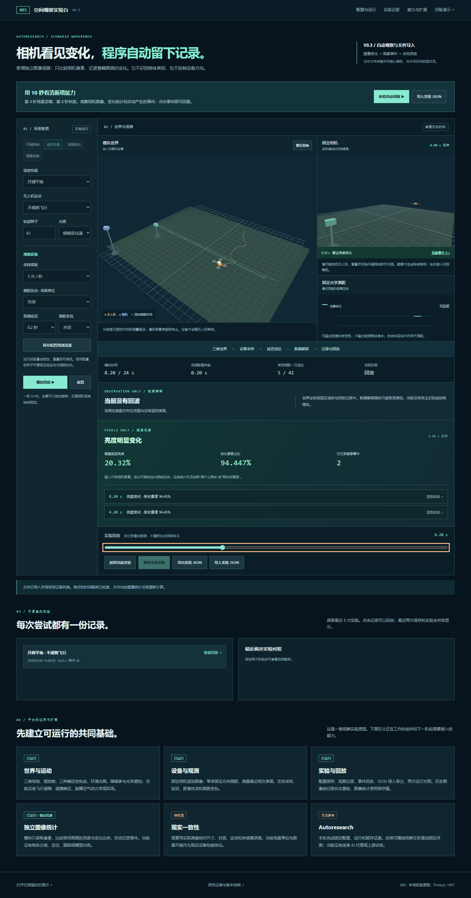
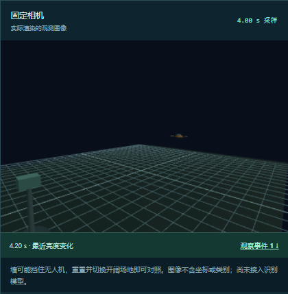
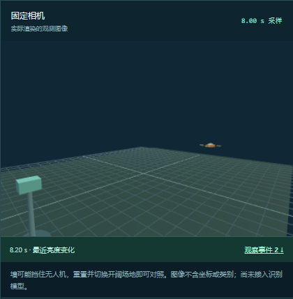
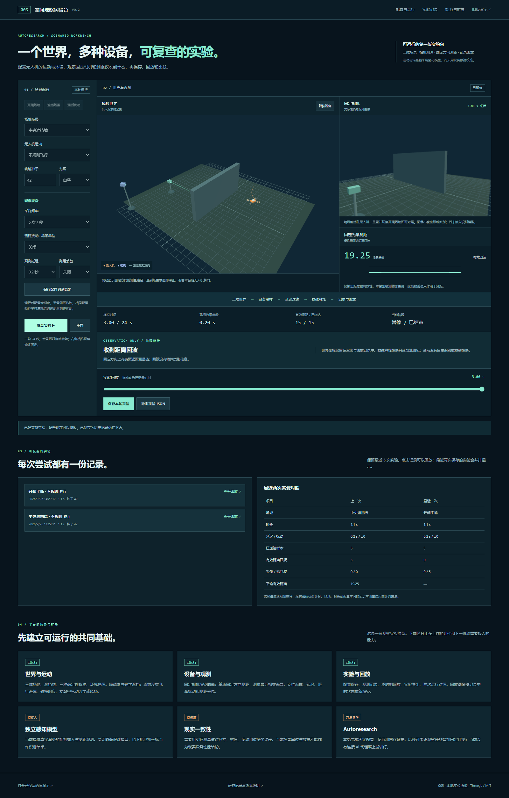
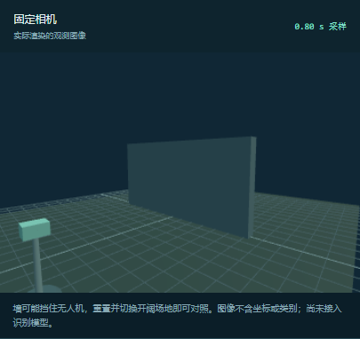
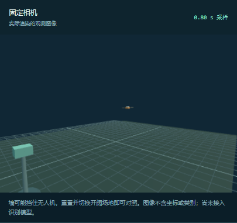

# V0.3 · 空间观察实验台

> 本文件保留 V0.3 时的能力与验证说明。当前版本见 [V0.4 说明](WORKBENCH.md)。

[打开实验台](../../sites/005-autoresearch/workbench.html) · [原版演示](../../sites/005-autoresearch/index.html#lab) · [V1 完整存档](snapshots/README.md)

通俗说明见[无人机运行与感知](SCENARIO.md)，网页“运行与感知说明”提供对应内容。场景旁的运动和采样说明随当前配置更新，历史回放使用历史配置；本轮说明整理未改变原有实验规则。

## 本轮目标

在 V0.2 的模拟世界、固定相机、测距与记录基础上，增加一个独立的图像观察模块：只根据送达的相机像素计算整幅画面的亮度和变化，自动留下事件，支持点击回看与文件导入。所有设备保持固定朝向；当前没有物体类别识别、定位、跟踪或设备控制。

## 已可使用

- **配置场景：** 开阔平地、中央遮挡墙、建筑方块；不规则、环绕、8 字三种运动；种子与白昼、黄昏、明暗变化三种光照设置。明暗变化演示在世界时间第 4 秒变暗、第 8 秒恢复。
- **相机：** 固定视点的 360 × 240 RGB 图像，由真实三维场景渲染产生。遮挡来自几何物体；全景视角的旋转不会改变相机输入。相机自身外壳与世界注记不进入图像。
- **光学测距：** 固定位置、固定方向的单束几何测距。取测量方向上范围内最近的物体表面，输出距离或无回波，不输出物体类别。画面中绿色线仅用于显示测量路径。
- **传感器条件：** 每秒 5 或 10 次采样；0、0.2 或 0.6 秒观测延迟；测距支持有界均匀扰动与独立随机丢包。相同种子与配置可复现扰动。延迟作用于图像和测距；扰动与丢包只作用于测距。
- **独立图像观察：** 每个相机包送达时，从图像缓冲区取得像素，计算整幅亮度、变化像素占比和平均像素差。首次图像建立基准，后续仅与前一张送达图像比较。输出不含物体类别、位置或编号。
- **自动事件：** 根据相邻图像的统计量产生“画面变化”或“亮度变化”事件。界面显示当前时刻之前的事件总数与最近 6 条记录；点击事件可跳到送达时刻。
- **记录回放：** 24 秒一轮，可随时暂停；拖动时间条或点击事件按记录查看。距离、图像统计和事件使用保存值，图像根据记录的世界状态与相机采样时刻重新渲染；回放不会再次调用图像观察模块。查看历史或导入的记录时，当前实验及其图像观察状态保留，点击“返回当前实验”后可以继续。
- **保存与导入：** 配置、最近 6 份实验保存在当前浏览器；同一轮重复保存会更新该轮记录。JSON 包含配置、世界状态、时间戳、传感器观测和图像统计，不含逐帧图片。支持导入新的 `observation-lab/2` 和旧的 `observation-lab/1` 文件，单文件上限 4 MB；旧记录显示“未包含图像观察”，不会补造结果。
- **对照：** 最近两份保存记录并排显示场地、运行时长、延迟、扰动、收到的样本、有效回波、无回波、丢包、平均距离和图像事件数。没有整体优劣评分，配置和时长不同的结果不直接用于算法排名。

## 建议体验顺序

1. 点击 **“体验自动观察”**，启动开阔场地的明暗变化演示。若当前实验已有记录，该按钮会先保留当前实验，再开始新一轮。
2. 观察世界在第 4 秒变暗、第 8 秒恢复，再看固定相机、亮度数值和事件列表。默认观测延迟为 0.2 秒，因此世界变化与相机数据送达不是同一时刻。
3. 点击一条图像事件，回看当时的图像与保存的统计；点击“返回当前实验”，再继续运行。事件由像素分析产生，图像观察模块不接收光照切换时刻或场景配置。
4. 暂停并保存，导出实验 JSON，再用“导入实验 JSON”重新打开。导入记录进入历史列表，也可以返回导入前的当前实验。
5. 如需比较遮挡与测距，先保存当前实验，再重置并选择“遮挡场景”或“开阔场地”；选择“观测扰动”可查看黄昏画面、延迟和测距丢包。

## 图像统计具体表示什么

模块先把每个 RGB 像素换算成加权亮度，然后比较连续两张图像。整幅画面亮度以 0–100% 表示，它是渲染图像的数值，不是现实照度或设备测量精度。

| 统计或规则 | 当前实现 |
| --- | --- |
| 变化像素 | 当前与前一张图像的像素亮度差至少为 18，亮度数值范围为 0–255 |
| 画面变化状态 | 变化像素占比至少为 0.1% |
| 亮度变化状态 | 整幅平均亮度相比前一张变化至少 8 个百分点，优先于画面变化状态 |
| 自动事件 | 进入变化状态且距上次事件至少 1.5 秒时记录；持续处于同一状态不逐帧重复记录 |
| 首张图像 | 仅建立基准，不产生变化事件 |

这些是本项目手工设定的演示规则，没有模型训练。移动、光照变化或其他像素变化都可能影响统计；结果不能说明是什么物体、物体在哪里、是否被遮挡或跟踪是否成功。明暗演示用于展示“画面输入 → 统计判断 → 事件记录”这一条可检查的数据流程。

## 数据边界和模块

| 文件 | 职责 | 接口边界 |
| --- | --- | --- |
| `sim3d.js` | 沿用 V1 的确定性运动轨迹 | 只为世界生成运动，不代表无人机飞控 |
| `lab-core.js` | 配置规范化、固定步进、采样、延迟队列、记录、统计与导入检查 | `Experiment(config, sample, observeImage)` 用 `sample(world, sequence)` 调用模拟设备；延迟送达时，仅把 `{ sequence, sampledAt }` 传给 `observeImage`；`interpret(observations, now)` 读取测距观测 |
| `image-observer.js` | 独立的整幅图像亮度与变化统计 | `createObserver().analyze(imageData, metadata)` 仅消费 RGBA 像素与采样序号、时间；`reset()` 清除前帧基准，不读取世界状态 |
| `workbench.js` | 三维世界、RGB 渲染、几何测距、图像缓冲、界面、存储和回放 | 模拟设备使用真实几何状态生成输入；图像包送达后按序号取像素调用观察模块；历史回放直接展示保存值 |
| `workbench.html` / `workbench.css` / `observer.css` | 配置、观测、事件、记录、能力列表 | 区分图像统计、传感器状态与尚未接入的识别模型 |

观测包中的 `camera` 仅含采样序号与时间；运行时图像由单独缓冲区送达。`range` 含序号、采样时间、状态与距离。新增 `vision` 使用 `frame-change/1` 版本，保存序号、采样时间、亮度、变化像素占比、平均像素差、状态和事件类型。没有图像观察结果时值为 `null`。

`groundTruth` 单独保存世界位置，用于世界重绘；它不传入 `image-observer.js`。图像统计在每个相机包首次送达时计算一次，同一包会沿用到下一次送达。回放图像重绘可能受浏览器或 GPU 差异影响，因此回放始终读取原先保存的统计，不用重新渲染的像素覆盖历史结果。

### JSON 与兼容性

新记录采用 `observation-lab/2`，实验 ID 与创建时间在本轮开始时确定，重复保存不会生成另一轮身份。旧 `observation-lab/1` 文件继续保留其版本和相机、测距内容；没有图像统计的旧记录不能按零事件来评价新算法。

`canonicalRecording(record)` 检查元数据长度、配置、帧数、连续 0.05 秒时间网格、采样序号、延迟和观测值的一致性，并生成只含允许字段的记录；同一采样序号在后续帧中不能改变内容。`validRecording(record)` 对无效输入返回 `false`。导入先解析和校验，成功后才加入历史并切换回放；格式不合法的文件不替换当前实验。

导入验证的是文件结构与时序一致性，不独立复算文件里的图像统计。JSON 也不包含原始逐帧图片；这是可回放的实验数据文件，不是录像。

## V0.3 自动测试

2026-09-26 本机执行 **24 项自动测试，全部通过**，覆盖原有轨迹与测距行为、像素统计和事件规则、图像模块输入边界、观察延迟与重复送达检查，以及记录导入：

- 实际 V0.2 JSON 样例可以读入，保持旧版内容，不补充图像结果。
- 配置字段顺序不会影响有效记录；空配置、损坏帧、错误元数据、提前送达和不连续时间被拒绝。
- 允许范围外的记录字段不进入规范化结果；同一采样序号的数值被修改时，记录被拒绝。
- 图像回调对每个送达的相机包只执行一次，只收到序号与采样时间。
- 同一实验多次生成记录时 ID、创建时间保持一致，先前快照不随运行继续而改变。

复核命令：`node --test projects/005-autoresearch/tests/observation.test.cjs projects/005-autoresearch/tests/workbench.test.cjs projects/005-autoresearch/tests/image-observer.test.cjs projects/005-autoresearch/tests/import.test.cjs`。

## V0.3 浏览器实测

2026-09-26 本机浏览器已实际运行完整的明暗变化演示，并导出 [V0.3 的 24 秒实验 JSON](experiments/example-image-observation-v03.json)。记录采用 `observation-lab/2`：481 个世界时刻、120 个送达的相机与测距包、6 个图像事件。

其中两次亮度事件与图像采样、延迟送达的关系如下：

| 画面变化 | 相机采样时刻 | 事件送达时刻 | 变化像素占比 |
| --- | ---: | ---: | ---: |
| 场景变暗 | 4.00 秒 | 4.20 秒 | 94.447917% |
| 场景恢复 | 8.00 秒 | 8.20 秒 | 94.446759% |

其余 4 次画面变化事件分别在 14.40、16.40、18.60、21.40 秒送达。这些是整幅图像的统计事件，没有识别物体身份。该开阔场景的固定测距方向收到 6 次有效回波和 114 次无回波；开阔场地仍可能有表面暂时进入测量方向，不能仅凭距离回波判断是哪一个物体。

已完成的交互检查：

- 点击事件可跳到对应送达时刻；再返回当前实验后，重绘的相机画布像素与离开前的实时画面一致。像素一致性结论仅适用于本机同一浏览器环境。
- 导入 V0.2 样例可看到 19.25 的保存测距值，以及“旧记录未包含图像观察”的状态。
- 查看历史或导入记录后，可以返回原实验继续运行，原有观察状态保持。
- 无效 JSON 文件被拒绝，当前实验和历史记录保持不变。
- V0.3 文件导入后使用保存的统计与事件，刷新后仍能从浏览器保存记录中打开。
- 390 像素宽的移动视口没有横向溢出，实测浏览器未出现页面脚本异常。

图片来源：本研究项目在本机浏览器实际运行 V0.3 后截取；另有 [V0.3 移动端截图](assets/workbench-v03-mobile.png)。画面和 JSON 都是该网页模型的实际输出，不代表现实设备数据或上游 autoresearch 的实验。

下面两张图从上述实际导出的记录回放截取，相机旁会持续显示最近一次变化事件，便于同时查看图像与判断结果：

| 4.20 秒收到变暗图像 | 8.20 秒收到恢复图像 |
| --- | --- |
|  |  |

## V0.2 浏览器证据与历史记录

以下为 2026-09-26 V0.2 版本的本机运行结果，不作为 V0.3 新增图像观察功能的验收结果：

- V1 与 V0.2 共 **8 项自动测试通过**，涵盖连续观察、轨迹复现、延迟、扰动、丢包、观测字段隔离、记录序列化与输入检查。
- 关闭扰动时，中央墙场景的固定方向测距值为 **19.25 个场景单位**；同一位置和方向的开阔场景在所测时段返回无回波。这是本程序几何模型的输出，不是设备实测。
- 暂停后回放到相同记录时刻，相机画布像素与原采样画面一致，距离值一致；这是本机同一浏览器环境的检查，不保证跨 GPU 像素一致。
- 保存两份实验后刷新页面，仍能读取记录并回放；保存的配置也能恢复。
- 观测扰动预设中实际出现有效回波与丢包两种状态。
- 桌面与 390 像素宽移动视口无横向溢出，浏览器没有脚本异常。
- 已通过页面实际导出[完整 24 秒记录](experiments/example-wall-42.json)：481 个世界时刻，送达 120 个测距样本，全部有效，平均距离 19.25 个场景单位；设置为中央墙、种子 42、5 Hz、0.2 秒延迟、关闭扰动与丢包。

图片来源：本研究项目在本机浏览器实际运行 V0.2 后截取；图中模型、设备与界面由本项目编写。V0.2 移动端截图保存在 `assets/workbench-mobile.png`。两张截图均不代表现实设备或上游 autoresearch 的运行结果。

以下是同一固定相机、相同种子和运动在约 0.8 秒采样时刻的实际画面；左侧中央墙挡住了无人机，右侧开阔场地中能看到空中的橙色物体。这只是输入图像的对照，没有运行自动检测算法。

| 中央墙 | 开阔场地 |
| --- | --- |
|  |  |

这两张对照图同样来自 V0.2 本机运行页面，未使用生成图片。

## 现实一致性的限制

目前是浏览器内的简化场景模型：长度为场景单位；轨迹直接驱动物体，没有旋翼动力学、飞控、风场或碰撞响应。障碍物参与光学遮挡与测距，尚不约束无人机运动；飞行物体可能穿过障碍。测距采用几何相交，没有光传播、材质反射、散射、多径、曝光或真实测量误差校准。

新增图像模块只提供整幅统计，未经过现实图像数据集评测；它不输出物体类别、位置或运动估计。图像事件数也不能作为识别成功率。不能由这些结果推断现实无人机性能或真实传感器精度。

## 下一阶段的扩展入口

1. **观察数据协议：** 在现有版本化记录上补充采样设备说明、生成版本和数据来源，增加更多被动观察场景。
2. **画面质量实验：** 围绕整幅亮度、噪声、曝光变化和数据缺失建立有标准答案的测试集，评价事件误报、漏报与处理时间。
3. **现实数据校准：** 使用有来源的相机画面与测距记录校准成像和误差模型，并报告适用范围。
4. **可重复评测：** 固定场景集、观察任务、预算与指标后，再接入外部实验代理比较观察规则。Autoresearch 在这里是方法参考，当前没有 AI 服务或上游 GPU 训练。

## 来源与许可

本实验台为本仓库独立实现；使用 [Three.js r159](https://github.com/mrdoob/three.js/tree/r159)，本地附带 [MIT 许可证](../../sites/005-autoresearch/vendor/THREE-LICENSE.txt)。上游 autoresearch 的归属、许可证及方法说明见[研究 README](README.md)。
