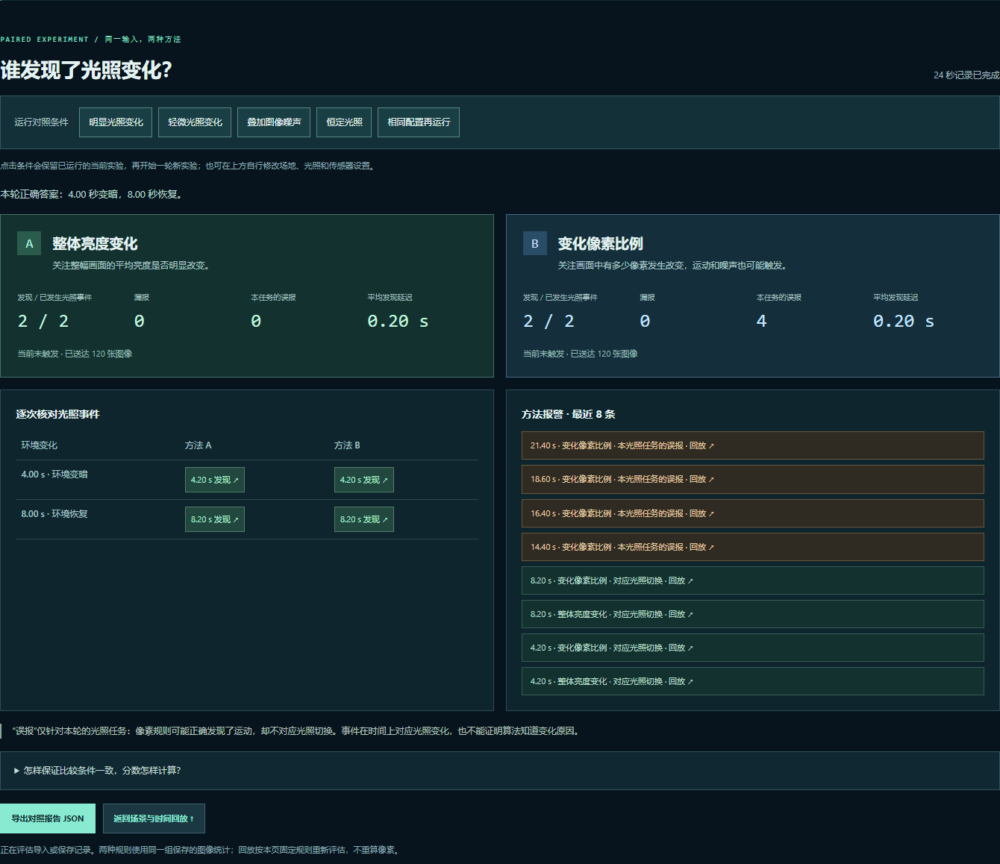

# V0.4 · 可比较的观察实验

> 历史记录：保存于升级 V0.5 之前。下述结果对应当时的四轮实际运行；[当前版本](WORKBENCH.md)已加入批量实验，网页链接打开的是当前页面。恢复旧版核心文件见[存档说明](snapshots/README.md)。

[打开实验台](../../sites/005-autoresearch/workbench.html) · [方法对照报告](../../sites/005-autoresearch/workbench.html#evaluation) · [场景文字说明](SCENARIO.md) · [V0.3 历史记录](WORKBENCH-V03.md) · [保存的版本](snapshots/README.md)

## 本轮完成了什么

同一轮三维场景中的相机图像，同时供两种独立规则使用。共同任务是**发现环境光照切换**，报告给出发现次数、漏报次数、误报次数、平均发现延迟，以及可点击回看的报警。

这次新增了轻微光照变化、相机图像噪声、四组快捷条件、相同配置重复运行和报告导出。无人机运动、固定相机与单束测距继续保留。当前没有物体类别识别、定位、跟踪或设备控制。

## 怎样体验

1. 点击 **“体验方法对照”**，运行明显光照变化条件。一轮 24 秒，第 4 秒变暗、第 8 秒恢复，无人机持续运动。
2. 在“方法对照报告”中比较 A、B 两张卡片。暂停后可点击报警或已发现的光照事件，查看当时图像。
3. 分别运行“轻微光照变化”“叠加图像噪声”“恒定光照”，看同一规则在不同条件下的表现。按钮先保留已运行的当前实验，再开始新实验。
4. “相同配置再运行”复用当前显示的配置与种子，生成新的实验编号。在同一浏览器环境中，可复查相同输入与结果。
5. “导出实验 JSON”保存回放数据；“导出对照报告 JSON”保存当前时刻的评价。实验文件支持重新导入，报告文件用于查看结果，不能作为实验文件导入。

## 场景与传感器条件

- **场地：**开阔平地、中央遮挡墙、建筑方块。障碍参与图像遮挡和测距，没有飞行碰撞响应。
- **运动：**不规则、空间环绕、空间 8 字；轨迹由种子决定，单轮 24 秒。
- **光照：**白昼恒定、黄昏恒定、明显明暗变化、轻微明暗变化。两个变化条件均在第 4 秒调暗环境灯光、第 8 秒恢复；明显条件还改变背景色。数值是演示渲染参数，未对应现实照度。
- **相机：**固定视点，360 × 240 RGB 图像；世界视角旋转不会改变它。图像噪声可关闭，或设置 ±8、±24 灰度级。每个像素的 RGB 通道共享一个有界随机偏移，超出范围时裁剪；噪声由种子与采样序号决定，显示与分析使用同一张图像。
- **固定测距：**单束固定方向、最近表面的几何相交距离，范围上限 44 个场景单位。测距扰动和丢包仍独立配置，不改变相机图像。
- **采样与延迟：**相机与测距共用 5 / 10 Hz 频率与 0 / 0.2 / 0.6 秒延迟。相机噪声在采样时加入，图像随后按延迟送达。

## 图像统计具体表示什么

`image-observer.js` 仍计算整幅画面的平均亮度、变化像素占比和平均像素差，并保留 V0.3 的通用变化事件。界面的“原始画面统计”显示这一层。

V0.4 的两种方法使用相同的已保存统计，各自独立判断。它们不使用旧通用事件字段来决定报警，也不获取无人机位置、场景光照配置或环境时间表。

| 方法 | 判定依据 | 报警规则 |
| --- | --- | --- |
| A · 整体亮度变化 | 相邻图像平均亮度差至少 8 个百分点 | 从未触发转为触发时记录；两次事件至少间隔 1.5 秒 |
| B · 变化像素比例 | 亮度差达到 18 灰度级的像素，占整幅图像至少 0.1% | 同上；持续满足条件时不重复记录 |

首帧仅建立基准。两种规则的阈值均为手工设定，未训练或自动调参。规则版本为 `illumination-comparison/1`。

方法 B 关注任意像素变化，因此运动或噪声也可能触发。把它用于光照任务时，这些额外报警记为误报；这不表示像素变化的计算本身有错。

## 如何评价

只有独立评估器获得环境光照时间表。明显与轻微变化条件的正确答案为 4.00 秒和 8.00 秒两次切换；白昼与黄昏恒定条件没有预设光照事件。

- **发现：**报警所用图像的采样时间位于某次切换开始后 1 秒内，第一条符合条件的报警匹配该次变化。一次报警只对应一个变化。
- **误报：**窗口外或没有匹配变化的报警；报告中的误报均限定为当前光照任务。
- **漏报：**匹配窗口加上配置的观测延迟结束后，仍没有对应报警。此前显示“等待”；尚未发生的事件不计漏报。
- **发现延迟：**报警实际送达时间减去环境切换时间，包含采样等待和传感器延迟。无发现时显示空值，不以零代替。
- **部分记录：**只评价当前显示时刻之前的数据。拖动回放时间条时，报告同步回到当时，未结束的窗口不会提前记失败。
- **输入缺失：**没有完整图像统计的记录显示无法评价，不把缺失数据当作零分。

时间窗口匹配只说明事件在时间上对应光照变化，不能证明算法理解了变化原因。报告不能作为无人机识别率或真实传感器性能结论。

## 本机实际运行结果

2026-09-26，四组条件均在浏览器中实际运行完整 24 秒，并从页面导出实验和报告。共同设置：开阔场地、不规则运动、种子 42、5 Hz、0.2 秒延迟、关闭测距扰动与丢包。每组含 481 个世界时刻、120 个已送达相机样本。

| 条件 | A 发现 / 漏报 / 误报 | B 发现 / 漏报 / 误报 | 证据 |
| --- | --- | --- | --- |
| 明显光照变化 | 2 / 0 / 0 | 2 / 0 / 4 | [报告](experiments/v04-strong-report.json) · [实验](experiments/v04-strong-run.json) |
| 轻微光照变化 | 0 / 2 / 0 | 2 / 0 / 4 | [报告](experiments/v04-soft-report.json) · [实验](experiments/v04-soft-run.json) |
| 明显变化 + 图像噪声 ±24 | 2 / 0 / 0 | 0 / 2 / 1 | [报告](experiments/v04-noise-report.json) · [实验](experiments/v04-noise-run.json) |
| 恒定白昼 | 0 / 0 / 0 | 0 / 0 / 5 | [报告](experiments/v04-constant-report.json) · [实验](experiments/v04-constant-run.json) |

成功匹配的事件平均发现延迟均为 0.20 秒。恒定光照没有预设事件，不能把 0 次发现理解为失败。

在本次轻微光照条件下，平均亮度变化未达到方法 A 的固定阈值。叠加噪声时，方法 B 从最初触发后持续满足条件，没有先回落再重新触发，因此漏掉两次新的光照切换。各规则的表现取决于任务、阈值和场景，四组结果不足以证明普遍优劣。

图片来源：本项目在本机浏览器运行网页后截取，非上游 autoresearch 或现实设备输出。另有[轻微变化](assets/v04-soft-report.png)、[图像噪声](assets/v04-noise-report.png)、[恒定光照](assets/v04-constant-report.png)和[手机报告](assets/v04-report-mobile.png)截图。

## 已做的验证

- **33 项自动测试通过。**新增验证覆盖共享统计与输入隔离、独立规则、时间窗口、观测延迟、恒定光照误报、缺少统计、实际 V0.3 文件兼容、V0.4 规则版本和图像噪声可复现性。
- 四组完整浏览器运行均实际导出文件，报告数字与页面一致。
- 含图像噪声的实验回放到同一时刻，画布像素与离开前的实时图像一致；仅针对本机同一浏览器环境。
- 导入 V0.3 文件可按当前固定规则重新评估；导入 V0.2 文件明确显示无法评价。两者均能返回原来的实验继续运行。
- 同一配置再次运行，前段世界与观测数据和上一轮逐帧一致；生成新的实验 ID。
- 点击报告事件回到 4.20 秒，刷新后可恢复已保存记录和报告；390 像素宽视口无页面横向溢出，未出现脚本异常。

复核命令：`node --test projects/005-autoresearch/tests/*.test.cjs`。

## 数据与兼容性

- 新实验格式为 `observation-lab/3`，新增 `cameraNoise` 配置和固定 `analysisProtocol`。
- `observation-lab/2` 与 `observation-lab/1` 继续可导入，原格式保持不变。旧文件不能伪装携带新版噪声或光照配置。
- 报告格式为 `illumination-report/1`，含配置、实际记录时长、规则版本、匹配窗口、各方法结果和报警时间，不含逐帧图像或三维坐标。
- 两种方法的报告始终根据保存的图像统计重新计算，页面明确标注这一点。旧记录不会被补写成“当时运行过两种方法”。
- 实验回放根据历史状态、采样序号和种子重绘含噪声的相机画面；图像统计使用保存值，不因重绘而覆盖。跨浏览器或 GPU 不承诺逐像素一致。
- 配置与最近 6 份记录保存在浏览器，实验 JSON 导入上限 4 MB。文件校验检查结构、版本和时序，不验证保存值是否被外部改写。

## 模块分工

| 文件 | 职责 | 数据边界 |
| --- | --- | --- |
| `sim3d.js` | 确定性三维轨迹 | 生成世界位置，不代表真实飞控 |
| `lab-core.js` | 固定步进、采样与延迟、记录、导入校验 | 世界坐标单独存储；图像回调只有采样序号与时间 |
| `camera-effects.js` | 可复现的合成图像噪声 | 像素、噪声强度、种子与序号；没有物体信息 |
| `image-observer.js` | 整幅图像统计与原有通用事件 | 只读取像素和采样元数据 |
| `illumination-study.js` | 两种独立规则及光照评估器 | `createRules()` 只读统计；`evaluate()` 才获得环境配置并做时间匹配 |
| `workbench.js` | 场景、相机、界面、存储、回放与报告导出 | 负责在模块之间传递对应的数据 |

## 限制与 Autoresearch 的关系

这是未经现实数据校准的网页原型。运动没有气动力、飞控、风场、避障或碰撞响应；测距没有光传播与反射模型；新增相机噪声也是人为合成。实验结论只适用于这组条件。

本轮落实了固定任务、相同输入、明确规则、保存证据和重复运行。Autoresearch 在这里是方法参考；当前没有 AI 自动改代码、候选搜索、自动保留或回退，也没有运行上游 GPU 训练。

本项目自行编写模拟与评测逻辑；三维渲染使用 [Three.js r159](https://github.com/mrdoob/three.js/tree/r159)，本地附带 [MIT 许可](../../sites/005-autoresearch/vendor/THREE-LICENSE.txt)。上游归属与研究来源见[项目 README](README.md)。
