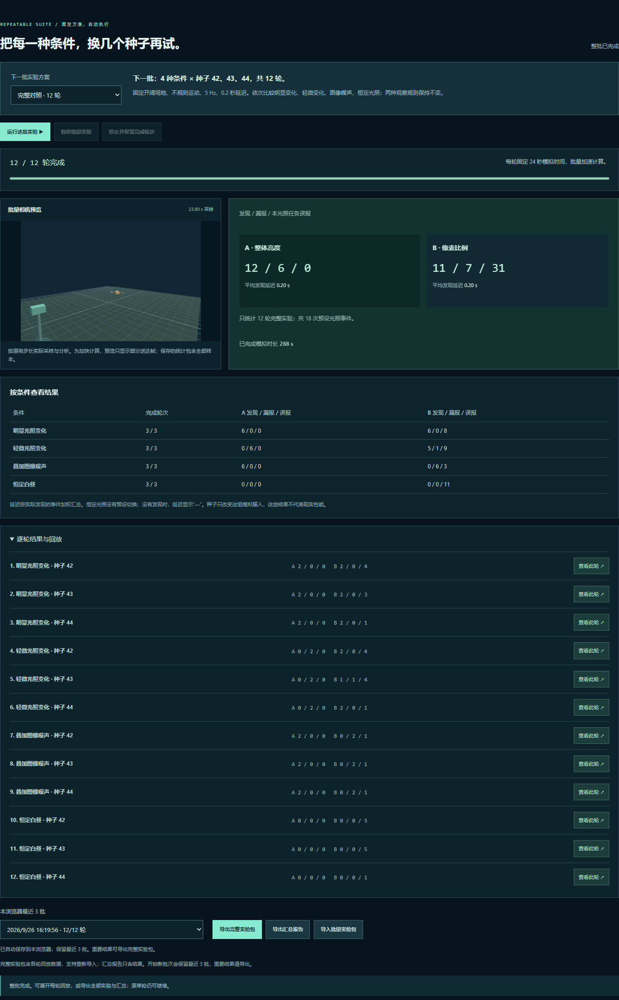

# V0.5 · 批量实验与结果总览

下一项任务已修订为[小语言模型训练优化](TASK-DESIGN.md)，当前完成设计与环境核查，尚未训练。本文继续记录实际可运行的 V0.5 光照实验。

[打开批量实验](../../sites/005-autoresearch/workbench.html#batch-lab) · [单轮对照报告](../../sites/005-autoresearch/workbench.html#evaluation) · [场景文字说明](SCENARIO.md) · [V0.4 历史记录](WORKBENCH-V04.md) · [保存的版本](snapshots/README.md)

## 本轮完成了什么

同一轮三维场景中的相机图像，同时供两种独立规则使用。共同任务是**发现环境光照切换**，报告给出发现次数、漏报次数、误报次数、平均发现延迟，以及可点击回看的报警。

V0.5 把单轮比较扩展为自动执行的固定实验方案：四种条件分别换三个种子，总计十二轮。页面显示运行进度、按条件汇总和每轮回放；可暂停、停止、保存及重新导入整批实验。原 V0.4 核心文件已[存档](snapshots/README.md)。

无人机运动、固定相机与单束测距继续保留。当前没有物体类别识别、定位、跟踪或设备控制。

## 怎样体验

1. 点击 **“开始批量实验”**。默认完整对照为四种条件 × 种子 42、43、44，共十二轮；快速对照只用种子 42，共四轮。
2. 看批量相机预览与进度。每轮固定 24 秒模拟时间，十二轮共 288 秒；加速计算的实际耗时取决于设备。
3. 查看 A、B 的总结果，再按条件和轮次检查差异。点击 **“查看此轮”**，进入单轮回放，可拖动时间条或点击报警复查。
4. **“暂停批量实验”**可继续；**“停止并保留完成轮次”**结束当前批次，只汇总完整跑完的轮次。已停止的批次保留结果，不支持从中断位置续跑；再次运行会新建批次。
5. **“导出完整实验包”**保存各轮数据，支持重新导入；**“导出汇总报告”**只保存结果，不能作为实验包导入。浏览器自动保留最近三批，重要结果可导出。
6. 原单轮实验在批量开始时暂停保留，批量结束后可继续。**“体验方法对照”**、四组单轮快捷条件和“相同配置再运行”仍可使用。

## 批量实验如何保证可比较

固定开阔场地、不规则运动、5 Hz 采样、0.2 秒延迟、关闭测距扰动与丢包。依次运行明显光照变化、轻微光照变化、明显变化叠加图像噪声 ±24、恒定白昼，每个条件内部按种子顺序运行。

每轮独立创建模拟和图像统计状态。批量仍执行全部 0.05 秒世界步进、全部相机采样和延迟送达；加速只减少实时等待及预览刷新，不跳过分析样本。每轮保存 481 个世界时刻、120 个已送达相机样本。

同一轮的两个方法读取完全相同的统计。不同条件复用同一组种子；种子改变模拟轨迹，也决定开启噪声时的随机序列。这三个种子只是小规模重复试验，不能据此推断现实中的可靠性。

汇总相加发现、漏报与误报次数；平均延迟按实际匹配的事件数加权，没有发现时为空值。未完成的轮次不参与评分，没有运行的条件显示空值。当前单轮和批量记录独立保存，批量运行时暂停单轮界面交互。

## 场景与传感器条件

- **场地：**开阔平地、中央遮挡墙、建筑方块。障碍参与图像遮挡和测距，没有飞行碰撞响应。
- **运动：**不规则、空间环绕、空间 8 字；轨迹由种子决定，单轮 24 秒。
- **光照：**白昼恒定、黄昏恒定、明显明暗变化、轻微明暗变化。两个变化条件均在第 4 秒调暗环境灯光、第 8 秒恢复；明显条件还改变背景色。数值是演示渲染参数，未对应现实照度。
- **相机：**固定视点，360 × 240 RGB 图像；世界视角旋转不会改变它。图像噪声可关闭，或设置 ±8、±24 灰度级。每个像素的 RGB 通道共享一个有界随机偏移，超出范围时裁剪；噪声由种子与采样序号决定，显示与分析使用同一张图像。
- **固定测距：**单束固定方向、最近表面的几何相交距离，范围上限 44 个场景单位。测距扰动和丢包仍独立配置，不改变相机图像。
- **采样与延迟：**相机与测距共用 5 / 10 Hz 频率与 0 / 0.2 / 0.6 秒延迟。相机噪声在采样时加入，图像随后按延迟送达。

## 图像统计具体表示什么

`image-observer.js` 仍计算整幅画面的平均亮度、变化像素占比和平均像素差，并保留 V0.3 的通用变化事件。界面的“原始画面统计”显示这一层。

两种方法使用相同的已保存统计，各自独立判断。它们不使用旧通用事件字段来决定报警，也不获取无人机位置、场景光照配置或环境时间表。

| 方法 | 判定依据 | 报警规则 |
| --- | --- | --- |
| A · 整体亮度变化 | 相邻图像平均亮度差至少 8 个百分点 | 从未触发转为触发时记录；两次事件至少间隔 1.5 秒 |
| B · 变化像素比例 | 亮度差达到 18 灰度级的像素，占整幅图像至少 0.1% | 同上；持续满足条件时不重复记录 |

首帧仅建立基准。两种规则的阈值均为手工设定，未训练或自动调参。规则版本为 `illumination-comparison/1`。

方法 B 关注任意像素变化，因此运动或噪声也可能触发。把它用于光照任务时，这些额外报警记为误报；这不表示像素变化的计算本身有错。

## 如何评价

只有独立评估器获得环境光照时间表。明显与轻微变化条件的正确答案为 4.00 秒和 8.00 秒两次切换；白昼与黄昏恒定条件没有预设光照事件。

- **发现：**报警所用图像的采样时间位于某次切换开始后 1 秒内，第一条符合条件的报警匹配该次变化。一次报警只对应一个变化。
- **误报：**窗口外或没有匹配变化的报警；报告中的误报均限定为当前光照任务。
- **漏报：**匹配窗口加上配置的观测延迟结束后，仍没有对应报警。此前显示“等待”；尚未发生的事件不计漏报。
- **发现延迟：**报警实际送达时间减去环境切换时间，包含采样等待和传感器延迟。无发现时显示空值，不以零代替。
- **部分记录：**只评价当前显示时刻之前的数据。拖动回放时间条时，报告同步回到当时，未结束的窗口不会提前记失败。
- **输入缺失：**没有完整图像统计的记录显示无法评价，不把缺失数据当作零分。

时间窗口匹配只说明事件在时间上对应光照变化，不能证明算法理解了变化原因。报告不能作为无人机识别率或真实传感器性能结论。

## 本机实际运行结果

2026-09-26，本机 Chromium 浏览器实际完成十二轮批量实验，并从页面导出[完整实验包](experiments/v05-full-batch.json)和[汇总报告](experiments/v05-full-report.json)。每个条件运行三个种子，合计 288 秒模拟时间、18 次预设光照事件。

| 条件（各三轮） | A 发现 / 漏报 / 误报 | B 发现 / 漏报 / 误报 |
| --- | --- | --- |
| 明显光照变化 | 6 / 0 / 0 | 6 / 0 / 8 |
| 轻微光照变化 | 0 / 6 / 0 | 5 / 1 / 9 |
| 明显变化 + 图像噪声 ±24 | 6 / 0 / 0 | 0 / 6 / 3 |
| 恒定白昼 | 0 / 0 / 0 | 0 / 0 / 11 |
| **合计** | **12 / 6 / 0** | **11 / 7 / 31** |

成功匹配的事件平均发现延迟均为 0.20 秒。恒定光照没有预设事件，不能把 0 次发现理解为失败。

本组结果中，方法 A 漏掉全部轻微光照切换，方法 B 在轻微变化中发现 5 次，但有额外报警。叠加噪声时，方法 B 持续满足触发条件，没有先回落再重新触发，因此漏掉新的切换。各规则的表现取决于任务、阈值和场景，不能仅按发现数判断优劣。恒定白昼的额外报警也表明“图像发生变化”不等于“光照发生变化”。

图片来源：本项目本机浏览器实际运行网页后的截图，非上游 autoresearch 或现实设备输出。另有[手机界面截图](assets/v05-batch-mobile.png)，拍摄于重新导入完整实验包后；导入时预览画布为空，需点击轮次查看图像。V0.4 的四轮原始实测及截图见[历史记录](WORKBENCH-V04.md)。

## 已做的验证

- **39 项自动测试通过。**新增六项验证覆盖固定方案、实际记录汇总、部分批次、配置与顺序校验、缺失统计和按匹配事件数加权的平均延迟。
- 十二轮完整浏览器运行、导出、导入与汇总重新计算一致。四个条件中种子 42 的每一帧记录均与 V0.4 实时运行的对应实验一致，验证此次加速没有改变这些输入。
- 批量暂停后进度保持；原单轮时间与相机像素在批量前后不变，结束后可继续单轮。
- 每轮回放可打开，并查看完整 24 秒对应的报告；无效导入被拒绝，当前结果保持不变。
- 刷新可恢复保存的十二轮；另一次快速批次暂停后停止，保存了[一轮完整实验](experiments/v05-stopped-batch.json)，未完成轮次没有计入汇总。
- 完整批次重新导入成功，与停止批次同时保留。390 像素宽视口无页面横向溢出，条件表可内部横向滚动；未出现页面脚本异常。

上述为本机浏览器和固定条件的验证。前版的像素回放与旧格式导入等验证记录保留在 [V0.4 历史说明](WORKBENCH-V04.md)。

复核命令：`node --test projects/005-autoresearch/tests/*.test.cjs`。

## 数据与兼容性

- 单轮实验继续采用 `observation-lab/3`，含 `cameraNoise` 配置和固定 `analysisProtocol`。
- `observation-lab/2` 与 `observation-lab/1` 继续可导入，原格式保持不变。旧文件不能伪装携带新版噪声或光照配置。
- 报告格式为 `illumination-report/1`，含配置、实际记录时长、规则版本、匹配窗口、各方法结果和报警时间，不含逐帧图像或三维坐标。
- 两种方法的报告始终根据保存的图像统计重新计算，页面明确标注这一点。旧记录不会被补写成“当时运行过两种方法”。
- 实验回放根据历史状态、采样序号和种子重绘含噪声的相机画面；图像统计使用保存值，不因重绘而覆盖。跨浏览器或 GPU 不承诺逐像素一致。
- 批量实验格式为 `illumination-batch/1`，固定方案版本为 `illumination-suite/1`；包含按顺序排列的完整单轮记录。导入检查版本、方案、顺序、配置、唯一编号、完整时长和统计字段，忽略外部附带的汇总结果。
- 汇总格式为 `illumination-batch-report/1`，保存完成轮数、总模拟时长、两种方法的总计、按条件和按轮次的结果。平均延迟以实际发现的事件数加权。
- 配置与最近六份单轮记录继续保存在浏览器本地存储；批量另用 IndexedDB 保留最近三批，每完成一轮自动保存。存储不可用时页面提示导出，仍可在当前页面查看结果。
- 单轮 JSON 导入上限 4 MB，批量实验包上限 20 MB。文件校验检查结构、版本和时序，不验证保存值是否被外部改写，也没有在文件中嵌入原始像素。

## 模块分工

| 文件 | 职责 | 数据边界 |
| --- | --- | --- |
| `sim3d.js` | 确定性三维轨迹 | 生成世界位置，不代表真实飞控 |
| `lab-core.js` | 固定步进、采样与延迟、记录、导入校验 | 世界坐标单独存储；图像回调只有采样序号与时间 |
| `camera-effects.js` | 可复现的合成图像噪声 | 像素、噪声强度、种子与序号；没有物体信息 |
| `image-observer.js` | 整幅图像统计与原有通用事件 | 只读取像素和采样元数据 |
| `illumination-study.js` | 两种独立规则及光照评估器 | `createRules()` 只读统计；`evaluate()` 才获得环境配置并做时间匹配 |
| `batch-study.js` | 固定批量方案、文件校验与汇总 | 汇总只读取各轮记录，未完成轮次不评分 |
| `batch-store.js` | 浏览器批量保存 | 独立保存最近三批，不占用单轮历史槽位 |
| `batch-workbench.js` | 进度、暂停停止、结果、导入导出 | 通过回调运行各轮及打开回放 |
| `workbench.js` | 场景、相机、界面、存储、回放与报告导出 | 负责在模块之间传递对应的数据 |

## 限制与 Autoresearch 的关系

这是未经现实数据校准的网页原型。运动没有气动力、飞控、风场、避障或碰撞响应；测距没有光传播与反射模型；新增相机噪声也是人为合成。实验结论只适用于这组条件。

本轮落实了固定任务、相同输入、明确规则、自动执行固定批次和保存证据。Autoresearch 在这里是方法参考；当前没有 AI 自动改代码、候选搜索、自动保留或回退，也没有运行上游 GPU 训练。

本项目自行编写模拟与评测逻辑；三维渲染使用 [Three.js r159](https://github.com/mrdoob/three.js/tree/r159)，本地附带 [MIT 许可](../../sites/005-autoresearch/vendor/THREE-LICENSE.txt)。上游归属与研究来源见[项目 README](README.md)。
