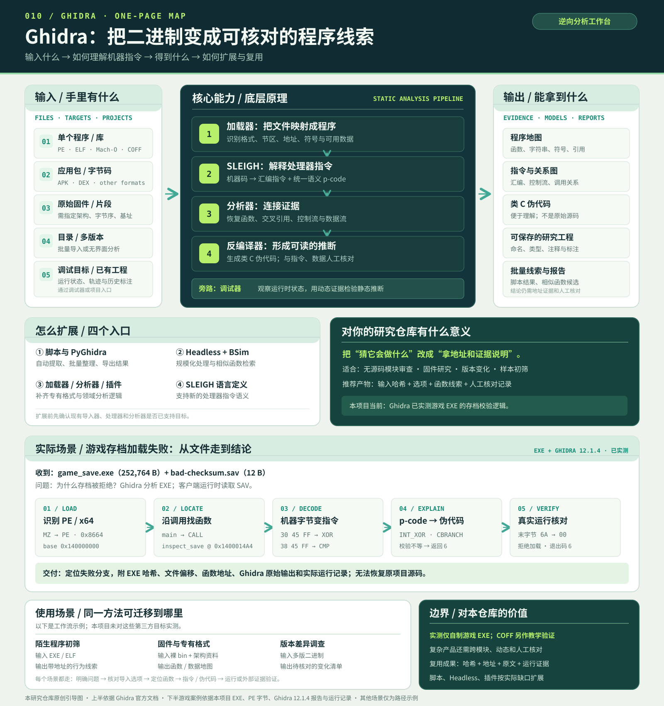

# 010 · Ghidra：从二进制线索到程序行为

> 研究对象：[NationalSecurityAgency/ghidra](https://github.com/NationalSecurityAgency/ghidra)。本文于 2026-09-26 核对官方资料，编译并运行两个自制样本。其中游戏存档案例把真实 Windows EXE 导入 Ghidra 12.1.4，保存了无界面反编译结果；网页交互是对本机结果的展示，不在浏览器内运行 EXE 或 Ghidra。

| 项目 | 内容 |
| --- | --- |
| 原仓库 | [NationalSecurityAgency/ghidra](https://github.com/NationalSecurityAgency/ghidra) |
| 作者与维护 | 美国国家安全局（NSA）Research Directorate 与 Ghidra 贡献者 |
| 原项目许可证 | 主体 [Apache License 2.0](https://github.com/NationalSecurityAgency/ghidra/blob/master/LICENSE)；部分第三方组件及顶层 `GPL/` 独立支持程序有各自许可证，见 [NOTICE](https://github.com/NationalSecurityAgency/ghidra/blob/master/NOTICE) |
| 研究日期 | 2026-09-26 |
| 研究状态 | 已核对官方能力和原理；已验证 COFF 样本四例输入；已运行自制游戏 EXE 的三例存档，并用 Ghidra 12.1.4 实际反编译其校验函数 |
| 网页展示 | [在线能力总图与交互实验台](https://yydshly.github.io/0926_codex_project/sites/010-ghidra/) · [网页源码](../../sites/010-ghidra/index.html) |

**摘要：**Ghidra 接收程序、固件、批量文件或调试目标，把机器指令变成可核对的函数、引用、关系图和类 C 伪代码。加载器建立地址空间，SLEIGH 将不同处理器的指令译成汇编与 p-code，分析器和反编译器再恢复控制流与数据流；脚本、无界面模式、插件与处理器定义可扩展流程。它适合无源码程序审查、固件研究和版本对比。本项目用一个游戏存档失败案例，实际从 EXE 反编译出校验函数，并将返回值与三次运行结果对照。对本仓库而言，价值是把“可能做什么”整理成带输入、地址和运行证据的可复核记录。

## 一张图看懂 Ghidra

图片说明：[`assets/capability-map.svg`](assets/capability-map.svg) 是本研究仓库原创绘制的概念图，无外部图片素材。它根据 [Ghidra 官方仓库](https://github.com/NationalSecurityAgency/ghidra)、[导入器说明](https://github.com/NationalSecurityAgency/ghidra/blob/master/Ghidra/Features/Base/src/main/help/help/topics/ImporterPlugin/importer.htm)、[SLEIGH 手册](https://ghidra.re/ghidra_docs/languages/html/sleigh.html)、[无界面分析说明](https://github.com/NationalSecurityAgency/ghidra/blob/master/Ghidra/RuntimeScripts/support/analyzeHeadlessREADME.md)和 [BSim 教程](https://github.com/NationalSecurityAgency/ghidra/blob/master/GhidraDocs/GhidraClass/BSim/BSimTutorial_Intro.md)汇总官方能力与原理。图中输入、输出和扩展是软件能力示意；实际完成范围见下方游戏 EXE 实测与 COFF 样本验证。

## 为什么研究

Ghidra 提供从编译产物到可理解逻辑的完整工作台：加载文件、反汇编、反编译、图形化查看、脚本化分析与扩展。这个子项目想回答三个具体问题：二进制分析从哪里获得可靠线索？机器指令如何跨架构进入统一分析流程？一个实际输入校验场景能展示哪些能力、哪些结论仍需要验证？[官方仓库](https://github.com/NationalSecurityAgency/ghidra)

## 核心能力与技术原理

1. **导入与初筛。**加载器识别二进制格式、架构、节区及可用符号。官方导入器帮助明确列出 COFF、PE、ELF、Mach-O、原始二进制等格式。本项目选 COFF 对象文件，是为了能把样本源码、字节和指令一一核对。[官方导入器说明](https://github.com/NationalSecurityAgency/ghidra/blob/master/Ghidra/Features/Base/src/main/help/help/topics/ImporterPlugin/importer.htm)
2. **指令语义统一。**SLEIGH 描述处理器指令的编码、汇编显示和语义，并可将指令翻译成 p-code。p-code 是处理器无关的寄存器传送语言，为数据流分析和反编译提供共同基础。[SLEIGH 手册](https://ghidra.re/ghidra_docs/languages/html/sleigh.html)、[p-code 参考](https://ghidra.re/ghidra_docs/languages/html/pcoderef.html)
3. **反编译与核对。**反编译器从机器行为恢复较高层的表达，便于审查条件、变量与调用关系；结果是推导出的伪代码，不会凭空恢复原始变量名、注释或设计意图。面对优化、无符号或混淆代码时，更需要把伪代码与指令、数据和运行行为交叉核对。[官方仓库](https://github.com/NationalSecurityAgency/ghidra)、[进阶反汇编课程](https://ghidra.re/ghidra_docs/GhidraClass/Advanced/improvingDisassemblyAndDecompilation.pdf)
4. **自动化与扩展。**Ghidra 有交互和无界面模式；脚本可用 Java 或 Python，扩展可实现分析器、加载器等组件。BSim 可在二进制集合里搜索结构相似函数，适合版本和复用关系调查。[无界面分析说明](https://github.com/NationalSecurityAgency/ghidra/blob/master/Ghidra/RuntimeScripts/support/analyzeHeadlessREADME.md)、[扩展说明](https://github.com/NationalSecurityAgency/ghidra/blob/master/GhidraDocs/GettingStarted.md)、[BSim 教程](https://github.com/NationalSecurityAgency/ghidra/blob/master/GhidraDocs/GhidraClass/BSim/BSimTutorial_Intro.md)

## 输入方式：分析对象与操作入口

| 手里的输入 | 如何开始 | 适合回答的问题 | 需要核对 |
| --- | --- | --- | --- |
| 单个程序或容器：PE（EXE/DLL）、ELF、Mach-O、COFF、APK、DEX 等 | 图形界面 **File → Import File** | 程序有哪些函数、导入项、字符串和调用路径？ | 自动识别的格式、处理器和加载选项是否正确 |
| 无标准文件头的原始固件或代码片段 | 选择 **Raw Binary**，再设置处理器语言、字节序、基址和必要的文件偏移 | 设备中的启动、配置或校验逻辑在哪里？ | 架构和基址错误会让反汇编失真 |
| 多个文件、目录或支持的容器 | 图形界面批量导入，或命令行 `analyzeHeadless` 加脚本 | 哪些版本或样本共享函数？哪些值得优先人工检查？ | 结果需记录输入、选项和工具版本，批量发现需抽样核对 |
| 运行中的程序或执行轨迹 | Ghidra Debugger 连接受支持的本机调试后端 | 静态分析推测的分支或数据是否在运行时出现？ | 平台、调试后端和依赖条件；动态行为不等于所有可能行为 |
| 已有 Ghidra 项目 | 继续打开本地项目，或通过 Ghidra Server 协作 | 如何复用已有标注和多人研究成果？ | 项目版本与共享仓库状态 |

官方 [Importer 帮助](https://github.com/NationalSecurityAgency/ghidra/blob/master/Ghidra/Features/Base/src/main/help/help/topics/ImporterPlugin/importer.htm)列有支持格式、单文件/批量导入和 Raw Binary 的语言与基址选项；[Headless Analyzer 说明](https://github.com/NationalSecurityAgency/ghidra/blob/master/Ghidra/RuntimeScripts/support/analyzeHeadlessREADME.md)涵盖目录导入与脚本；[Getting Started](https://github.com/NationalSecurityAgency/ghidra/blob/master/GhidraDocs/GettingStarted.md)介绍 GUI、调试器依赖和项目服务器。

**输入边界：**网页链接与自然语言问题可以作为研究线索，却不是 Ghidra 的主要二进制输入。网页下方的十六进制输入只为解释本项目样本的校验规则；页面新加的“本地文件预检”仅在浏览器读取前 4 KB，按文件头给出启发式格式提示，不等于 Ghidra 导入或反编译。

## 实测场景：游戏存档为什么被拒绝

假设你只有一个游戏客户端 EXE 和一份无法加载的存档，想知道问题出在版本、文件头、字段范围还是校验字节。为了给出可公开复现的结果，本项目自制了一个最小 Windows x64 客户端 [`game_save.exe`](game-save-demo/game_save.exe)。它不是第三方商业游戏；[`game_save.c`](game-save-demo/game_save.c) 仅用于让读者核查，Ghidra 实际导入的是编译后的 EXE。

客户端读取 12 字节 `.sav`：`GSV1` 文件头、版本 `01`、载荷长度 `05`、关卡、四字节小端分数和末尾校验字节。校验值从 `5A` 开始，与偏移 6–10 的字节逐个异或。教学构建使用 `-O0` 且保留函数符号，因此 `inspect_save` 名称可见；真实商业游戏若剥离符号或混淆，还需通过字符串、调用关系和运行线索定位函数。我们运行了三份实际文件：

| 输入存档 | 相对正常文件的变化 | 客户端实际输出 | 退出码 |
| --- | --- | --- | --- |
| [`valid.sav`](game-save-demo/valid.sav) | `47 53 56 31 01 05 07 10 27 00 00 6A` | `SAVE OK: level=7 score=10000` | `0` |
| [`bad-checksum.sav`](game-save-demo/bad-checksum.sav) | 末字节 `6A → 00` | `SAVE REJECTED: checksum mismatch` | `6` |
| [`bad-version.sav`](game-save-demo/bad-version.sav) | 版本字节 `01 → 02` | `SAVE REJECTED: unsupported version or payload` | `5` |

这些输出和退出码保存在 [`run-report.txt`](game-save-demo/run-report.txt)。随后用官方 **Ghidra 12.1.4 PUBLIC** 无界面分析导入相同 EXE，通过 [`ExportGameSave.java`](game-save-demo/ExportGameSave.java) 导出 [`ghidra-report.txt`](game-save-demo/ghidra-report.txt)。Ghidra 识别为 `x86:LE:64:default`、`windows` 编译器规范，并在地址 `1400014a4` 找到 `inspect_save`。报告中的反编译结果显示从 `0x5a` 开始逐字节异或、与偏移 `0xb` 比较；不相等时返回 `6`，版本条件失败时返回 `5`。这与客户端的三次实际运行相互印证。另存的 [`binary-inspection.txt`](game-save-demo/binary-inspection.txt) 提供编译器级符号和指令摘录。

### 从原始字节走到这个结论

这里有**两种不同的二进制输入**：`game_save.exe` 是需要逆向分析的程序，`.sav` 是运行时交给程序处理的数据。Ghidra 读取的是 EXE；本机执行 EXE 时才读取存档。网页按钮切换的是已记录的运行结果。为了回答“Ghidra 怎样从二进制走到伪代码”，我们又导出了 [`pe-header-report.txt`](game-save-demo/pe-header-report.txt) 和 Ghidra 的 [`ghidra-trace.txt`](game-save-demo/ghidra-trace.txt)：

| 步骤 | 此次实际证据 | 如何走向下一步 |
| --- | --- | --- |
| 识别文件 | 文件偏移 `0` 为 `4D 5A`；`0x3C` 处的值为 `0x80`；`0x80` 处为 `50 45 00 00 64 86` | 确认 PE 签名与机器类型 `0x8664`（x64）；Ghidra 报告 `Portable Executable (PE)`、`x86:LE:64:default` |
| 建立地址 | 镜像基址 `0x140000000`，`.text` 节 RVA `0x1000`、文件偏移 `0x600` | 例如 `0x140001534` 的 RVA 是 `0x1534`，对应文件偏移 `0x1534 - 0x1000 + 0x600 = 0xB34` |
| 找到函数 | `main` 中 `0x1400016a0` 的字节为 `E8 FF FD FF FF`，Ghidra 列为 `CALL 0x1400014a4` | 调用目标是 `inspect_save`；本教学构建保留了该符号。`0x140001679` 的调用对应读文件函数，之后才进入校验 |
| 解码指令 | `0x140001534` 是 `30 45 FF` → `XOR byte ptr [RBP + -0x1],AL`；`0x14000154e` 是 `38 45 FF` → `CMP ...`；`0x140001553` 是 `B8 06 00 00 00` → `MOV EAX,0x6` | 指令显示程序在累积异或值、比较，并准备错误码 `6` |
| 统一语义 | 同一段 Ghidra p-code 含 `INT_XOR`、`CBRANCH` 和 `COPY 0x6` | 数据流与分支条件可供反编译器组织成较高层表达；网页只摘录操作名，完整原文见报告 |
| 反编译与运行核对 | [`ghidra-report.txt`](game-save-demo/ghidra-report.txt) 中不等分支令 `uVar2 = 6`；损坏存档的实际输出为 `SAVE REJECTED: checksum mismatch`、退出码 `6` | 伪代码的解释得到本机运行支持，结论限于此 EXE 和这三份存档 |

PE 文件头可用 [`inspect_pe.py`](game-save-demo/inspect_pe.py) 从发布的 EXE 重新计算；Ghidra 的指令与 p-code 由 [`TraceGameSave.java`](game-save-demo/TraceGameSave.java) 在实际导入后导出。完整过程也在[网页的六步证据链](https://yydshly.github.io/0926_codex_project/sites/010-ghidra/#analysis-path)中逐步展示。SLEIGH 指令解码、p-code 和反编译负责把机器行为表达得更易读；这不意味着恢复原始源码、变量名或设计意图。

复现方式：在有 MinGW-w64 GCC 的 Windows 上运行 [`build.ps1`](game-save-demo/build.ps1) 生成 EXE 与三份存档；在有 Java 21 和 Ghidra 12.1.4 的环境中用 `analyzeHeadless <临时工程目录> <工程名> -import <game_save.exe 路径> -scriptPath <game-save-demo 目录> -postScript ExportGameSave.java <报告路径>` 导出反编译文本。重新编译会改变 EXE 哈希和地址，需重新运行 Ghidra 并更新证据。本次发布的 EXE SHA-256 为 `fe7caccd3d193f46b4eded4276d279cfd91004f6a2f219b7a8388e1468a3fbd5`。

[网页交互查看三例结果](https://yydshly.github.io/0926_codex_project/sites/010-ghidra/#game-demo)：按钮切换已保存的真实输出；你也可选择本地 12 字节 `.sav`，由浏览器按已核对规则计算结果。浏览器不会执行 EXE，也不会启动 Ghidra。这个演示说明 Ghidra 如何帮助定位存档加载失败的**具体分支**；它不能凭 EXE 恢复原项目源码、服务器逻辑或所有游戏行为。

## 补充教学场景：分析一个帧解析模块

假设只收到一个编译好的输入校验模块，需要判断它接受什么格式、错误输入如何返回。为避免虚构第三方软件结果，本项目编写了一个最小、无害的 [`frame_gate.c`](fixture/frame_gate.c)：头部为 `FRM1`、两个大端字节表示载荷长度，后面是载荷。函数 `inspect_frame` 依次检查最短头部、标识和声明长度，分别返回 `-1`、`-2`、`-3`；成功时返回载荷长度。这些规则由本项目源码直接定义，并非对未知商业程序的推测。

网页的四个输入样例演示正常、截断、标识错误和长度越界。还可以手动修改十六进制输入，观察页面如何沿检查路径得到结果。网页用 JavaScript 复现上述规则，**没有执行 `.obj` 文件**。文件头、原始字符串和反汇编摘录则来自下面的本地编译检查记录。

## 动手验证：实际完成了什么

运行环境：Windows，Microsoft Visual C/C++ 19.29（VS 2019 工具链），`cl`、`link` 与 `dumpbin`。执行 [`fixture/build.ps1`](fixture/build.ps1) 后得到 [`fixture/frame_gate.obj`](fixture/frame_gate.obj) 和 [`fixture/dumpbin-report.txt`](fixture/dumpbin-report.txt)。脚本同时编译 [`fixture/verify.c`](fixture/verify.c)，将其与样本对象文件链接并执行；四个断言全部通过，测试进程返回 `0`。验证程序保存在被忽略的 `fixture/build/` 目录。重新编译会更新对象文件的时间戳与校验和，指令偏移也可能随编译器版本和参数变化。

| 已核对项目 | 本次实际结果 | 证据 |
| --- | --- | --- |
| 文件格式 | COFF 对象文件，`8664 machine (x64)`；本次文件大小 1,406 字节 | `dumpbin /headers`、对象文件 |
| 节区 | 共 7 个节区；代码在 `.text$mn`，样本字符串在 `.data` | `dumpbin /headers`、`/rawdata` |
| 字符串 | `.data` 含 `46 52 4D 31 20 ...`，可读为 `FRM1 payload gate` | `dumpbin /rawdata` |
| 函数线索 | COFF 符号表含 `frame_format_name` 与 `inspect_frame` | `dumpbin /symbols` |
| 条件分支 | `001D`、`0025` 检查指针与最短长度；`0048` 起比较 `F/R/M/1`；`00CC`、`00CF` 比较声明长度与剩余字节 | `dumpbin /disasm` 中 `.text$mn` 节内偏移 |
| 四例执行 | 正常帧返回 `3`，截断头部返回 `-1`，错误标识返回 `-2`，声明长度超过剩余字节返回 `-3` | `verify.c` 与编译后程序的退出码 `0`，记录于检查报告末尾 |
| 此样本未验证 | `frame_gate.obj` 在 Ghidra 中的具体反编译排版与 p-code 输出；未分析真实恶意样本或固件 | 本节只使用编译器检查与运行证据；Ghidra 实测仅针对上方游戏 EXE |

如需继续核对这个 COFF 教学样本，可将 [`frame_gate.obj`](fixture/frame_gate.obj) 通过 **File → Import File** 导入并运行自动分析，再打开 `inspect_frame`，把 Listing、Decompiler 与本项目检查记录逐项对照。官方导入器文档列有 COFF 支持；本研究未对这个对象文件执行 Ghidra 分析，因此不报告它的具体 Ghidra 输出。[官方导入器说明](https://github.com/NationalSecurityAgency/ghidra/blob/master/Ghidra/Features/Base/src/main/help/help/topics/ImporterPlugin/importer.htm)

## 网页展示的证据层次

网页位于 [`sites/010-ghidra/index.html`](../../sites/010-ghidra/index.html)，无需服务端。直接打开或在本仓库下使用本地静态服务器即可浏览；CSS、JavaScript 和项目资源均用相对路径引用。

| 页面区域 | 属性与边界 |
| --- | --- |
| 游戏存档案例 | 展示真实 PE 文件头、地址映射、Ghidra 12.1.4 指令与 p-code、反编译摘录及三份 `.sav` 的实际运行输出；按钮切换保存的结果，文件选择器只做本地规则复核 |
| 文件线索 | 来自本地 `dumpbin` 检查的实际 COFF 文件头、节区和字符串摘录 |
| 机器指令 | 来自本地 `dumpbin /disasm` 的节内偏移摘录，随所选输入切换重点片段 |
| p-code 原理 | 根据官方文档绘制的等价关系示意；不是本样本在 Ghidra 中产生的实测 p-code |
| 可读逻辑 | 根据本仓库样本源码手写的简化伪代码；不是 Ghidra 的实际反编译文本 |
| 输入测试 | 浏览器 JavaScript 对用户输入计算同一套校验规则；不会执行对象文件或读取本机其他文件 |
| 本地文件预检 | 用户主动选择或拖入文件后，浏览器只读取开头最多 4 KB，展示格式线索、文件大小和前 32 字节；不上传、不运行、不进行 Ghidra 分析 |

## 四类具体使用场景

1. **无源码模块的输入规则：**给定本项目的 COFF 对象文件和帧字节，问“哪些头部通过、哪些被拒绝”。本项目已检查文件头、字符串和指令，并执行四个输入样例；网页可交互复现路径。结论范围仅限这个自制样本。
2. **陌生程序的行为初筛：**给定授权取得的 EXE、DLL 或 ELF，先导入并检查导入项、字符串、交叉引用和函数，再把关键伪代码与指令对照；产物是带地址证据的待验证行为线索。本项目没有实际分析第三方程序。
3. **设备固件的格式研究：**给定原始 `bin` 与硬件资料，先确定处理器、字节序和基址，再寻找启动、配置和校验路径；产物是有地址依据的函数地图。错误的加载参数可能产生貌似合理但无效的结果。本项目没有实测固件。
4. **多个版本的差异调查：**给定两版或一目录二进制，批量导入、提取函数信息，用 BSim 寻找相似函数，再人工比较控制流和数据；产物是待审查函数清单。BSim 相似不等于功能相同。本项目没有实测版本对比。[BSim 教程](https://github.com/NationalSecurityAgency/ghidra/blob/master/GhidraDocs/GhidraClass/BSim/BSimTutorial_Intro.md)

## 使用场景与研究价值

- **无源码程序初筛：**把文件头、字符串、导入项、函数调用和交叉引用组合起来，形成下一步分析假设。某一个字符串本身不能证明完整行为。
- **版本差异与代码复用：**利用反编译、调用图及 BSim 搜索结构相似函数，减少逐个函数人工查找。相似度只是线索，还需要核对差异和上下文。[BSim 原理与用途](https://github.com/NationalSecurityAgency/ghidra/blob/master/GhidraDocs/GhidraClass/BSim/BSimTutorial_Intro.md)
- **固件与专有格式：**已有加载器或处理器描述不足时，开发加载器或 SLEIGH 语言规范。这是较高成本的扩展方向，通常应先验证实际缺口。[SLEIGH 手册](https://ghidra.re/ghidra_docs/languages/html/sleigh.html)
- **本研究仓库的下一步：**优先设计可重复的无界面提取流程，记录输入二进制、工具版本、分析选项、函数线索和人工核对结果；遇到具体局限后再写扩展。这样更容易比较方法效果，也不会把推测当作实测结果。

## 图片、来源与许可

- Ghidra 名称、软件能力和原理资料归 [NSA 与 Ghidra 贡献者](https://github.com/NationalSecurityAgency/ghidra)所有。本项目没有复制上游界面图片或代码。主体许可证为 [Apache 2.0](https://github.com/NationalSecurityAgency/ghidra/blob/master/LICENSE)；第三方组件与顶层 `GPL/` 程序按 [NOTICE](https://github.com/NationalSecurityAgency/ghidra/blob/master/NOTICE) 分别核对。
- [`assets/cover.svg`](assets/cover.svg) 为本研究仓库依据自制样本与公开原理原创绘制，无外部图片素材。它是研究引导图，不是实际 Ghidra 画面。
- [`assets/capability-map.svg`](assets/capability-map.svg) 为本研究仓库依据上述官方资料原创绘制的能力总图，无外部图片素材；[`assets/capability-map.png`](assets/capability-map.png) 是同一张图的网页渲染版。它们说明产品能力和分析路径，不代表本次 Ghidra 实测输出。
- [`fixture/frame_gate.c`](fixture/frame_gate.c)、[`game-save-demo/game_save.c`](game-save-demo/game_save.c)、构建脚本、编译样本、检查记录及网页交互均为本研究仓库制作，不属于上游 Ghidra 项目。Ghidra 实际导出的指令与 p-code 见 [`game-save-demo/ghidra-trace.txt`](game-save-demo/ghidra-trace.txt)，反编译输出见 [`game-save-demo/ghidra-report.txt`](game-save-demo/ghidra-report.txt)。
