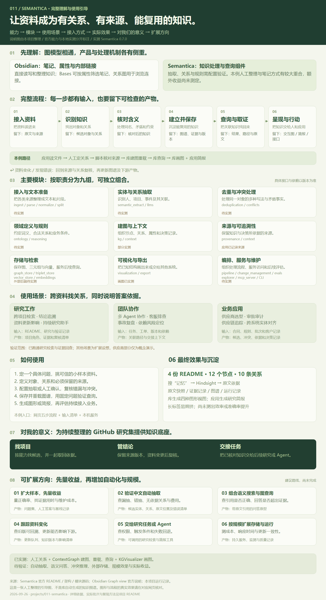
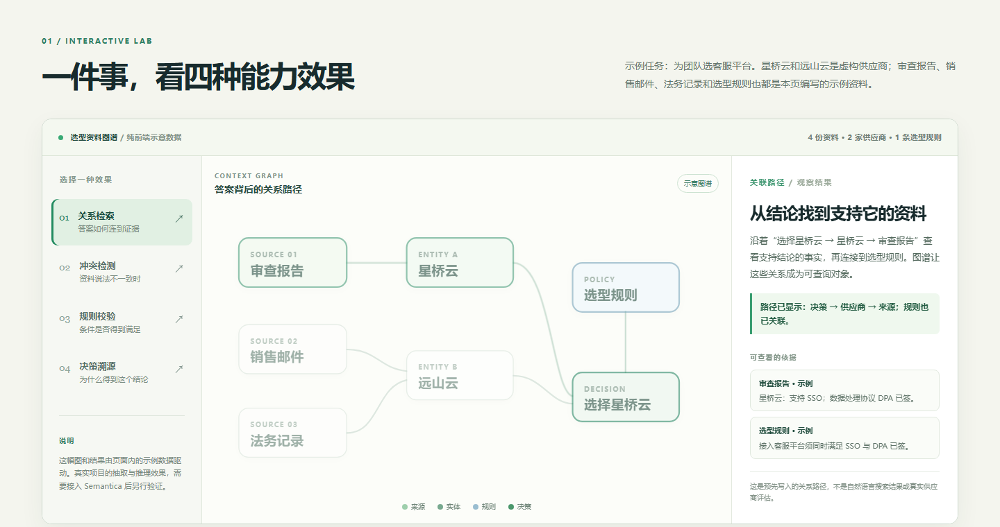
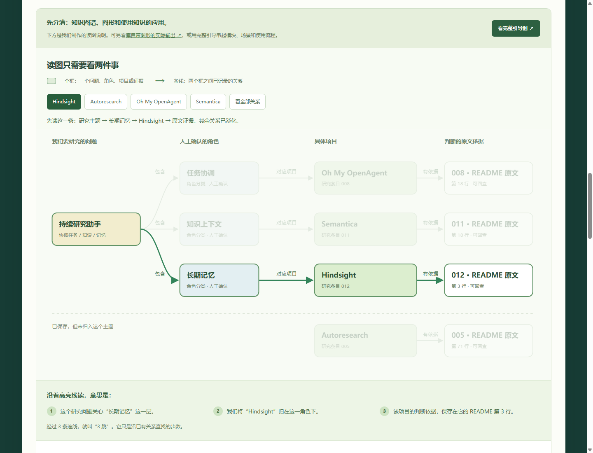
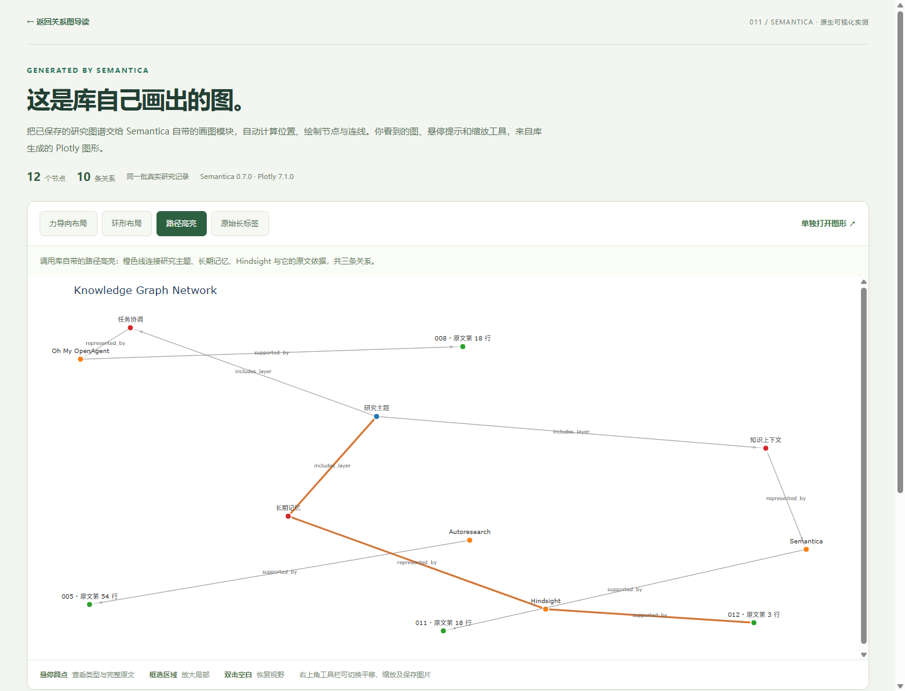
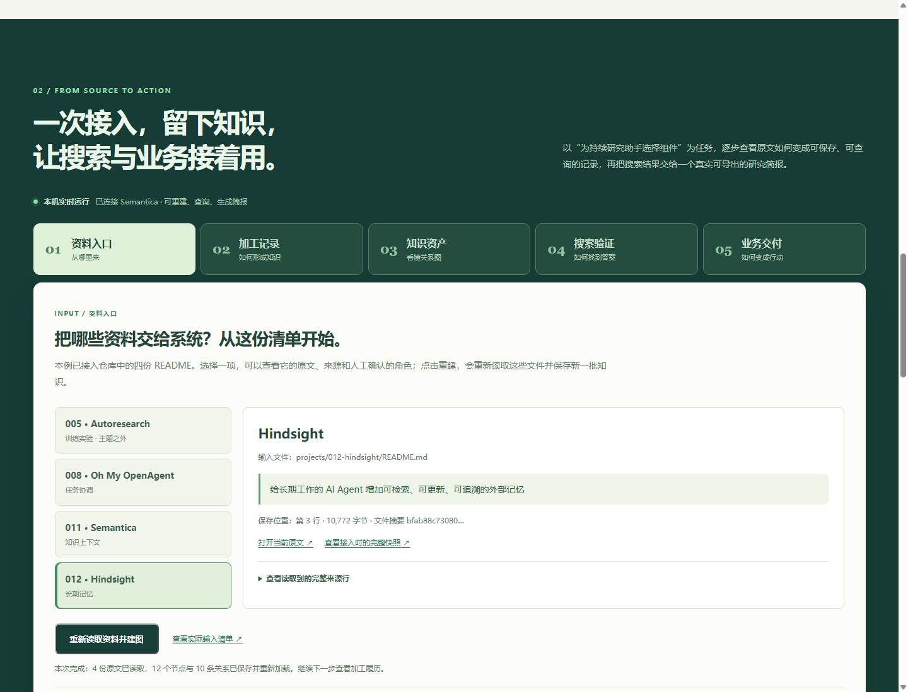

# 011 · Semantica：有来源的知识图谱与决策上下文



**图片说明与来源：** 本仓库依据 Semantica 官方文档、源码、Obsidian 官方说明与本地运行记录原创整理的完整总览图，分别标明库能力、当前实测与扩展计划。它是人工整理的引导图；库原生图谱效果见下文。[放大 SVG](assets/guide-overview.svg)。

## 项目速览

| 项目 | 内容 |
| --- | --- |
| 原仓库 | [semantica-agi/semantica](https://github.com/semantica-agi/semantica) |
| 作者与归属 | [Semantica 团队及原仓库贡献者](https://github.com/semantica-agi/semantica/graphs/contributors) |
| 原项目许可证 | [MIT](https://github.com/semantica-agi/semantica/blob/main/LICENSE) |
| 研究日期 | 2026-09-26 |
| 研究状态 | 已核查官方文档与关键源码；已完成概念交互页；已用 Semantica 0.7.0 对本仓库研究记录完成一次本地试验 |
| 网页展示 | [完整理解与使用引导](../../sites/011-semantica/guide.html) · [场景与真实流程](../../sites/011-semantica/index.html) · [库原生图形](../../sites/011-semantica/native-graph.html)；直接打开可浏览快照，启动本地服务后可实际重建、搜索和生成简报 |

**一句话摘要：** Semantica 是 Python 知识与上下文基础设施：把多来源信息组织为实体、关系、事实、来源和决策，提供图查询、规则推理、冲突处理及来源追踪。它可以作为 AI 应用的语义层，但抽取质量和业务判断仍要用真实数据检验。[官方 README](https://github.com/semantica-agi/semantica/blob/main/README.md)

## 理解摘要

- **能力：** 提供从资料接入、抽取、实体去重与冲突处理，到建图、存储、查询、规则检查、来源追踪和可视化的组件，供开发者搭建知识系统。
- **实现原理：** 解析与切分资料，通过规则、机器学习、LLM 或人工确认实体和关系；将其保存为带属性与来源的节点和边，再用图遍历、规则或可选向量检索为应用取回知识。画图显示已有结构，事实质量取决于抽取和复核。
- **使用场景：** 跨资料研究、带证据的问答、Agent 共享上下文、工单排查、供应链追踪、规则与决策审计；具体集成与业务动作仍由应用负责。
- **对我们的意义：** 把 GitHub 项目、能力、结论与原文联系起来，让研究记录可搜索、可复核、可交接。已实测四份资料的建图、重载、查询与原生画图，尚未证明比笔记整理或直接搜 README 更高效。

能力与原理依据[官方架构](https://github.com/semantica-agi/semantica/blob/main/ARCHITECTURE.md)及下文源码研究；场景和研究价值属于应用分析。

**在线入口：** [能力摘要与真实流程](https://yydshly.github.io/0926_codex_project/sites/011-semantica/) · [完整引导与 Obsidian 对比](https://yydshly.github.io/0926_codex_project/sites/011-semantica/guide.html) · [库原生图谱](https://yydshly.github.io/0926_codex_project/sites/011-semantica/native-graph.html)。GitHub Pages 提供静态展示、快照内筛选与快照简报导出；重新接入资料、运行 Python 和核验当前文件版本需启动本机服务。

## 先看完整引导图

我们把本轮讨论整理为[完整引导网页](../../sites/011-semantica/guide.html)，先用 Obsidian 关系图建立类比，再区分“知识图谱数据、图形视图、使用知识的应用”。Obsidian 默认图中的节点主要表示笔记、连线表示内部链接；本例把角色、项目与证据分别作为节点，关系带有明确类型。[Obsidian 官方说明](https://obsidian.md/help/plugins/graph)

总览图见页首，也可进入[网页引导](../../sites/011-semantica/guide.html)按流程逐项查看。

**引导图说明与来源：** 本仓库原创的内容与排版，依据 Semantica 官方 README、架构说明、抽取指南、可视化源码，以及本项目的实际运行记录整理。此图是人工整理的能力说明图，不是 Semantica 自动生成的关系图；原生图形的运行证据见下文。可下载 [PNG 长图](assets/guide-overview.png) 或打开 [SVG 高清版](assets/guide-overview.svg)。SVG 由本项目生成，PNG 通过本地 Chrome 实际渲染导出，未使用第三方照片。

网页包含八部分引导和一项产品对比专题：

1. **先理解：** 图谱保存结构，图形显示结构，应用使用知识；自动抽取、建图与画图分别负责不同环节。
2. **全流程：** 接入资料 → 识别知识 → 核对含义 → 建立并保存 → 查询与取证 → 呈现与行动，可切换“库完整能力”与“我们的实际做法”。
3. **模块地图：** 按职责整理九组主要模块，展开查看接口归属、官方依据与验证范围；不把应用自制的来源快照等同于已验证原生 provenance 模块。
4. **十二个场景：** 覆盖研究、团队、业务，逐项说明输入、实际问题、预期产物和验证状态。
5. **如何使用：** 已有演示体验、新资料试点、持续业务接入三条路线，附本地安装和启动入口。
6. **最终效果：** 并列展示库原生图形和我们制作的读图说明，链接图谱、证据、处理记录和研究简报。
7. **对本仓库的意义：** 支撑按能力找项目、按来源复核结论、向后续研究交接证据；是否节省时间尚未测量。
8. **扩展路线：** 扩大样本与基线评估 → 中文自动抽取 → 语义检索与图查询 → 资料版本与影响 → Agent 或业务工具 → 持久存储与持续评估。每一步列出产物和验证办法，均为建议计划。

**产品对比专题：** 对照 Obsidian 与 Semantica 的共同图模型、六项差异、Hindsight 同题示例、当前验证边界和选择建议。

网页版的[桌面截图](assets/guide-preview.png)、[交互流程截图](assets/guide-flow-preview.png)和[手机截图](assets/guide-mobile-preview.png)来自本地 Chrome。内容保存在 [guide-content.json](guide-content.json)，通过 [build_guide.py](build_guide.py)生成网页离线数据与说明图；网页交互、资源链接和 SVG 边界已用浏览器检查。重新导出 PNG 可运行 `node projects/011-semantica/verify_guide.mjs`，需要当前本机服务和已安装的 Chrome。

## 与 Obsidian 的对比总结

[网页对比专题](../../sites/011-semantica/guide.html#comparison)区分三个层次：在表达关系的抽象上，两者都可使用节点与连线；在数据组织上，Obsidian 主要围绕本地笔记、属性和内部链接，Semantica 可组织类型化的实体、关系、证据和决策记录；在处理机制上，Semantica 的抽取、去重、冲突检查与规则组件需要实际配置和验证，超出图形展示本身。

Obsidian 是直接使用的知识管理应用，其 [Properties](https://obsidian.md/help/properties)支持结构化笔记属性，[Bases](https://obsidian.md/help/bases)支持查看、编辑、排序与筛选文件和属性；[默认关系图](https://obsidian.md/help/plugins/graph)用于浏览笔记之间的内部链接。Semantica 主要提供搭建知识处理与查询系统的组件，能力范围见[官方架构](https://github.com/semantica-agi/semantica#architecture)。对比并不排除 Obsidian 通过插件或自行开发扩展能力。

**对当前试验的判断：** 四份 README 的角色标注、项目筛选和证据整理，与 Obsidian 中人工维护笔记及属性存在很大重合。尚未开展 Obsidian 实机对测，也未证明 Semantica 比 Obsidian 或直接搜索 README 更快、更准确。网页中 Obsidian 的 Hindsight 操作路径明确标为用法示例，Semantica 的路径标为已实测。

**选择建议：** 以个人阅读与研究整理为主时，先使用现成笔记能力更直接；需要批量处理多处资料、复用处理规则、向应用或 Agent 提供知识时，再测试 Semantica 是否减少开发和维护工作。两者可以设计成“Obsidian 维护原文 → Semantica 读取确认版本 → 网页或 Agent 查询”，目前尚未接通。后续应以相同资料和问题比较正确性、耗时、开发投入与维护成本。这些是结合本仓库任务的应用判断，不是已测出的竞品结论。

对比依据核对日期：2026-09-26。专题的[桌面截图](assets/comparison-preview.png)与[手机截图](assets/comparison-mobile-preview.png)为本项目在本地 Chrome 实际渲染所得。

## 为什么研究

本仓库以编号收录 GitHub 项目，并要求每项研究保留源仓库、许可、实际发现和图片来源。随着项目增加，单篇 README 可以回答“这个项目是什么”，但跨项目问题会变难，例如“哪些项目共用同一技术”“哪项结论出自哪份资料”。Semantica 值得研究，因为它提供了把这些关系和证据显式记录下来的一组现成组件。下文用四份真实研究记录验证了最小的建图和遍历路径。

## 核心发现

1. **它覆盖从资料到图谱的完整处理链。** 官方架构列出接入、解析、规范化、切分、实体与关系抽取、冲突检测、去重、建图、规则与来源追踪、存储和导出等环节。文件、网页、数据库与数据平台都可作为输入；模块也可独立使用。[架构说明](https://github.com/semantica-agi/semantica/blob/main/ARCHITECTURE.md)、[官方 README](https://github.com/semantica-agi/semantica/blob/main/README.md)
2. **“语义”来自显式关系和约束，而不只是相似度。** 图节点可表示实体、事实和决策，边表示关联；图遍历回答“谁连接了什么”，向量检索帮助找近似内容。OWL、SHACL、SKOS 等用于概念定义和约束；Datalog、Rete、SPARQL 等用于规则与查询。[官方 README](https://github.com/semantica-agi/semantica/blob/main/README.md)、[推理模块](https://github.com/semantica-agi/semantica/tree/main/semantica/reasoning)
3. **抽取方法可替换，质量必须检验。** 抽取指南提供模式、正则、spaCy、Hugging Face 模型和 LLM 等方式。主方法失败时还可能退到简单启发式规则；有结构化输出不等于事实正确。[抽取指南](https://github.com/semantica-agi/semantica/blob/main/semantica/semantic_extract/semantic_extract_usage.md)
4. **“因果链”主要是对已记录关系的追踪。** 源码将 `CAUSED`、`INFLUENCED`、`PRECEDENT_FOR` 等边用于上下游遍历和影响统计。这可解释决策脉络，不能单凭图上的标签证明现实中的因果关系。[ContextGraph 源码](https://github.com/semantica-agi/semantica/blob/main/semantica/context/context_graph.py)、[CausalChainAnalyzer 源码](https://github.com/semantica-agi/semantica/blob/main/semantica/context/causal_analyzer.py)
5. **可追溯范围是系统外部过程。** 官方明确区分“记录输入上下文、规则、来源和执行轨迹”与“解释基础模型内部思考”。实际审计还取决于接入时是否记录了可信来源、版本和操作过程。[官方 README](https://github.com/semantica-agi/semantica/blob/main/README.md)、[来源追踪模块](https://github.com/semantica-agi/semantica/tree/main/semantica/provenance)

## 网页先展示什么

打开[交互网页](../../sites/011-semantica/index.html)，围绕同一件虚构的“客服平台供应商选型”切换四种观察方式：

| 交互效果 | 页面让你看到 | 对应的 Semantica 能力 |
| --- | --- | --- |
| 关系检索 | 从“选择星桥云”追到供应商、规则和审查资料 | Context Graph 节点、边与图遍历 |
| 冲突检测 | 两份资料对远山云的 DPA 状态给出不同说法，页面同时展示两条记录 | 冲突检测与来源保留 |
| 规则校验 | 在两家供应商之间切换，观察“必须有 SSO 且 DPA 已签”的规则结果 | 策略、约束和可解释规则 |
| 决策溯源 | 查看结论依赖的事实、来源、规则和结果 | 决策记录与 PROV-O 风格的来源链 |



**网页截图说明与来源：** 2026-09-26 在本地 Chrome 中实际渲染本项目网页后截取；画面展示页面的初始关系检索模式。供应商、文档和结论均为本仓库构造的示例，不是 Semantica 包的运行结果或官方截图。

上面这个**供应商概念体验**的输入、事实、路径和结果均写在前端示例代码中，由浏览器计算或切换呈现。**这一部分不是 Semantica 包的运行结果。**不需要账号、API 密钥或构建步骤；直接打开网页即可体验。网页使用相对资源路径。真实运行部分见下一节。

## 真实试验：本仓库的研究图谱

**实际问题：** 本仓库哪些项目分别负责 Agent 的任务协调、知识上下文和长期记忆？依据是什么？

本次用 [Semantica 0.7.0](https://pypi.org/project/semantica/0.7.0/) 的 `ContextGraph` 完成建图、保存、重新加载和查询。文件接入与简报产出由本仓库编写的应用代码完成。页面按五个步骤展示数据如何进入、形成知识、保存、被检索和用于交付。

| 步骤 | 具体输入与处理 | 留下的产物 / 责任 |
| --- | --- | --- |
| 资料入口 | [输入清单](pilot-inputs.json)指定 005、008、011、012 四份 README、证据锚点和人工角色 | 清单是实际接入配置；本例没有上传入口或网页抓取 |
| 加工记录 | 脚本读取原文，验证锚点唯一，记录行号与 SHA-256；人工解释角色含义；Semantica 写入节点与关系 | 4 个项目、4 个证据、3 个角色和 1 个主题，共 12 个节点 / 10 条关系 |
| 知识资产 | 保存完整原文快照、来源清单、证据表、完整图谱和运行记录，再用新的 ContextGraph 重载 | [来源清单](artifacts/source-manifest.json)、[证据表](artifacts/evidence.json)、[图谱](artifacts/knowledge-graph.json)、[运行履历](artifacts/run-report.json) |
| 搜索验证 | 输入“记忆”“任务协调”或项目名，调用 ContextGraph.query，再沿项目关系取回原文 | 可回查来源的检索结果；属于关键词查询，没有向量语义搜索或自然语言问答 |
| 业务交付 | 勾选检索结果，检查来源文件与输入清单版本，按应用模板整理研究简报 | 本地生成 `artifacts/research-brief.md`；来源变化时要求先复核重建，不自动做技术选型 |

**沉淀的含义：** 文件保存后，查询可以加载已有图谱复用关系；证据、来源和处理记录也能交给后续工作。本例保存最新一批知识，尚未实现多版本历史、增量更新或外部数据库。

### 怎样读懂这张图

[网页的关系图导读](../../sites/011-semantica/index.html#graph-guide)直接使用本次保存的图谱数据绘制。选择 Hindsight 时，高亮的路径读作：**研究主题 → 长期记忆 → Hindsight → README 原文**。一个框是一个节点，一条箭头是已经记录的一种关系；经过三条连线就叫“三跳”。页面逐条解释关系，并显示最后找到的原文依据，支持继续用“记忆”搜索。

全图的 12 个节点由 1 个研究问题、3 个角色、4 个项目和 4 段证据组成；10 条关系由 3 条问题到角色、3 条角色到项目和 4 条项目到证据的连接组成。选择 Autoresearch 可看到它只有“项目 → 原文”的一跳关系；它已保存，但没有被人工归入这个研究主题。节点数量不代表准确率，图上的连接也不代表项目已完成集成。



**关系图截图说明与来源：** 本仓库网页在本地 Chrome 的实际渲染截图；节点和连线来自 Semantica 保存的 `artifacts/knowledge-graph.json`，布局与解释由本项目制作。

### 库自带画图功能的实际效果

[打开原生可视化实测页](../../sites/011-semantica/native-graph.html)。此页中的图形实际调用 Semantica 0.7.0 的 `KGVisualizer.visualize_network` 生成，使用 Plotly 7.1.0 显示。切换按钮、说明和页面外框由本项目制作；节点位置、连线、配色、悬停与高亮均使用库生成的图形，没有手绘坐标或重写绘图逻辑。

| 输出 | 实际观察 |
| --- | --- |
| 力导向布局 | 自动排布完整的 12 个节点和 10 条关系，能看到主题网络与 Autoresearch 的独立关系；个别连线交叉 |
| 环形布局 | 相同节点沿圆周排列，连接数据保持不变 |
| 路径高亮 | 将 ContextGraph 实际查询返回的 Hindsight 路径传给 visualizer，库以橙色显示三条关系 |
| 原始长标签 | 保留完整证据句作为标签时，文字容易重叠或超出可视区域；前三种输出缩短问题和证据的标签，完整内容保留在悬停提示中 |



**原生图形截图说明与来源：** 本地 Chrome 实际渲染本项目的原生可视化实测页后截图；图形由 Semantica / Plotly 生成，页面由本仓库制作。[普通布局截图](assets/native-preview.png)。本例仍使用人工核对的关系，不能把自动布局理解成自动发现知识。

**版本适配与验证：** 本地 0.7.0 的 `ContextGraph.to_kg_dict()` 导出 `source_id/target_id`，而 `KGVisualizer` 读取 `source/target`。接入脚本补齐同值字段后再画图，保留节点 ID、关系类型、端点和方向。脚本核验实际绘制的节点数、连线数和高亮关系数；浏览器验证了四种输出切换、原生悬停提示和移动端页面宽度。布局使用固定随机种子 42，未调整库的图形样式；原始图中默认字体较小，窄屏查看更依赖放大与单独打开。

**复现与记录：** [生成脚本](native_graph.py)随 `run_pilot.py` 建图一起运行，也可单独读取已有图谱生成视图。四份 HTML 使用相对路径共享本地 Plotly 脚本，支持离线打开。输入图谱摘要、批次、运行版本和显示处理记录保存在 [native-visualization.json](artifacts/native-visualization.json)。Plotly 按 MIT 许可使用，已随本地脚本保留[许可文件](../../sites/011-semantica/native/LICENSE-plotly.txt)。

| 查询结果 | 在本仓库中承担的角色 | 可核对依据 |
| --- | --- | --- |
| 008 · Oh My OpenAgent | 任务协调 | [008 研究记录](../008-oh-my-openagent/README.md)中的任务编排、工具与持续执行描述 |
| 011 · Semantica | 知识上下文 | [011 研究记录](README.md)中的实体、关系、事实、来源与决策描述 |
| 012 · Hindsight | 长期记忆 | [012 接入时的完整研究快照](artifacts/sources/012.md)中的可检索、可更新的外部记忆描述 |



**真实试验截图说明与来源：** 2026-09-26 用本地 Chrome 实际渲染[本项目网页](../../sites/011-semantica/index.html#pilot)后截取，展示资料入口和五步流程；页面、接入服务与业务模板由本仓库制作，不是 Semantica 官方产品界面。[手机视图截图](assets/pilot-mobile-preview.png)同样来自本地 Chrome。

005 · Autoresearch 同样进入图谱，作为排除对照。其研究重点是训练实验循环，人工标注时没有把它连到这次查询的三个角色，因此本次三跳遍历不返回它。这是**限定问题范围**的效果，不是 Semantica 自动判断 005 不相关。

**实际效果：** 保存后重新加载的图谱可查询：“记忆”命中 012，“任务协调”命中 008，“Semantica”命中 011，“Autoresearch”命中 005；无关关键词返回空结果。主题查询只连接前三项，但项目名搜索可以找到全部四项。每个项目均关联一条可定位原文的证据。业务端据此生成简报，复用已有角色和出处；尚未测出比直接阅读 README 更快或更准确。

**代价和边界：** 角色归类、证据选择和排除 005 都由人完成；本次没有启用 Semantica 的中文自动抽取、向量检索、冲突检测或规则推理。图谱查询只复现已录入的关系，不证明原项目的宣称，也不构成性能测试。研究记录继续增加时，关系维护与来源更新的人工成本需要另测。

**复现：** 使用 Python 3.12，在独立环境中安装[固定版本依赖](requirements.txt)。从仓库根目录运行：

```powershell
python -m pip install -r projects/011-semantica/requirements.txt
python projects/011-semantica/run_pilot.py
python projects/011-semantica/serve_pilot.py --port 8761
```

本项目已创建的环境可使用 `projects/011-semantica/.venv/Scripts/python.exe` 替代上面的 `python`。服务默认仅监听本机；启动后进入 `http://127.0.0.1:8761/sites/011-semantica/index.html#pilot`，即可从网页重建、检索和生成简报。按 Ctrl+C 关闭服务。

增加资料时修改 [pilot-inputs.json](pilot-inputs.json)，录入文件路径、证据原文和已核对的角色，然后重建。若原文锚点消失或出现多次，处理会报错要求复核。页面也检查文件版本；生成简报时若来源或标注已变化，服务拒绝沿用旧记录。

**来源完整性：** 每份输入的原文快照随 011 一起保存。若克隆后的仓库暂未收录某个源项目（例如 012），脚本会读取该项目已保存的快照，并在来源清单与网页标出实际读取路径；这验证的是存档版本，不能证明上游资料仍然最新。原文件存在时优先读取原文件，锚点不匹配会报错。

**应用入口与库的分工：** [serve_pilot.py](serve_pilot.py) 提供本项目的网页接口，`/api/build` 重新接入、`/api/search` 查询保存图谱、`/api/brief` 生成本地简报。这些接口是本仓库编写的演示应用，不是对 Semantica 官方 API 的原样部署。直接用文件方式打开网页时，可以查看快照、筛选记录和导出明确标注的快照简报，但无法执行 Python 或核验当前文件版本。

## 技术原理与模块

```text
文件 / 网页 / 数据库
        ↓
解析、规范化、切分、抽取
        ↓
冲突检测与实体去重
        ↓
知识图谱（实体、关系、事实、时间、来源）
        ↓
本体与约束 / 规则推理 / 决策记录
        ↓
图遍历 + 语义检索 → REST、MCP、CLI 或可视化
```

构图和规则处理可用确定性方法完成；从自然语言抽取实体、关系时也可选机器学习或 LLM。官方提供 RDF 和属性图后端及向量存储适配。快速入门中的 `ContextGraph` 示例在内存里建立节点和边；要做持久服务，还需选择存储后端并设计数据更新流程。[官方 README](https://github.com/semantica-agi/semantica/blob/main/README.md)、[ContextGraph 源码](https://github.com/semantica-agi/semantica/blob/main/semantica/context/context_graph.py)

## 场景、扩展与对我的意义

适合多源企业知识整合、需要证据链的问答、Agent 共享上下文，以及需要复核规则和决策过程的工作流。对本仓库，最有价值的扩展是把“项目、源仓库、方法、功能、结论、许可证、图片来源”连成可查询的研究图谱，并为每条关系保存对应 README 或上游文档链接。

已用四个项目完成人工标注与一次跨项目图查询。下一步可以扩展到更多条目，比较 README 搜索与图谱查询的答案正确率、证据定位时间和维护成本，再决定是否引入自动抽取与持久图数据库。中文抽取、领域本体、增量更新和人工纠错可作为后续方向；这些尚未验证。

## 动手验证与边界

- **已完成：** 核查官方文档与关键源码；四种概念体验；四份真实 README 的接入、证据与原文保存、ContextGraph 建图/保存/重载/查询、本地服务和按证据生成研究简报；KGVisualizer 实际生成四种图形视图。
- **未完成：** 未用本仓库资料运行自动抽取、冲突检测或规则推理；未验证外部图数据库与向量存储；未测性能或与纯文本搜索的效率差异。
- **性能声明：** 官方 README 给出特定版本和数据集上的优化数字，同时说明部分数字是历史测量，结果受硬件、图形态和后端影响。本研究不把这些数字当作本地实测。[官方性能说明](https://github.com/semantica-agi/semantica/blob/main/README.md#performance)

## 参考、署名与图片许可

- 原始项目、名称、文档和源码归 Semantica 团队及[原仓库贡献者](https://github.com/semantica-agi/semantica/graphs/contributors)所有，原项目按 [MIT License](https://github.com/semantica-agi/semantica/blob/main/LICENSE) 发布。
- 原生可视化页使用 Semantica 的 `KGVisualizer` 和 Plotly；`assets/native-preview.png`、`assets/native-path-preview.png` 是其实际输出的本地网页截图。Plotly 及其脚本版权归 Plotly 及相关贡献者，随文件保留 MIT 许可。
- 能力事实主要来自[官方 README](https://github.com/semantica-agi/semantica/blob/main/README.md)、[ARCHITECTURE.md](https://github.com/semantica-agi/semantica/blob/main/ARCHITECTURE.md)、[抽取指南](https://github.com/semantica-agi/semantica/blob/main/semantica/semantic_extract/semantic_extract_usage.md)、[ContextGraph](https://github.com/semantica-agi/semantica/blob/main/semantica/context/context_graph.py) 与[因果链分析源码](https://github.com/semantica-agi/semantica/blob/main/semantica/context/causal_analyzer.py)。访问和研究日期：2026-09-26。
- `assets/cover.svg` 为本仓库原创说明图，`assets/lab-preview.png` 为虚构供应商概念体验的本地网页截图；`assets/pilot-preview.png`、`assets/pilot-mobile-preview.png` 和 `assets/graph-preview.png` 为 Semantica 本地试验结果的网页渲染截图。所有图形与页面由本项目制作，没有引用第三方图片。概念体验截图只解释机制；真实试验截图需要连同 [JSON 结果](pilot-result.json)和[复现脚本](run_pilot.py)一起理解。
