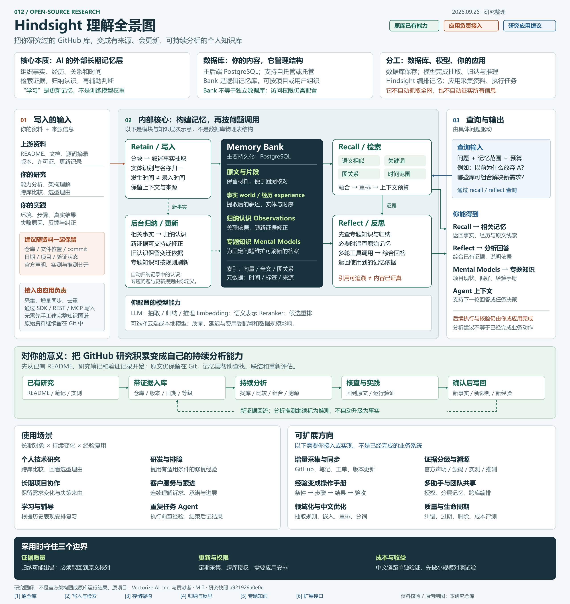

# 012 · Hindsight

Hindsight 是 AI Agent 的外部长期记忆系统：把文档、对话和任务经历整理成可检索、可更新、可追溯的记忆，供后续问答与分析使用。

- **能力：** 写入资料与经历，找回相关证据，生成带来源的回答，并维护归纳认识与专题知识。
- **实现原理：** 主要在 PostgreSQL 上保存原文、事实、实体关系和索引；模型抽取信息，语义、关键词、图关系与时间检索共同召回证据，再由模型综合分析。经验积累发生在外部记忆中，不会因此更新模型权重。
- **使用场景：** 持续研究、技术选型、研发排障、长期客户服务，以及需要复用历史经验的 Agent。
- **对我们的意义：** 把已研究的 GitHub 项目、源码发现、实测结果和选型理由作为持续更新的知识来源，帮助跨项目比较、回查依据、发现过期结论，减少重复调研。采集更新与结论核验仍需自己组织。

| 项目 | 内容 |
| --- | --- |
| 原仓库 | [vectorize-io/hindsight](https://github.com/vectorize-io/hindsight) |
| 作者与归属 | Vectorize AI, Inc. 与 Hindsight 贡献者；本研究不代表官方 |
| 核对日期 | 2026-09-26 |
| 源码快照 | [`a921929a0e0e`](https://github.com/vectorize-io/hindsight/tree/a921929a0e0ea82fb49da1daa0ca3e152e41fcc1)，上游提交时间 2026-09-25 UTC |
| 原项目许可证 | [MIT](https://github.com/vectorize-io/hindsight/blob/a921929a0e0ea82fb49da1daa0ca3e152e41fcc1/LICENSE)，Copyright (c) 2025 Vectorize AI, Inc. |
| 研究状态 | 文档与关键源码分析；未部署 Hindsight、未连接 LLM、未复现实验 |
| 网页展示 | [中文研究网页](https://yydshly.github.io/0926_codex_project/sites/012-hindsight/) · [可放大的总览图](https://yydshly.github.io/0926_codex_project/sites/012-hindsight/map.html) · [网页源码](../../sites/012-hindsight/index.html) |

图片说明：本仓库依据官方文档、关键源码与本次讨论原创绘制的理解汇总图；不是 Hindsight 官方架构图、控制台截图或原库实测输出。图中分别标注原库能力、应用接入责任与研究建议，没有使用第三方图片素材。

[打开可放大的全景图](../../sites/012-hindsight/map.html) · [高清 PNG](assets/understanding-map.png) · [矢量 SVG](assets/understanding-map.svg)

## 一张图中的关键理解

- **本质：** 为 Agent 提供外部长期记忆与知识组织，主要通过更新记忆而非模型权重来积累经验。
- **数据库：** 使用 PostgreSQL 等已有数据库管理原文、记忆、关系与索引；Bank 是逻辑范围，不等于为每个 GitHub 库创建一个独立数据库。
- **输入与输出：** 写入资料及来源信息；查询输入问题、范围与预算。输出包括检索记忆、带依据的分析、专题知识和 Agent 上下文。
- **内部流程：** Retain 抽取与归一，Memory Bank 存储，后台归纳和专题刷新，Recall 多路检索，Reflect 综合证据。图是逻辑结构，不对应精确的物理数据库表。
- **对个人研究的意义：** 已有研究 → 带证据入库 → 跨项目分析 → 回到原文或实践核查 → 确认后的新经验写回。推测仍应保留推测标记。
- **扩展责任：** 采集、定时更新、授权与实际业务执行由外围应用或集成组件提供；图中的扩展建议尚未在本项目实现。

图解主要依据：[写入](https://hindsight.vectorize.io/developer/retain)、[检索](https://hindsight.vectorize.io/developer/retrieval)、[存储](https://hindsight.vectorize.io/developer/storage)、[归纳](https://hindsight.vectorize.io/developer/observations)、[反思](https://hindsight.vectorize.io/developer/reflect)、[专题知识](https://hindsight.vectorize.io/developer/mental-models)、[扩展](https://hindsight.vectorize.io/developer/extensions)。

## 核心能力与原理

Hindsight 的“学习”主要是积累外部记忆、更新归纳认识，再把相关内容交给模型使用。它并不因此修改模型权重，也不会自动证明被写入的信息真实。

| 层次 | 作用 | 依据 |
| --- | --- | --- |
| `retain` | 将记录整理成包含上下文、实体、时间与关系的记忆，区分外部信息与 Agent 经历 | [写入文档](https://hindsight.vectorize.io/developer/retain) |
| `recall` | 组合语义、关键词、图关系和时间检索，融合与重排候选，按上下文预算返回 | [检索文档](https://hindsight.vectorize.io/developer/retrieval) |
| `reflect` | 使用工具循环收集证据、追查材料并形成回答；推理仍依赖接入模型 | [反思文档](https://hindsight.vectorize.io/developer/reflect) |
| Observations | 后台归纳相关记忆，在新证据或纠正到来时调整认识并关联依据 | [归纳文档](https://hindsight.vectorize.io/developer/observations) |
| Mental Models | 为固定问题维护可刷新的专题答案，读取与重新生成分离 | [知识模型文档](https://hindsight.vectorize.io/developer/mental-models) |

处理链为：原始记录 → 抽取和实体整理 → 存储与关联 → 多路检索 → 基于证据的综合判断。区分事件发生时间和录入时间，有助于处理回溯记录。主要存储采用 PostgreSQL，结合向量、全文、关系与元数据；并不需要为每种数据独立部署一套存储。[存储说明](https://hindsight.vectorize.io/developer/storage)

### 已核对的源码发现

- [`search/fusion.py`](https://github.com/vectorize-io/hindsight/blob/a921929a0e0ea82fb49da1daa0ca3e152e41fcc1/hindsight-api-slim/hindsight_api/engine/search/fusion.py)：`reciprocal_rank_fusion` 按不同通道的排名累计分数；源码中包含 semantic、bm25、graph、temporal 四类来源。另有适用于去重检索的交错融合实现，不能把所有内部检索都简化成同一个策略。
- [`reflect/agent.py`](https://github.com/vectorize-io/hindsight/blob/a921929a0e0ea82fb49da1daa0ca3e152e41fcc1/hindsight-api-slim/hindsight_api/engine/reflect/agent.py)：反思实现包含分层检索、工具调用与上下文预算管理；专题知识、归纳认识和原始记忆分别承担不同角色。
- [`search/graph_retrieval.py`](https://github.com/vectorize-io/hindsight/blob/a921929a0e0ea82fb49da1daa0ca3e152e41fcc1/hindsight-api-slim/hindsight_api/engine/search/graph_retrieval.py)：图检索有独立接口，接收 bank、事实类型、检索预算及标签范围；不应将其理解为无限制的全库搜索。

这些是静态代码观察，不是性能测试。当前实现与早期论文在术语和细节上会有差异，应以实际采用版本为准。默认原生 PostgreSQL 全文后端也不是真正的 BM25；选用的检索扩展会影响行为。

## 使用场景与边界

适合长期个人助手、研发排障、客户服务和持续研究：同一对象被反复服务，历史信息会变化，过去结果会影响未来判断。仅做一次性摘要、稳定手册查询或固定短流程时，直接搜索或较简单的 RAG 可能更经济。

需要核对的边界：

1. **中文链路。** 中文 LLM 只是其中一环；嵌入、重排和全文分词也要适配。官方文档列出的默认本地模型和原生全文配置偏向英文。[多语言说明](https://hindsight.vectorize.io/developer/multilingual)
2. **证据与真实性。** 来源引用可帮助核查，但抽取、归纳和推理仍可能错误；被存储为“事实”并不等于经过外部核验。
3. **权限。** Bank 与标签用于组织范围，应用仍需明确身份、授权和跨项目共享策略。[扩展与租户](https://hindsight.vectorize.io/developer/extensions)
4. **成本。** 写入、归纳、模型调用、嵌入和重排都有开销，须结合调用频率与材料规模测量。[性能说明](https://hindsight.vectorize.io/developer/performance)

作者论文报告 LongMemEval 最高 91.4%，属于特定设置下的作者实验；本项目未复现，不能作为中文业务准确率承诺。[论文：Hindsight is 20/20](https://arxiv.org/abs/2512.12818)

## 可扩展方向（研究建议）

| 优先级 | 方向 | 应补充的工作 |
| --- | --- | --- |
| 1 | 研究证据管理 | 区分官方声明、源码发现、本人实测与推测，记录版本、时间与出处 |
| 2 | 任务经验复用 | 组织条件、动作、结果和失败原因，仅将验证过的经验提升为操作步骤 |
| 3 | 分层共享 | 明确个人、项目与团队范围，通过应用编排实现跨库查询与授权 |
| 全程 | 质量与生命周期 | 测试纠错、过期、删除、引用、新旧状态和维护成本 |

可利用租户、操作校验、HTTP 与 MCP 扩展点实现部分业务逻辑；以上建议尚未在本研究中实现。

## 对本研究仓库的意义

Git 中的原始材料和人工确认结论继续作为可审查依据；记忆层可用于找回设计理由、联结相似项目以及生成待核验的经验归纳。核心问题是：它能否减少重复解释背景、重复调研和重复踩坑。

建议试验尚未执行：选择 3–5 个已有项目，整理约 30–50 条真实记录，准备约 20 个问题，包含纠错、条件变化和无依据的问题。用同一材料比较直接搜索、基础 RAG 与 Hindsight，衡量答案正确性、引用支持度、新旧状态识别、耗时与成本。

## 网页与验证

- 入口：[`sites/012-hindsight/index.html`](../../sites/012-hindsight/index.html)，样式与脚本使用相对路径，无外部字体或运行依赖。可以直接在浏览器打开，也可以从仓库根目录启动静态服务器。
- Windows 本地预览：双击 [`open-preview.cmd`](../../sites/012-hindsight/open-preview.cmd)，会在后台启动仅本机可访问的服务并打开网页；已在运行时直接复用。也可直接打开 `index.html`，无需服务。后台服务随电脑关闭而结束，不会设置开机启动。
- 原理区可切换写入、存储、检索和反思四步；时间线展示三个阶段的预设认识。二者仅在浏览器切换展示内容，不运行 Hindsight，不调用模型，不写入真实记忆。
- 页面包含能力、原理、场景、边界、扩展、个人价值与来源；支持键盘操作、窄屏布局和减少动态效果偏好。
- 检查结果见 [verification.md](verification.md)。网页通过本仓库的 GitHub Pages 工作流发布；发布的是研究说明与静态交互示意，未部署 Hindsight 后端服务。

## 图片、归属与许可

- `assets/cover.png`：保留的首版研究网页实际浏览器截图；不是原项目运行结果。
- `assets/understanding-map.svg` / `.png`：本次讨论的原创理解汇总图，是当前根索引的主要预览。构图和文字由本仓库编写；SVG 为可编辑原件，PNG 为同内容高清渲染，可通过 `build-understanding-map.cjs` 重建 SVG。
- 其他桌面、手机与记忆更新区域截图也由本项目本地生成；完整列表与查看入口见 [本地验证记录](verification.md#截图)。
- 页面中的流程图由 HTML/CSS 构成，用于解释数据处理关系；示例日期和“方案 A”均为本仓库编写的虚构材料。
- Hindsight 名称与原项目成果归原作者及贡献者；本仓库新增的中文整理、网页和示例不代表上游。
- 上游代码采用 MIT；再分发上游软件的副本或实质部分，应依许可证保留版权与许可声明。本研究链接上游代码，没有复制整套库或嵌入官方图片。论文许可与软件许可分别适用。
