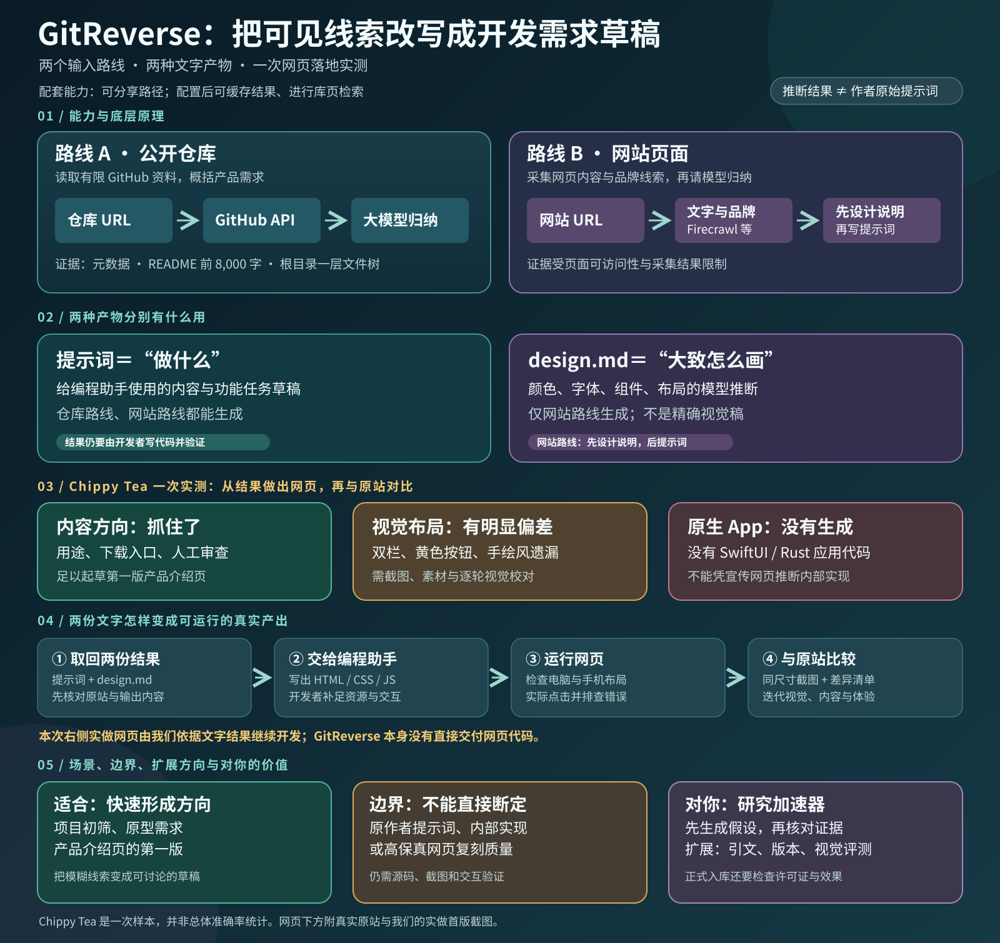
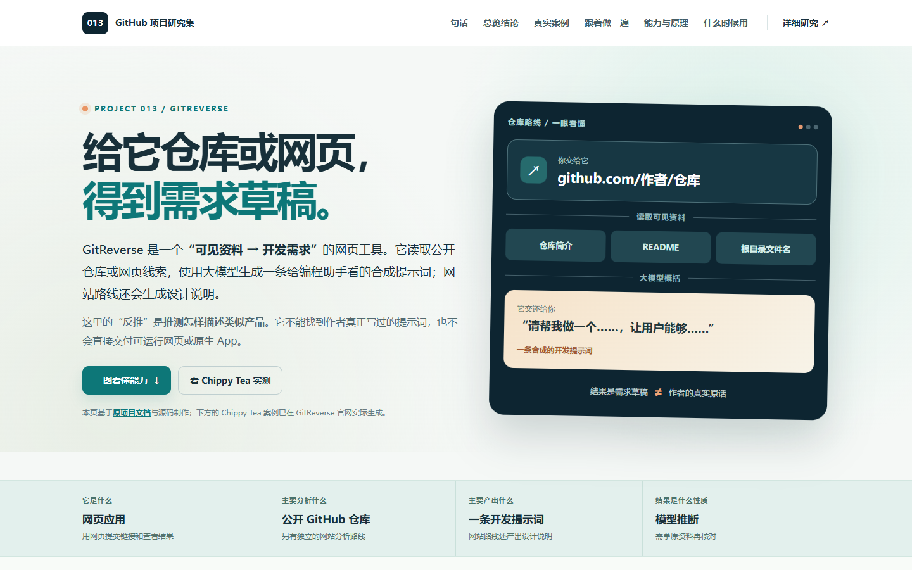

# 013 · GitReverse：从公开仓库或网站生成开发提示词



**图片说明与来源：** 本仓库原创绘制的研究总览图，依据下方列出的 GitReverse 文档、源码及 2026-09-26 的 Chippy Tea 网站路线实测整理。图中补全了两份结果变成可运行网页的流程、适用场景、边界、扩展方向与本研究价值；[教学网页总览](../../sites/013-gitreverse/index.html#summary)紧接图后展示原站和实做首版的桌面、手机截图。图中的“内容方向较准、视觉偏差明显”只描述这一次对比，图内未嵌入第三方图片素材。[下载 PNG 版](assets/research-summary-preview.png) · [查看原先较细的技术路线图](assets/capability-map.svg)。

## 项目速览

| 项目 | 内容 |
| --- | --- |
| 原仓库 | [filiksyos/gitreverse](https://github.com/filiksyos/gitreverse) |
| 作者与归属 | [filiksyos](https://github.com/filiksyos) 与[原仓库贡献者](https://github.com/filiksyos/gitreverse/graphs/contributors) |
| 研究版本 | `main` 的 [`1a1dbdaa704b985e7a6990ac309ae5222e92090b`](https://github.com/filiksyos/gitreverse/commit/1a1dbdaa704b985e7a6990ac309ae5222e92090b) |
| 研究日期 | 2026-09-26 |
| 原项目许可证 | 研究时根目录未见 `LICENSE`，GitHub 仓库元数据的 `license` 为 `null`；代码再使用范围需向权利人确认。[仓库元数据](https://api.github.com/repos/filiksyos/gitreverse) |
| 研究状态 | 已核查 README 与关键源码；2026-09-26 已对 Chippy Tea 完成一次网站路线实测、网页落地和同尺寸对比；仓库路线未实测 |
| 网页展示 | [交互教学页面](../../sites/013-gitreverse/index.html#summary)：扩展总览图、原站与实做首版截图、能力与原理、两种产物及结论；[落地对比](../../sites/013-gitreverse/chippytea-comparison.html) |

**一句话摘要：** GitReverse 是一个网页应用。它把公开 GitHub 仓库的有限资料，或网站的页面与视觉线索，交给大模型，生成一条供编程助手使用的**合成需求提示词**。输出是对“怎样描述类似产品”的推测，无法恢复作者真实输入过的提示词。[原仓库 README](https://github.com/filiksyos/gitreverse/blob/1a1dbdaa704b985e7a6990ac309ae5222e92090b/README.md)

**汇总结论：** 仓库路线输出需求提示词；网站路线先产出概括视觉方向的 design.md，再写建站提示词。两者是后续开发的输入，不是现成代码或原作者的真实原话。Chippy Tea 的一次落地表明，核心内容足以支撑第一版介绍页，但准确的双栏布局、黄色按钮与品牌素材仍要人工补充和截图校对；它也没有生成原生 Mac App。[看完整对比](../../sites/013-gitreverse/chippytea-comparison.html)。

## 要回答的问题

这个项目的标题容易让人以为它能从成品取回“原始 prompt”。本研究具体核查：输入究竟是什么、模型看到了哪些证据、生成了什么、网页分析与代码仓库分析有什么区别；并实际将网站路线的两份结果写成网页，与原站比较布局和视觉效果。

如果想先直观看懂，可以打开[交互教学页面](../../sites/013-gitreverse/index.html)，先看 Chippy Tea 的真实案例，再切换“GitHub 仓库”和“网站网址”逐步查看输入、取证、生成与使用。网站路线引用原服务的实际输出；仓库路线的示例提示词由本研究手写。

### 教学网页预览



**图片说明与来源：** 本仓库制作的教学网页在本地 Chrome 中实际渲染的桌面截图；其中 Chippy Tea 案例引用 GitReverse 官网实测结果，流程示意与中文解读由本研究编写。页面内的 Chippy Tea 官网截图归原网站所有。[查看总览区域](../../sites/013-gitreverse/preview-summary-desktop.png) · [查看手机总览](../../sites/013-gitreverse/preview-summary-mobile.png) · [查看真实案例](../../sites/013-gitreverse/preview-chippytea-case.png) · [查看四步交互](../../sites/013-gitreverse/preview-walkthrough.png)。

## 核心发现

1. **仓库路线是浅层需求归纳。** 服务读取仓库元数据、默认分支的文件树和 README，但传给模型的是**根目录一层文件树**，README 最多前 **8,000 字符**；快速生成流程没有逐个读取源码文件、提交历史或运行项目。[生成接口](https://github.com/filiksyos/gitreverse/blob/1a1dbdaa704b985e7a6990ac309ae5222e92090b/app/api/reverse-prompt/route.ts)
2. **输出刻意写成“人的需求”。** 系统提示词要求模型生成一条约 120–200 个英文词、口语化、侧重结果的用户消息，并避免无证据的功能、文件清单和架构术语。因此它适合做开发起点，不是完整功能规格或代码审计报告。[仓库生成规则](https://github.com/filiksyos/gitreverse/blob/1a1dbdaa704b985e7a6990ac309ae5222e92090b/lib/system-prompt.ts)
3. **网站路线有独立的取证和两次生成。** Firecrawl 或 context.dev 提供页面 Markdown 与品牌/样式线索；模型先写 `design.md`，再结合设计摘要生成建站提示词。可得到页面的视觉方向，但不能由单页资料证明后台功能或完整业务流程。[网站证据采集](https://github.com/filiksyos/gitreverse/blob/1a1dbdaa704b985e7a6990ac309ae5222e92090b/lib/website-scraper.ts) · [网站生成链路](https://github.com/filiksyos/gitreverse/blob/1a1dbdaa704b985e7a6990ac309ae5222e92090b/lib/website-reverse-engine.ts)
4. **缓存和检索服务于复用。** 配置 Supabase 后，仓库提示词可写入 `prompt_cache`；库页可浏览和搜索已缓存的条目，配置嵌入模型时支持混合搜索。缓存读取按 `owner/repo` 命中，没有在该路径中检查最新提交，因此不能假设缓存结果随上游代码自动更新。[仓库生成接口](https://github.com/filiksyos/gitreverse/blob/1a1dbdaa704b985e7a6990ac309ae5222e92090b/app/api/reverse-prompt/route.ts) · [库页接口](https://github.com/filiksyos/gitreverse/blob/1a1dbdaa704b985e7a6990ac309ae5222e92090b/app/api/library/route.ts)

## 真实演示：输入 Chippy Tea 官网

2026-09-26，我们在 [GitReverse 官网](https://www.gitreverse.com/)选择 **Website**，输入用户给出的 `https://www.chippytea.com/`，点击 **Get Prompt**。服务返回可公开查看的[生成提示词](https://www.gitreverse.com/website/chippytea-com?url=https%3A%2F%2Fchippytea.com%2F)与独立的[设计说明](https://www.gitreverse.com/designs/chippytea-com)。这次是对正在运行的原服务的实际调用，不是本研究手写模拟。服务以后重新生成时，内容可能变化。

| 步骤 | 这次实际发生了什么 |
| --- | --- |
| 输入 | Chippy Tea 的公开**网页 URL**；没有提供 App 安装包，也没有上传源码。 |
| 网页证据 | [Chippy Tea 官网](https://www.chippytea.com/)介绍一款用 SwiftUI 与 Rust 构建的原生 macOS 空间清理应用：查找旧构建文件、项目依赖与安装包，让用户审查估算大小和移除影响后自行选择；页面有下载和源码入口。 |
| 提示词输出 | 开头是“Build me a simple marketing site for chippytea”；后文要求奶油色背景、温暖的深灰文字、圆润字体、首屏介绍、下载按钮、示例清理条目、已节省空间数字等。它要求构建的是**产品营销网页**。 |
| 设计说明输出 | `design.md` 总结了颜色、字体、组件、布局和响应式建议。部分属于推断，例如未被证实的移动端断点与悬停样式。 |
| 没有得到 | 原作者写过的提示词、SwiftUI／Rust 应用源码、应用内部扫描和删除逻辑的验证。 |

**交叉核对发现：** 官网的黄色下载按钮、手绘感边框和胶带装饰都很醒目；这次生成的设计说明主要强调奶油色、灰褐色及方角平面组件，对这些特征概括不足。官网示意图里的“85.43 GB saved”及文件清理条目也明确标注为*虚构文件与示例结果*，不能引用为真实用户节省空间的实测数据。这个案例说明：GitReverse 很适合快速写出类似网页的第一版需求，但想要忠实复刻仍需重新看原页并检查交互与布局。

### 把两份结果做成网页，再与原站对比

本研究继续将[生成提示词](https://www.gitreverse.com/website/chippytea-com?url=https%3A%2F%2Fchippytea.com%2F)作为内容与功能任务书，将[design.md](https://www.gitreverse.com/designs/chippytea-com)作为视觉规范，写出[可运行的静态网页](../../sites/013-gitreverse/chippytea-rebuild/index.html)。[对比页面](../../sites/013-gitreverse/chippytea-comparison.html)展示操作方法、桌面与手机的并排截图及差异分析。这是**基于 GitReverse 输出进行的后续开发**，不是 GitReverse 直接生成的网站代码。

制作第一版时，页面内容、奶油色背景、灰褐色强调、深灰正文、方角组件和堆叠式布局主要依照两份生成结果；**没有**把 Chippy Tea 的原网页截图作为重建页素材。文字用的灰褐色从生成说明的 #7A736A 略微加深为 #70695F，以提高其在奶油色底上的对比度。唯一额外补上的外部目标是[官网下载地址](https://www.chippytea.com/download)和[源码地址](https://github.com/richiemcilroy/chippytea#build-and-run)，均由人工从原站核对。Review 对话框、示意数字更新与 Activity 记录也是本实验编写的虚构数据交互，不代表模型恢复了应用功能。

| 核对项 | 结果 |
| --- | --- |
| 内容 | “释放 Mac 空间”、旧构建目录／依赖／安装包、下载入口、人工审查与空间统计均被保留，足以支撑第一版产品介绍页。 |
| 桌面首屏 | [原站](../../sites/013-gitreverse/chippytea-source-desktop-comparison.png)是左侧介绍、右侧应用预览；[实做页](../../sites/013-gitreverse/chippytea-rebuild-desktop.png)按生成说明做成单列，应用示意进入下一屏。 |
| 品牌视觉 | 原站有黄色按钮、鱼形标识、胶带装饰和手绘边框；生成设计说明没有准确提供这些素材与处理规则，实做页因此主要使用灰褐色与方角。 |
| 手机首屏 | [原站](../../sites/013-gitreverse/chippytea-source-mobile-comparison.png)仍可看到音乐卡片和应用预览顶部；[实做页](../../sites/013-gitreverse/chippytea-rebuild-mobile.png)的布局与内容顺序不同。 |
| 运行与交互 | 1440×900 和 390×844 浏览器截图无横向溢出或 JavaScript 报错；实做页的 Review、统计更新、Activity 记录已操作验证。虚构交互不读取或删除本机文件。 |

**对比口径：** 截图都在 Chrome、设备缩放 1、相同 CSS 视口和初始状态下生成；[桌面并排图](../../sites/013-gitreverse/preview-chippytea-desktop-comparison.png)及[手机并排图](../../sites/013-gitreverse/preview-chippytea-mobile-comparison.png)可直接核对。这只是一轮输入和一版实现，不是 GitReverse 的总体准确率测试。由于实现者必须填补提示词中未规定的细节，差异不能全部归因于 GitReverse。

## 能力全图

| 能力 | 输入 | 处理与输出 | 使用条件与边界 |
| --- | --- | --- | --- |
| 仓库快速逆向 | 公开 GitHub URL 或 `owner/repo` | 解析仓库身份，读取简介、语言、主题、根目录文件树和 README，输出一条合成开发提示词 | 需要可用模型 API Key；只支持能通过 GitHub API 读取的仓库。[输入解析](https://github.com/filiksyos/gitreverse/blob/1a1dbdaa704b985e7a6990ac309ae5222e92090b/lib/parse-github-repo.ts) · [GitHub 客户端](https://github.com/filiksyos/gitreverse/blob/1a1dbdaa704b985e7a6990ac309ae5222e92090b/lib/github-client.ts) |
| 可分享仓库路径 | `/owner/repo` | 直接打开相同的快速逆向页面；`/tree/...` 路径会转到整个仓库 | 目前不会按子目录限定输入，README 把子目录分析列为后续工作。[原仓库 README](https://github.com/filiksyos/gitreverse/blob/1a1dbdaa704b985e7a6990ac309ae5222e92090b/README.md) |
| 网站逆向 | 网站 URL | 采集页面文字和样式证据，生成 `design.md` 与一条建站提示词 | 需要 Firecrawl 或 context.dev 凭据及模型凭据；证据受网页可访问性和采集结果限制。[网站证据采集](https://github.com/filiksyos/gitreverse/blob/1a1dbdaa704b985e7a6990ac309ae5222e92090b/lib/website-scraper.ts) · [网站生成链路](https://github.com/filiksyos/gitreverse/blob/1a1dbdaa704b985e7a6990ac309ae5222e92090b/lib/website-reverse-engine.ts) |
| 结果收藏与发现 | 已生成的提示词 | 可选缓存、库页浏览与搜索；README 还列出登录后的历史页 | Supabase 是相关功能的前提；不等于每次都重新分析上游仓库。[原仓库 README](https://github.com/filiksyos/gitreverse/blob/1a1dbdaa704b985e7a6990ac309ae5222e92090b/README.md) · [库页接口](https://github.com/filiksyos/gitreverse/blob/1a1dbdaa704b985e7a6990ac309ae5222e92090b/app/api/library/route.ts) |

### 两条路线的实际差别

| 问题 | 公开仓库路线 | 网站路线 |
| --- | --- | --- |
| 主要证据 | 仓库描述、语言、主题、根目录文件名、README | 页面 Markdown、标题、品牌和样式资料；证据提供方可能附截图 URL |
| 模型要做的事 | 把仓库线索概括为一条产品需求 | 先概括设计体系，再结合页面内容写建站需求 |
| 输出 | 一条合成提示词 | `design.md` 与一条合成提示词 |
| 不能据此证明 | 代码实现细节、运行效果、作者原始意图 | 隐藏页面、后台逻辑、真实交互效果 |

网站路线使用的采集数据与输出结构见[网站逆向实现](https://github.com/filiksyos/gitreverse/blob/1a1dbdaa704b985e7a6990ac309ae5222e92090b/lib/website-reverse-engine.ts)；两种系统提示词分别见[仓库版](https://github.com/filiksyos/gitreverse/blob/1a1dbdaa704b985e7a6990ac309ae5222e92090b/lib/system-prompt.ts)与[网站版](https://github.com/filiksyos/gitreverse/blob/1a1dbdaa704b985e7a6990ac309ae5222e92090b/lib/website-reverse-system-prompt.ts)。

## 技术原理：一次仓库逆向怎样完成

```text
GitHub URL / owner/repo
        │ 解析与校验
        ▼
GitHub API：仓库元数据 + 默认分支文件树 + README
        │ 文件树只保留深度 1；README 最多 8,000 字符
        ▼
固定系统提示词 + 仓库证据
        │ 调用所配置的大模型
        ▼
合成用户提示词 ── 可选：写入 Supabase 缓存供库页检索
```

GitHub 客户端通过 API 请求仓库、分支、Git tree 与 README。虽然取得的是递归文件树，快速接口在组装模型输入前调用 `formatAsFilteredTree(..., 1)`，所以模型看到的文件名范围只有根目录这一层。系统提示词规定目标和写法，具体句子由外部大模型生成；这不是从 Git 日志“解码”提示词。[GitHub 客户端](https://github.com/filiksyos/gitreverse/blob/1a1dbdaa704b985e7a6990ac309ae5222e92090b/lib/github-client.ts) · [生成接口](https://github.com/filiksyos/gitreverse/blob/1a1dbdaa704b985e7a6990ac309ae5222e92090b/app/api/reverse-prompt/route.ts)

README 列出 Grok、OpenRouter、Azure OpenAI、Google AI Studio 和 ApiSmart 五种快速生成服务商；至少要配置其中一种对应凭据。技术栈为 Next.js、React、TypeScript、Tailwind CSS；Supabase、Stripe 属于可选配套，而不是“逆向”算法本身。[原仓库 README](https://github.com/filiksyos/gitreverse/blob/1a1dbdaa704b985e7a6990ac309ae5222e92090b/README.md)

## 适用场景

- **研究受理：** 初看一个陌生仓库时，快速得到“它可能要满足什么用户需求”的草稿，再决定是否深入阅读。
- **原型起步：** 将参考项目的目标改写成自己的需求，交给编程助手开始讨论或实现；仍需补充用户、范围、验收条件和差异化要求。
- **灵感检索：** 对已缓存的公开项目按主题查找可参考的产品表达。
- **网页参考：** 从可访问页面提取视觉与内容方向，用于草拟建站需求；后续应自行检查视觉和交互是否接近目标。

**不宜单独承担的任务：** 代码安全审计、许可证判断、完整架构还原、真实功能验收，或证明“这就是作者最初的 prompt”。这些任务需要更深的证据和实际测试。

## 对本研究集的意义

GitReverse 可以放在“候选项目入库”之前，帮助写一段初始的能力假设；本研究集的正式条目仍应以源码、官方文档和实际验证记录为依据。若要做自己的扩展，优先把输出从一条提示词升级成**带证据的能力清单**：每项功能关联 README 或源码位置，标明“已证实 / 推断 / 未验证”，并记录仓库提交 SHA。这样才能与本仓库要求的来源、实际发现和版本边界对齐。

可进一步研究的方向：按子目录和关键文件取证；为缓存加入提交版本和刷新策略；让模型输出结构化规格与证据引用；用人工标注集衡量功能覆盖、误报、成本与耗时；处理来自仓库 README 的不可信指令。这些是**建议的扩展**，不是声称原项目已经具备的功能。

## 验证记录与限制

- **已完成：** 于研究日读取原仓库 README、主生成接口、系统提示词、GitHub 客户端、网站采集与生成链路、库页接口，并对照当前 `main` 提交记录上述发现；在原服务对 Chippy Tea 官网完成一次网站路线实测，并对照原网页核查输出。
- **后续实测：** 已按生成的提示词与设计说明写出本地静态网页，浏览器验证桌面／手机首屏、外部链接、Review 对话框与 Activity 状态，并保存并排对比图。
- **尚未完成：** 未部署 GitReverse；未对真实 GitHub 仓库运行仓库路线；未系统评估多个网站的输出质量、耗时或费用。上述 Chippy Tea 结果只代表一次生成。
- **结果风险：** README 可缺失、过时或带有宣传性描述；一层文件树不足以确认实现；网站采集可能遗漏页面；模型也可能错误推断。输出应作为待核实草稿。

## 图片、参考与许可

- 新封面 [research-summary.svg](assets/research-summary.svg) 由本仓库原创绘制，结合原仓库文档、关键源码与本次 Chippy Tea 网页落地对比；[PNG 版](assets/research-summary-preview.png)由本地 Chrome 直接渲染 SVG 得到。图中未使用 GitReverse 或 Chippy Tea 的图片素材；Chippy Tea 对比结论仅来自一次实测。
- [总览区域桌面截图](../../sites/013-gitreverse/preview-summary-desktop.png)和[手机截图](../../sites/013-gitreverse/preview-summary-mobile.png)是本仓库教学网页在本地 Chrome 的实际渲染，显示上方原创总览图和本研究撰写的中文说明。
- 新增的桌面和手机原站截图分别为 [桌面](../../sites/013-gitreverse/chippytea-source-desktop-comparison.png)与[手机](../../sites/013-gitreverse/chippytea-source-mobile-comparison.png)，拍摄于 2026-09-26，仅供本项目对照；原网站、品牌及画面归 Chippy Tea 作者。[实做页桌面](../../sites/013-gitreverse/chippytea-rebuild-desktop.png)与[手机](../../sites/013-gitreverse/chippytea-rebuild-mobile.png)截图由本研究网页在本地浏览器渲染；[桌面并排图](../../sites/013-gitreverse/preview-chippytea-desktop-comparison.png)和[手机并排图](../../sites/013-gitreverse/preview-chippytea-mobile-comparison.png)是对比页面的浏览器截图。

- 原技术路线图 `assets/capability-map.svg` 也由本仓库原创绘制，基于原仓库文档和源码；它是研究示意图，不是官方架构图或运行截图。未使用第三方图片。
- `sites/013-gitreverse/preview-desktop.png`、`preview-walkthrough.png`、`preview-mobile.png`、`preview-chippytea-case.png` 和 `preview-chippytea-case-mobile.png` 是本仓库教学网页在本地 Chrome 中渲染得到的截图；页面结构与中文解读由本研究编写，Chippy Tea 提示词与设计说明则链接至 GitReverse 的实际生成结果。
- `sites/013-gitreverse/chippytea-source-2026-09-26.png` 是 2026-09-26 对 [Chippy Tea 官网](https://www.chippytea.com/)首屏的实际截图，仅用于在研究案例中对照模型输出；原网页、品牌及图像归 Chippy Tea 作者所有。截图中的容量和文件列表是原网页明确标注的演示内容。
- 原项目名称、文档与源码归原作者和贡献者。研究时 [GitHub 元数据](https://api.github.com/repos/filiksyos/gitreverse)未报告许可证，根目录也未见许可证文件；本项目只做事实归纳和链接引用，没有复制原项目代码或图片。计划移植实现时应先核实授权。
- 主要一手资料：[README](https://github.com/filiksyos/gitreverse/blob/1a1dbdaa704b985e7a6990ac309ae5222e92090b/README.md)、[仓库生成接口](https://github.com/filiksyos/gitreverse/blob/1a1dbdaa704b985e7a6990ac309ae5222e92090b/app/api/reverse-prompt/route.ts)、[仓库系统提示词](https://github.com/filiksyos/gitreverse/blob/1a1dbdaa704b985e7a6990ac309ae5222e92090b/lib/system-prompt.ts)、[网站生成链路](https://github.com/filiksyos/gitreverse/blob/1a1dbdaa704b985e7a6990ac309ae5222e92090b/lib/website-reverse-engine.ts)、[网站证据采集](https://github.com/filiksyos/gitreverse/blob/1a1dbdaa704b985e7a6990ac309ae5222e92090b/lib/website-scraper.ts)。
